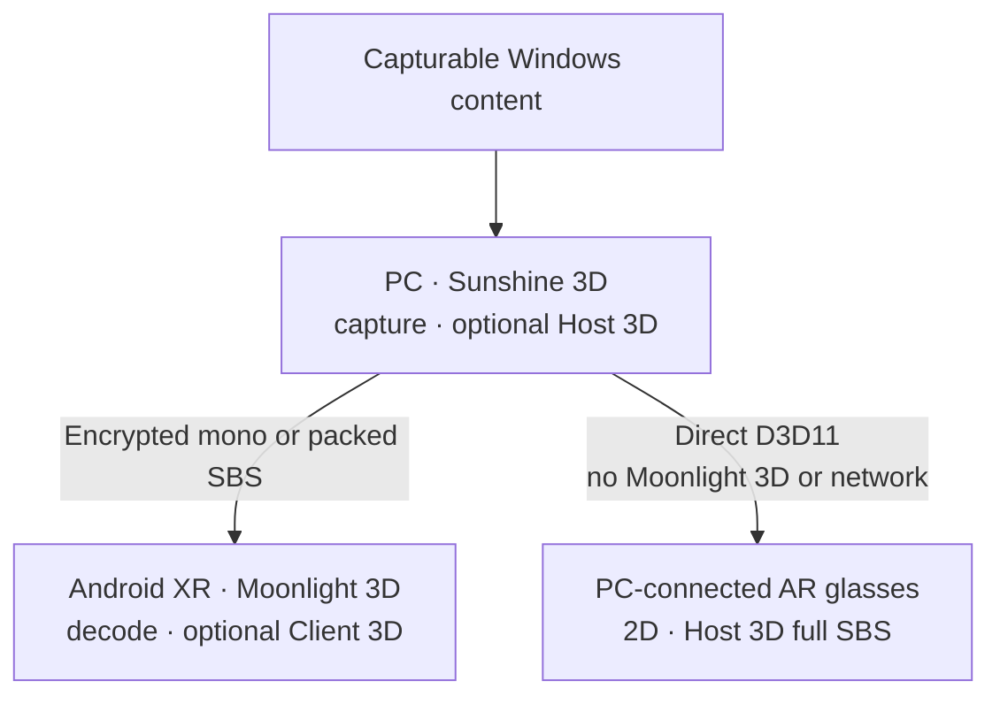
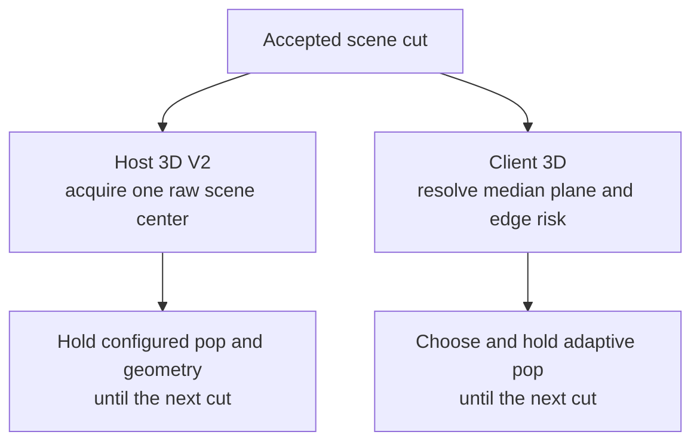

<p align="center">
  
</p>

<h1 align="center">Sunshine 3D</h1>

<p align="center">
  <strong>Everything you love on your PC, now in 3D.</strong><br>
  Watch, play, and work in immersive 3D on an XR headset or supported AR glasses.
</p>

> [!IMPORTANT]
> **Current host support: Windows 11 with an NVIDIA GPU only.**
> AMD and Intel GPUs, software encoding, Linux, and macOS hosts are not supported.

<p align="center">
  <picture>
    <source media="(prefers-reduced-motion: reduce)" srcset="./docs/assets/readme/sunshine3d-moonlight3d-workflow.png">
    
  </picture>
</p>

<p align="center">
  Stream to Moonlight 3D on Android XR, or let Sunshine 3D drive connected AR glasses directly.
</p>

<p align="center">
  <a href="https://github.com/dcatcher9/moonlight-android"><strong>Get Moonlight 3D →</strong></a>
  ·
  <a href="#quick-start">Quick start</a>
  ·
  <a href="./docs/configuration.md">Configuration</a>
  ·
  <a href="./docs/troubleshooting.md">Troubleshooting</a>
</p>

Sunshine 3D is the Windows host and host-side 2D-to-3D engine. It works on captured frames instead
of requiring game mods, player plug-ins, or application-specific stereo support. It can estimate
stereo with Depth Anything V2 and occlusion-aware reprojection, then either encode the result for
Moonlight 3D or present it directly to supported local glasses.

> **Looking for the headset app?** Install
> [Moonlight 3D](https://github.com/dcatcher9/moonlight-android), the Android XR client designed
> and tested with this host.

> **What “content-universal” means:** the AI path can process content visible to the supported
> Windows capture path. Protected or otherwise noncapturable surfaces remain outside the pipeline,
> and monocular depth is an estimate rather than authored stereo geometry.

## Popular use cases

| What you want to do | Best path and payoff |
|---|---|
| **🎬 Watch capturable browser or local video in 3D** | When Windows capture can see the decoded frames, choose Host 3D or Client 3D to convert the player output live |
| **📦 Create a 3D video file** | Use the host Web UI to run the causal production Host SBS path once and encode compressed SBS H.265 or AV1 without playback pacing |
| **🎮 Turn an existing flat PC game into 3D** | Use the PC GPU with Host 3D or the headset GPU with Client 3D—no game-specific stereo mod or profile required |
| **🖥️ Use a private spatial Windows desktop** | Stay in 2D for maximum text clarity or enable AI depth when useful; the virtual display negotiates landscape or portrait geometry, refresh rate, HDR state, and scale |
| **🎞️ Present native SBS games and media** | Select Raw SBS to preserve the source’s authored left/right views without estimating depth again |
| **⚡ Choose where the AI runs** | Move between Host 3D and Client 3D while keeping the same app library, controls, audio, and input loop |
| **👓 Drive tethered AR glasses directly** | Use Sunshine 3D’s local presenter for 2D or host-generated full SBS while bypassing network encode/decode |

## PC, Android XR, and AR glasses

The product boundary is intentionally simple: Sunshine 3D owns the PC; Moonlight 3D owns the
Android XR experience; directly attached AR glasses stay on the PC path.



Direct AR output is currently video-only and supports 1920×1080 2D or 3840×1080 host-generated
full SBS on an approved, non-primary, non-cloned display. A remote XR virtual-display session that
is connecting, active, or retained for resume takes priority over the local glasses presenter.
Windows audio remains on its current default endpoint.

## Conversion and passthrough modes

The paired apps keep stereo production and presentation separate, so the best processing location
can be chosen for each workload.

| Mode in Moonlight 3D | Where 3D is produced | Use when |
|---|---|---|
| **2D** | No 3D processing | You want a direct mono desktop or game with the lowest processing cost |
| **Client 3D** | Galaxy XR GPU using Depth Anything V2 Small or MiDaS 2.1 | Sunshine 3D sends mono video and the headset should create depth |
| **Raw SBS** | The source creates both views; Moonlight 3D splits them | The source renders packed left/right views inside a Virtual Display-backed session, which Raw SBS requires |
| **Host 3D** | Windows CUDA/TensorRT-capable NVIDIA GPU | Sunshine 3D should convert mono content before encoding |

Host 3D and Client 3D are the real-time 2D-to-3D paths. Raw SBS preserves stereo supplied by the
source, while 2D bypasses conversion entirely.

## Quick start

1. Install Sunshine 3D and the bundled SudoVDA virtual-display driver on the Windows PC.
2. Start Sunshine 3D with administrator privileges.
3. Open `https://localhost:47990` and leave the pairing page open. No sign-in is required on
   this PC or an allowed trusted local network; credentials are used only if WAN Web UI access is
   explicitly enabled.
4. Build or install [Moonlight 3D](https://github.com/dcatcher9/moonlight-android) on Galaxy XR,
   then select the discovered PC or add its IP address manually.
5. Moonlight 3D displays a four-digit PIN. Enter it in Sunshine 3D’s **Enter PIN** card.
6. Open the client application library and launch **Virtual Display** for the complete resolution
   and Raw SBS workflow, or launch another configured application.
7. Begin in **2D**, then choose Client 3D, Raw SBS, or Host 3D from the in-headset dock.

The Web UI also shows QR pairing as a secondary option for compatible clients. Moonlight 3D’s
normal setup flow uses the PIN. For the direct local path, configure
[Local AR glasses](./docs/sbs-local-ar-glasses.md) instead; Moonlight 3D is not involved.

## Stable depth from scene to scene

Host 3D and Client 3D both avoid per-frame depth pumping, but they use different calibrated
controllers:

- **Host 3D V2** applies the configured pop strength literally. On the first usable depth field and
  after an accepted scene cut, it chooses a conservative raw center as the zero-disparity plane and
  holds it for the shot. Its coordinate scale and near/far curve are fixed; it does not change pop
  strength or continuously move the screen plane. Its one live geometry control is the configured
  pop strength.
- **Client 3D** retains scene-aware adaptive pop and its shot-stable median zero plane. With the
  shipping defaults it chooses a shot-level multiplier between `1.20×` and `2.00×`, using less
  relief for edge-dense depth and more for lower-risk scenes.



These shot-stable decisions reduce convergence breathing and pumping. They do not guarantee perfect
depth, artifact-free reprojection, or flawless cut detection.

## Why this pair stands out

Its distinguishing scope is one coordinated workflow spanning flat streaming, authored SBS,
host-side AI conversion, headset-side AI conversion, remote Android XR interaction, and direct
local AR-glasses presentation.

| Workflow category | Scope | Main tradeoff |
|---|---|---|
| **Sunshine 3D + Moonlight 3D** | Capturable Windows content can use AI depth on the PC or Galaxy XR; authored SBS is preserved for remote Android XR, while Sunshine 3D can present host-generated 3D directly to local glasses | Validated around Windows 11, NVIDIA, and Galaxy XR; inferred geometry is scene-dependent |
| **Native stereo only** | The application or media supplies authored eye views to a compatible local or streaming stack | Preserves authored binocular geometry and avoids monocular estimation when well authored, but only where the source explicitly supplies stereo |
| **Media-only conversion** | A player or preprocessing tool converts video for file- or player-oriented output | Well-scoped for video, but not a general interactive desktop/game workflow |
| **Local glasses-only conversion** | A PC converter presents supported content directly to attached glasses | No network round trip, but no remote Android XR experience |
| **Conventional flat streaming** | Games, video, and desktop stay mono across a remote video, audio, and input loop | No stereo depth; avoids AI-depth processing cost |

Individual products vary; this compares workflow scope rather than claiming every implementation
in a category behaves identically. Native stereo remains preferable when accurate authored eye
views are available.

## Main features

| Feature | What it provides |
|---|---|
| **Private virtual display** | An on-demand SudoVDA desktop negotiated from the client’s selected resolution, refresh rate, HDR state, and scale |
| **Host AI 3D** | A GPU-resident D3D11 → TensorRT → bounded inverse-warp → NVENC pipeline with matched-frame depth and convex-2x edge refinement |
| **Offline Host 3D conversion** | Converts video to compressed H.265 or AV1 SBS with the same causal V2 estimator/renderer as live Host 3D, running as fast as decoder/GPU/encoder backpressure permits |
| **Scene-aware 3D stability** | Host V2 holds one raw scene center with literal configured pop; Client 3D separately holds its adaptive pop and median plane for the shot |
| **Responsive quality controls** | Live resolution, frame-rate, and bitrate updates without rebuilding the application, capture, or virtual-display session when the selected mode supports it |
| **Modern video path** | Native H.264 NVENC as the baseline; HEVC, AV1, and 10-bit HDR are enabled only when their capabilities are available |
| **Secure pairing and permissions** | PIN-first pairing, a secondary QR option for compatible clients, encrypted protocol 13 sessions, and per-device launch/input/clipboard permissions |
| **Complete interaction** | Desktop audio, stereo or surround sinks, keyboard, mouse, touch, pen, gamepad, and text clipboard synchronization |
| **Warm reconnect** | Keeps the single active app and virtual desktop ready during the configurable `session_resume_grace` window |
| **Direct AR-glasses output** | Video-only presentation to an approved, non-primary, non-cloned Windows display in 1920×1080 2D or 3840×1080 full SBS |

## Requirements and intentional limits

- **Host:** Windows 11.
- **GPU:** Native H.264 NVENC and a current NVIDIA driver. HEVC, AV1, and 10-bit support are
  optional capabilities. Host 3D additionally requires a CUDA/TensorRT-capable NVIDIA device that
  maps to the selected D3D capture adapter.
- **Client:** Moonlight 3D using the modern encrypted protocol on Android XR. Samsung Galaxy XR is
  the validated headset.
- **Session model:** One active remote XR session. A second launch is rejected until the current
  session exits or its reconnect grace period expires.
- **HDR:** Requires compatible content, Windows display state, codec, NVIDIA encode capability,
  and client decoder/display support. H.264 is SDR in this host.

Sunshine 3D intentionally does not target Linux or macOS hosts, AMD/Intel/software encoding,
legacy Moonlight protocol variants, multiple simultaneous sessions, UPnP, input-only sessions,
remote file operations, or remote server-command features. Portrait streaming uses an explicit
portrait resolution rather than rotating a landscape capture. Packed SBS dimensions remain
subject to the selected codec and GPU’s NVENC limits.

The first successfully paired client receives full permissions. Later clients start with the
default permission set until an administrator grants additional launch, input, or clipboard access
in the Web UI.

## Build from source

The supported development build uses Windows, MSYS2 UCRT64, CMake, Ninja, official Node.js, and
the NVIDIA TensorRT C++ Windows package. Set `TENSORRT_DIR` to the extracted TensorRT directory.
A CUDA Toolkit is not required; the host uses the NVIDIA driver API.

```bash
git clone --recurse-submodules https://github.com/dcatcher9/Apollo-3D.git
cd Apollo-3D

# Run the remaining commands in an MSYS2 UCRT64 shell.
export PATH="/c/Program Files/nodejs:$PATH"
export TENSORRT_DIR="/c/path/to/TensorRT"
cmake -B cmake-build-relwithdebinfo -G Ninja -S . \
  -DCMAKE_BUILD_TYPE=RelWithDebInfo
ninja -C cmake-build-relwithdebinfo
```

On the first host launch—or after changing the model, TensorRT version, or GPU—Sunshine 3D may
download an ONNX model and spend several minutes building a TensorRT engine in the background.
Internet access is required unless the model is already present. Ordinary 2D streaming remains
available if depth preparation fails. See [Building](./docs/building.md) for dependencies and
packaging details.

## Documentation

| Topic | Guide |
|---|---|
| Install, pair, and stream | [Quick start](#quick-start) |
| Host settings | [Configuration reference](./docs/configuration.md) |
| Local AR glasses | [Local AR glasses](./docs/sbs-local-ar-glasses.md) |
| Host AI 3D design | [Host SBS pipeline](./docs/host-sbs.md) |
| Host AI 3D scene cuts | [Host SBS scene cuts](./docs/host-sbs-scene-cuts.md) |
| Host AI 3D status and limitations | [SBS 3D roadmap](./docs/sbs-3d-roadmap.md) |
| Offline Host 3D video conversion | [Offline conversion pipeline](./docs/whole-clip-sbs-pipeline.md) |
| Reproducible quality evaluation | [SBS benchmark tools](./tools/sbsbench/README.md) |
| Common failures | [Troubleshooting](./docs/troubleshooting.md) |
| Developer architecture and validation | [CLAUDE.md](./CLAUDE.md) |

## Project lineage

Sunshine 3D descends from [ClassicOldSong/Apollo](https://github.com/ClassicOldSong/Apollo),
itself a hard fork of [Sunshine](https://github.com/LizardByte/Sunshine). Upgrade-sensitive
internal names such as `Apollo`, `sunshine.exe`, `test_sunshine`, configuration keys, service
identifiers, and installation paths remain intentionally unchanged. They are implementation
lineage, not the visible product name or a compatibility promise.

## License

Sunshine 3D is licensed under GPL-3.0-only. See [LICENSE](./LICENSE).
