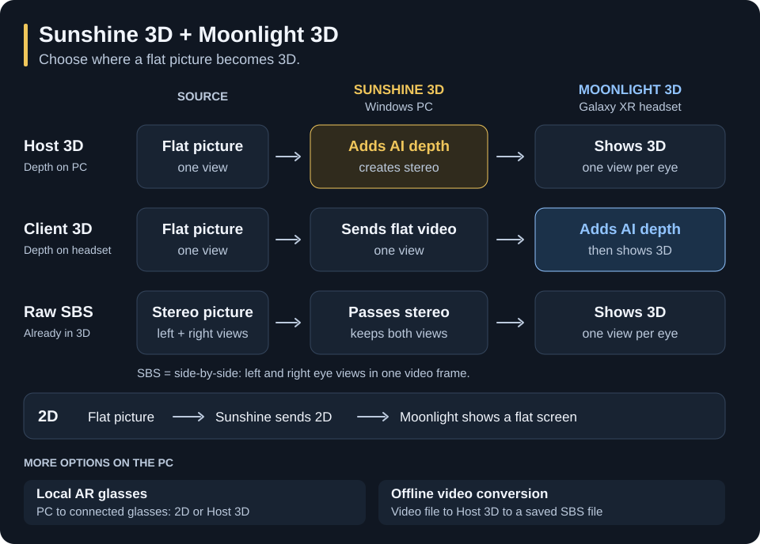
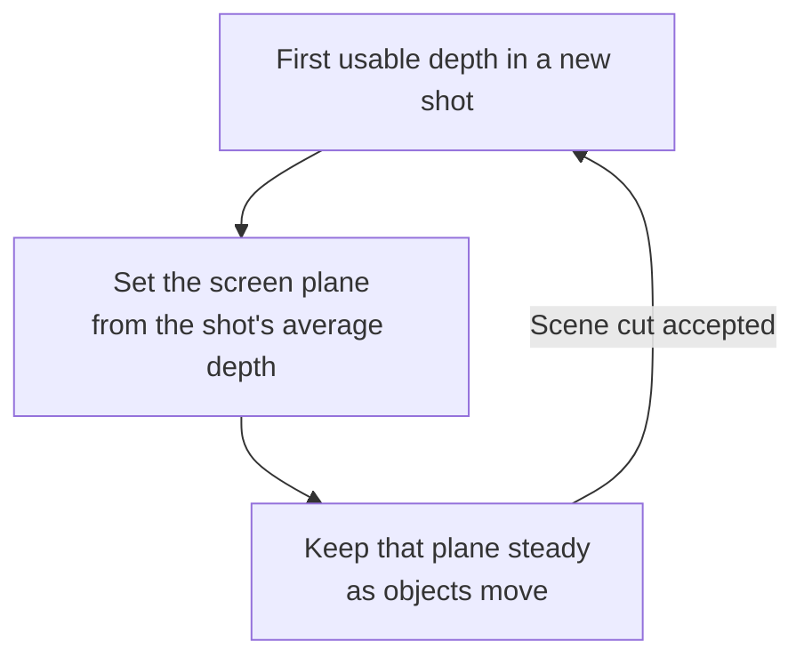

<p align="center">
  
</p>

<h1 align="center">Sunshine 3D</h1>

<p align="center">
  <strong>Everything you love on your PC, now in 3D.</strong><br>
  Watch, play, and work in immersive 3D on an XR headset or supported AR glasses.
</p>

> [!IMPORTANT]
> **Current host support: Windows 11 with an NVIDIA GPU only.**
> AMD and Intel GPUs, software encoding, Linux, and macOS hosts are not supported.

<p align="center">
  
</p>

<p align="center">
  Choose where to create 3D, then watch on your headset or connected glasses—or save a 3D video.
</p>

<p align="center">
  <a href="https://github.com/dcatcher9/moonlight-android"><strong>Get Moonlight 3D →</strong></a>
  ·
  <a href="#quick-start">Quick start</a>
  ·
  <a href="./docs/configuration.md">Configuration</a>
  ·
  <a href="./docs/troubleshooting.md">Troubleshooting</a>
</p>

Sunshine 3D is the Windows host and host-side 2D-to-3D engine. It works on captured frames instead
of requiring game mods, player plug-ins, or application-specific stereo support. It can estimate
depth with Depth Anything V2 Small and frozen ZipDepth convex-2x refinement, then use its Depth
Coordinate V2 renderer to create stereo for Moonlight 3D, supported local glasses, or a converted
video file.

> **Looking for the headset app?** Install
> [Moonlight 3D](https://github.com/dcatcher9/moonlight-android), the Android XR client designed
> and tested with this host.

> **What “content-universal” means:** the AI path can process content visible to the supported
> Windows capture path. Protected or otherwise noncapturable surfaces remain outside the pipeline,
> and monocular depth is an estimate rather than authored stereo geometry.

## Popular use cases

| What you want to do | Best path and payoff |
|---|---|
| **🎬 Watch capturable browser or local video in 3D** | When Windows capture can see the decoded frames, choose Host 3D or Client 3D to convert the player output live |
| **📦 Create a 3D video file** | Convert a local video from the host Web UI into H.265 or AV1 SBS for later playback |
| **🎮 Turn an existing flat PC game into 3D** | Use the PC GPU with Host 3D or the headset GPU with Client 3D—no game-specific stereo mod or profile required |
| **🖥️ Use a private spatial Windows desktop** | Stay in 2D for maximum text clarity or enable AI depth when useful; the virtual display negotiates landscape or portrait geometry, refresh rate, HDR state, and scale |
| **🎞️ Present native SBS games and media** | Select Raw SBS to preserve the source’s authored left/right views without estimating depth again |
| **⚡ Choose where the AI runs** | Move between Host 3D and Client 3D while keeping the same app library, controls, audio, and input loop |
| **👓 Drive tethered AR glasses directly** | Use Sunshine 3D’s local presenter for 2D or host-generated full SBS while bypassing network encode/decode |

## PC, Android XR, and AR glasses

The product boundary is intentionally simple: Sunshine 3D owns the PC; Moonlight 3D owns the
Android XR experience; directly attached AR glasses stay on the PC path.

| Where you want to watch | What you need | What Sunshine 3D does |
|---|---|---|
| **Galaxy XR headset** | Sunshine 3D on the PC + Moonlight 3D on the headset | Streams 2D or stereo, with audio and input |
| **PC-connected AR glasses** | Sunshine 3D + a supported glasses display | Presents 2D or Host 3D directly on the glasses |
| **A saved 3D video** | Sunshine 3D + the approved FFmpeg tools | Converts a local file to SBS for later playback |

Direct AR output is currently video-only and supports 1920×1080 2D or 3840×1080 host-generated
full SBS on an approved, non-primary, non-cloned display. A connecting or active remote XR session
takes priority over the local glasses presenter. Both paths restore displays immediately on
disconnect and retain their session for resume; a fresh connection can replace a retained session.
Windows audio remains on its current default endpoint.

## Conversion and passthrough modes

The paired apps keep stereo production and presentation separate, so the best processing location
can be chosen for each workload.

| Mode in Moonlight 3D | Where 3D is produced | Use when |
|---|---|---|
| **2D** | No 3D processing | You want a direct mono desktop or game with the lowest processing cost |
| **Client 3D** | Galaxy XR GPU using original ZipDepth Base | Sunshine 3D sends mono video and the headset should create depth |
| **Raw SBS** | The source creates both views; Moonlight 3D splits them | The source renders packed left/right views inside a Virtual Display-backed session, which Raw SBS requires |
| **Host 3D** | Windows CUDA/TensorRT-capable NVIDIA GPU | Sunshine 3D should convert mono content before encoding |

Host 3D and Client 3D are the real-time 2D-to-3D paths. Raw SBS preserves stereo supplied by the
source, while 2D bypasses conversion entirely.

## Install on Windows

Use a suitable build from [Sunshine 3D releases](https://github.com/dcatcher9/Apollo-3D/releases)
when available, or [build from source](#build-from-source). The Windows installer bundles TensorRT
and the virtual-display runtime. Its default destination is `C:\Program Files\Sunshine3D`; existing
Apollo installations follow the normal upgrade flow.

Packages built with optional client-driver support also offer VB-CABLE microphone forwarding and
DualSense haptics components. These are optional and require a client that implements the matching
feature. See [Microphone and DualSense setup](./docs/host-client-features.md).

## Quick start

1. Install Sunshine 3D and the bundled SudoVDA virtual-display driver on the Windows PC.
2. Start Sunshine 3D with administrator privileges.
3. Open `https://localhost:47990` and leave the pairing page open. No sign-in is required on
   this PC or an allowed trusted local network; credentials are used only if WAN Web UI access is
   explicitly enabled.
4. Build or install [Moonlight 3D](https://github.com/dcatcher9/moonlight-android) on Galaxy XR,
   then select the discovered PC or add its IP address manually.
5. Moonlight 3D displays a four-digit PIN. Enter it in Sunshine 3D’s **Enter PIN** card.
6. Open the client application library and launch **Virtual Display** for the complete resolution
   and Raw SBS workflow, or launch another configured application.
7. Begin in **2D**, then choose Client 3D, Raw SBS, or Host 3D from the in-headset dock.

The Web UI also shows QR pairing as a secondary option for compatible clients. Moonlight 3D’s
normal setup flow uses the PIN. For the direct local path, configure
[Local AR glasses](./docs/sbs-local-ar-glasses.md) instead; Moonlight 3D is not involved.

While streaming, the virtual display temporarily becomes the Windows primary display, making it
the default destination for applications that follow primary-monitor placement. Current Moonlight
3D enables **Use virtual display only while streaming** by default in **Global Settings → Streaming
defaults**. This disables ordinary physical displays during the stream. Turn it off and reconnect
to keep those displays active. Older clients that omit the setting keep physical displays active.

An approved AR-glasses output stays active when it needs scanout; Sunshine automatically keeps the
shared cursor on the virtual display in that case. The previous display setup is restored on
disconnect, including during the reconnect grace period. This is the same signed-in Windows
desktop, with shared applications, focus, and cursor. See
[Virtual desktop interaction](./docs/virtual-desktop.md) for application placement, restoration,
and recovery after a host crash.

## Stable depth from scene to scene

Host 3D and Client 3D use Depth Coordinate V2 with calibration for their respective models. On the
first usable depth field of a shot, each places the screen plane at the average raw depth and holds
it there while objects move. An accepted scene cut lets the next shot choose a new plane.

Host 3D uses the **Host 3D strength** setting in the host Web UI; Client 3D uses its fixed calibrated
strength. Neither automatically increases or reduces strength for each scene. The models and GPU
renderers differ, so their output is not expected to be identical.



These shot-stable decisions reduce convergence breathing and pumping. They do not guarantee perfect
depth, artifact-free reprojection, or flawless cut detection.

The [Host SBS pipeline](./docs/host-sbs.md) and
[Client SBS architecture](https://github.com/dcatcher9/moonlight-android/blob/moonlight-noir/docs/android-xr-sbs.md)
own the model, geometry, and failure behavior.

## Convert a video for later

1. End the remote stream or local AR presentation so the conversion job can use the GPU.
2. Open **Convert** in the host Web UI on the PC and select a local video.
3. Choose **Convert video**, an unused output name, and H.265 or AV1. Use **Analyze only**
   when you want scene diagnostics without creating a video.
4. Start the job and follow its progress. The completed SBS video is saved beside the input as
   `.mkv` or `.mp4`.

Conversion uses the same Host 3D pipeline in source order and runs as fast as decoding, the GPU,
and encoding permit. Supported audio, subtitles, and other streams are preserved. SDR and static
PQ/HLG HDR are supported; dynamic HDR, interlaced input, and other unsupported media are rejected.
Existing output files are never overwritten.

The host needs an approved installation-local `ffmpeg.exe` / `ffprobe.exe` pair. See
[media-tool setup](./docs/building.md#offline-media-tools) and the
[offline conversion guide](./docs/whole-clip-sbs-pipeline.md) for exact input and output requirements.

## Why this pair stands out

Its distinguishing scope is one coordinated workflow spanning flat streaming, authored SBS,
host-side AI conversion, headset-side AI conversion, remote Android XR interaction, and direct
local AR-glasses presentation.

| Workflow category | Scope | Main tradeoff |
|---|---|---|
| **Sunshine 3D + Moonlight 3D** | Capturable Windows content can use AI depth on the PC or Galaxy XR; authored SBS is preserved for remote Android XR, while Sunshine 3D can present host-generated 3D directly to local glasses | Validated around Windows 11, NVIDIA, and Galaxy XR; inferred geometry is scene-dependent |
| **Native stereo only** | The application or media supplies authored eye views to a compatible local or streaming stack | Preserves authored binocular geometry and avoids monocular estimation when well authored, but only where the source explicitly supplies stereo |
| **Media-only conversion** | A player or preprocessing tool converts video for file- or player-oriented output | Well-scoped for video, but not a general interactive desktop/game workflow |
| **Local glasses-only conversion** | A PC converter presents supported content directly to attached glasses | No network round trip, but no remote Android XR experience |
| **Conventional flat streaming** | Games, video, and desktop stay mono across a remote video, audio, and input loop | No stereo depth; avoids AI-depth processing cost |

Individual products vary; this compares workflow scope rather than claiming every implementation
in a category behaves identically. Native stereo remains preferable when accurate authored eye
views are available.

## Main features

| Feature | What it provides |
|---|---|
| **Private virtual display** | An on-demand SudoVDA desktop negotiated from the client’s selected resolution, refresh rate, HDR state, and scale |
| **Virtual-display-only streaming** | A client-controlled desktop mode that disables ordinary physical monitors, handles cursor bounds automatically, and restores displays on disconnect |
| **Host AI 3D** | Matched-frame DAV2 Small depth with frozen ZipDepth convex-2x refinement, rendered through D3D11/TensorRT and encoded with NVENC |
| **Window-aware Host 3D** | On supported Desktop Duplication captures, focuses depth analysis on eligible foreground video or app content; eligible subtitles receive dedicated plane conditioning |
| **Offline Host 3D conversion** | Converts video to compressed H.265 or AV1 SBS with the same causal V2 estimator/renderer as live Host 3D, running as fast as decoder/GPU/encoder backpressure permits |
| **Stable 3D screen plane** | Both AI modes hold a raw-depth scene center for the shot, with configured Host 3D strength or fixed Client 3D strength |
| **Responsive quality controls** | Live resolution, frame-rate, and bitrate updates without rebuilding the application, capture, or virtual-display session when the selected mode supports it |
| **Headset Host Stats** | Host depth health and, with host diagnostics enabled, inference/reuse counts, output activity, and stage timings in Moonlight 3D |
| **Modern video path** | Native H.264 NVENC as the baseline; HEVC, AV1, and 10-bit HDR are enabled only when their capabilities are available |
| **Secure pairing and permissions** | PIN-first pairing, a secondary QR option for compatible clients, encrypted protocol 13 sessions, and per-device launch/input/clipboard permissions |
| **Complete interaction** | Desktop audio, stereo or surround sinks, keyboard, mouse, touch, pen, gamepad, and text clipboard synchronization |
| **Optional microphone and DualSense haptics** | Host support for VB-CABLE microphone routing and game-authored DualSense PCM through HIDMaestro; requires optional drivers and a client implementation |
| **Warm reconnect** | Keeps the single active app and virtual desktop ready during the configurable `session_resume_grace` window |
| **Direct AR-glasses output** | Video-only presentation to an approved, non-primary, non-cloned Windows display in 1920×1080 2D or 3840×1080 full SBS |

## Requirements and intentional limits

- **Host:** Windows 11.
- **GPU:** Native H.264 NVENC and a current NVIDIA driver. HEVC, AV1, and 10-bit support are
  optional capabilities. Host 3D additionally requires a CUDA/TensorRT-capable NVIDIA device that
  maps to the selected D3D capture adapter.
- **Client:** Moonlight 3D using the modern encrypted protocol on Android XR. Samsung Galaxy XR is
  the validated headset.
- **Session model:** One active presentation session. A fresh launch can replace a disconnected
  session during its reconnect grace; active remote streams and pending handshakes remain protected.
- **HDR:** Requires compatible content, Windows display state, codec, NVIDIA encode capability,
  and client decoder/display support. H.264 is SDR in this host.

Sunshine 3D intentionally does not target Linux or macOS hosts, AMD/Intel/software encoding,
legacy Moonlight protocol variants, multiple simultaneous sessions, UPnP, input-only sessions,
remote file operations, or remote server-command features. Portrait streaming uses an explicit
portrait resolution rather than rotating a landscape capture. Packed SBS dimensions remain
subject to the selected codec and GPU’s NVENC limits.

Moonlight 3D's resolution presets include landscape and portrait XR, phone, and tablet dimensions.
These are virtual-display sizes for the XR client; they do not add phone or tablet app support.
Host 3D requires a supported [resolution fit](./docs/host-sbs.md#authenticated-resolution-fitting).

The Android app currently has the shared protocol foundations for microphone forwarding and
authored DualSense PCM, but does not yet implement microphone capture or DualSense PCM playback. Ordinary
controller input and feedback remain separate from these optional features.

The first successfully paired client receives full permissions. Later clients start with the
default permission set until an administrator grants additional launch, input, or clipboard access
in the Web UI.

## Build from source

The supported development build uses Windows, MSYS2 UCRT64, CMake, Ninja, official Windows Node.js
LTS (at least 22.12), and the NVIDIA TensorRT C++ Windows package. Follow
[Building Sunshine 3D](./docs/building.md) to install the dependencies and apply `patch_trt.py` to
fresh TensorRT headers before configuring. Set `TENSORRT_DIR` to that extracted TensorRT directory.
A CUDA Toolkit is not required; the host uses the NVIDIA driver API.

```bash
git clone --recurse-submodules https://github.com/dcatcher9/Apollo-3D.git
cd Apollo-3D

# Run the remaining commands in an MSYS2 UCRT64 shell.
export PATH="/ucrt64/bin:/c/Program Files/nodejs:$PATH"
export TENSORRT_DIR="/c/path/to/TensorRT"
cmake -B cmake-build-relwithdebinfo -G Ninja -S . \
  -DCMAKE_BUILD_TYPE=RelWithDebInfo
ninja -C cmake-build-relwithdebinfo
```

Use `RelWithDebInfo` for live XR testing. Keep the UCRT64 runtime on the child process `PATH`, and
quit any installed tray host before starting a development copy. Run `sunshine.exe` as Administrator
with the build directory as its working directory so it can find `assets/`.

The production depth pipeline requires the authenticated model assets supplied with the build.
On first preparation—or when model, TensorRT, or GPU cache identity changes—building the TensorRT
engine can take several minutes. Missing or invalid model assets leave Host 3D flat; ordinary 2D
streaming remains available. See [Building](./docs/building.md) for packaging and engine-cache details.

## Documentation

| Topic | Guide |
|---|---|
| Install, pair, and stream | [Quick start](#quick-start) |
| Host settings | [Configuration reference](./docs/configuration.md) |
| Virtual display, cursor, and display recovery | [Virtual desktop interaction](./docs/virtual-desktop.md) |
| Microphone and DualSense setup | [Optional client features](./docs/host-client-features.md) |
| Local AR glasses | [Local AR glasses](./docs/sbs-local-ar-glasses.md) |
| Host AI 3D design | [Host SBS pipeline](./docs/host-sbs.md) |
| Host AI 3D scene cuts | [Host SBS scene cuts](./docs/host-sbs-scene-cuts.md) |
| Host AI 3D status and limitations | [SBS 3D roadmap](./docs/sbs-3d-roadmap.md) |
| Offline Host 3D video conversion | [Offline conversion pipeline](./docs/whole-clip-sbs-pipeline.md) |
| Reproducible quality evaluation | [SBS benchmark tools](./tools/sbsbench/README.md) |
| Host/client boundary tests | [Joint workflow gate](./docs/joint-workflow-tests.md) |
| Common failures | [Troubleshooting](./docs/troubleshooting.md) |
| Developer architecture and validation | [CLAUDE.md](./CLAUDE.md) |

## Project lineage

Sunshine 3D descends from [ClassicOldSong/Apollo](https://github.com/ClassicOldSong/Apollo),
itself a hard fork of [Sunshine](https://github.com/LizardByte/Sunshine). Upgrade-sensitive
internal names such as `Apollo`, `sunshine.exe`, `test_sunshine`, configuration keys, service
identifiers, and installation paths remain intentionally unchanged. They are implementation
lineage, not the visible product name or a compatibility promise.

## License

Sunshine 3D is licensed under GPL-3.0-only. See [LICENSE](./LICENSE).
