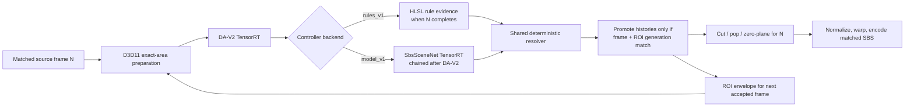

# Host SBS GPU scene controller

## Decision

Build the controller in two interchangeable GPU-only backends:

1. **`rules_v1` first**: deterministic HLSL compute passes implement conservative rules.
2. **`model_v1` second**: a small recurrent TensorRT network replaces only the evidence
   producer after the runtime path and training data are proven.

Both backends use the same versioned inputs, write the same evidence outputs, and feed the same
deterministic resolver. Scene cuts, ROI ownership, history promotion, pop limits, zero-plane
latching, comfort bounds, and fallback behavior remain Apollo code, not model policy.

This is the preferred order. It validates the difficult parts first: GPU resource ownership,
matched-frame identity, ROI-generation resets, recurrent history, drop-on-busy behavior,
telemetry, evaluation, and rollback. It also produces a deterministic baseline and mines the
cases that should enter model training. The rule output is useful weak supervision, but it is
never ground truth.

The eventual production setting may expose:

```text
sbs_scene_controller = off | rules | model | shadow_rules | shadow_model
```

The implementation in this change deliberately exposes only `off` and `shadow_rules`, with
`off` as the default. `shadow_rules` runs the real GPU tensors, resolver, history, and dump path,
but it has no connection to crop, normalization, warp, pop, or zero-plane authority. Active
`rules` remains unavailable until the remaining adversarial and 4K90 soak gates pass and active
rollout is explicitly approved.
Off/shadow inference binds one immutable all-zero legacy transform;
it does not allocate, dispatch, map, or lifecycle-track the active transform banks, so an
experimental builder failure cannot disable ordinary Host SBS.

Changing backend during a stream requires an explicit controller-state reset. The two backends
share state layouts, but learned hidden features are not meaningful to the rule backend.

## Product goal

Host SBS should understand enough about the current screen and depth history to make four related
decisions:

- select one useful Depth Anything V2 inference region when a browser contains a playing video or
  a static collage;
- reject browser chrome, sidebars, advertisements, and unrelated applications from the focused
  region;
- distinguish content cuts from flashes, scrolling, and ROI geometry changes; and
- select safe shot-latched pop strength and zero-plane evidence.

The renderer continues to draw the complete color frame. Only the depth inference envelope is
rectangular. The focus/exclusion evidence may be disconnected or non-rectangular. A deterministic
GPU reducer converts it to one conservative rectangular DA-V2 envelope for the next accepted
frame. Outside that envelope and its quiet feather band, disparity is exactly zero.

A wrong focused ROI is worse than full-frame inference. Ambiguous, low-confidence, unsupported,
or out-of-distribution input must abstain to the existing full-frame controller.

## Runtime boundaries

The shipping runtime is native C++/HLSL/D3D11/CUDA Driver API/TensorRT. Python is allowed for
dataset generation, training, ONNX export, calibration, and offline evaluation only.

Production constraints:

- one DA-V2 inference per accepted source frame;
- at most one scene-controller inference per completed DA-V2 inference;
- no full-resolution CPU copy;
- no synchronous GPU readback, `Map`, `Flush`, or CPU wait in the streaming path;
- no second independent CUDA stream in v1;
- one bounded inference in flight, with a nonblocking `cuStreamQuery` readiness check;
- no browser extension, DOM, accessibility, or application-specific runtime dependency;
- exact frame and ROI-generation ownership;
- one rectangular DA-V2 ROI, without adaptive tiling or recursive subdivision;
- independent TensorRT execution context and recurrent state for every encoder instance; and
- deterministic fallback if any backend, schema, calibration, or state check fails.

The current low-resolution full-frame appearance is required. Full-resolution RGB and an RGB
history ring are not. A depth-only controller cannot discover a challenger outside a crop, cannot
distinguish a main video from an animated sidebar, and cannot recover a static collage when DA-V2
has already produced flat depth.

## High-level pipeline



The selected ROI from frame `N` can affect DA-V2 only on the next accepted frame. Rendering frame
`N` always uses the ROI metadata stored with frame `N`; it never samples the tracker's newest
rectangle.

Every duration in this design is measured on the accepted captured-stream presentation timeline.
The synthetic recipe's `fps_num/fps_den` is that stream cadence, not the frame rate of a video
embedded in a browser page. For example, a 30 FPS player presented by a 90 Hz stream still advances
controller wall time by about 1/90 second per accepted stream submission.

## Shared Scene Controller ABI v1

The contract is defined once in a checked-in JSON schema. A generator emits:

- C++ enums, dimensions, and reflection;
- HLSL indices and constants;
- Python dataset/export names;
- an ONNX metadata manifest; and
- test fixtures.

The schema includes an ordered-field hash, not only a version and field count. Apollo rejects a
rule shader, TensorRT plan, calibration file, capture, or dataset whose schema hash differs. This
prevents a reordered field with the same count from silently changing meaning.

External interop tensors are FP32 for the simplest D3D11 structured-buffer contract. TensorRT
builds FP16 layers internally. IDs remain integer CPU/GPU metadata; a 64-bit frame ID is never
encoded in an FP32 model input.

### Canonical spatial canvas

Controller resources use fixed maximum capacities:

```text
appearance canvas: 256 x 256
analysis canvas:   128 x 128
recurrent canvas:   32 x 32
```

The active controller extent is rectangular and aspect-preserving:

- 16:9 landscape dispatches `256x144` / `128x72`;
- 9:16 portrait dispatches `144x256` / `72x128`; and
- ultrawide and other supported ratios derive the corresponding short side once per stream
  geometry.

This does not rotate or anisotropically stretch the user's screen. It gives landscape, portrait,
and ultrawide streams reusable maximum-size GPU allocations. Texels outside the logical extent
are neither written nor sampled and are not model input, history, black content, zero depth, or
padding. The logical dimensions and validity channel bound every dispatch and reduction.

### Inputs

| Tensor | Type and shape | Meaning |
| --- | --- | --- |
| `scene_rgb` | FP32 capacity `[1,3,256,256]` | Current full-frame, display-referred, tone-mapped, exact-area RGB in the active rectangular extent. |
| `analysis_grid` | FP32 capacity `[1,10,128,128]` | Current deterministic appearance, activity, coverage, and coordinate features in the active rectangular extent. |
| `roi_depth_raw` | FP32 `[1,1,Hd,Wd]` | Alias of DA-V2 `predicted_depth`; dynamic and affine-ambiguous. |
| `layout_history` | FP32 capacity `[1,12,128,128]` | Full-frame deterministic temporal history over the active rectangular extent. |
| `depth_history` | FP32 capacity `[1,10,128,128]` | ROI-local deterministic depth history over the active rectangular extent, with ROI geometry retained in `meta`. |
| `hidden_in` | FP32 `[1,24,32,32]` | Learned recurrent state. `rules_v1` requires it to be zero. |
| `meta` | FP32 `[1,32]` | Timing, ROI, reset, source, and configuration scalars. |

`Hd` and `Wd` are the current patch-aligned DA-V2 tensor dimensions. The scene network must not
call TensorRT APIs returning `Dims` by value across the MinGW/MSVC boundary. Passing a `Dims` into
`setInputShape` remains allowed by the existing Apollo rule.

`rules_v1` additionally aliases the existing adaptive-controller state as a backend-private
sidecar. It uses the authoritative valid-depth fraction, cut flags/pulse, pop ratio, analysis
flags, and cumulative external-cut count without copying them to CPU. Those legacy values are
projected into the shared outputs; they are not extra SbsSceneNet inputs.

#### `analysis_grid` channels

| Index | Channel |
| ---: | --- |
| 0 | viewport-valid mask |
| 1 | exposure-invariant luminance ordinal |
| 2 | local luminance variance |
| 3 | dense multidirectional edge/texture evidence |
| 4 | chroma/saturation magnitude |
| 5 | temporal-activity occupancy, not change magnitude |
| 6 | committed DA ROI coverage; full-frame until an ROI lock is held |
| 7 | normalized viewport x coordinate |
| 8 | normalized viewport y coordinate |
| 9 | decayed click/tap interaction heatmap; zero when unavailable |

The feature pass retains only the immediately previous low-resolution ordinal/feature grid. It
does not retain original RGB frames. The previous-feature grid advances only for a frame that was
actually accepted into the DA/controller chain; a busy-dropped capture cannot silently become the
temporal reference for a different depth frame.

#### `layout_history` channels

| Index | Channel |
| ---: | --- |
| 0 | previous exposure-invariant luminance ordinal |
| 1 | fast activity EMA |
| 2 | slow activity EMA |
| 3 | photographic-density EMA |
| 4 | chroma EMA |
| 5 | horizontal motion estimate |
| 6 | vertical motion estimate |
| 7 | motion confidence |
| 8 | stable occupancy/dwell |
| 9 | accepted focus evidence EMA |
| 10 | exclusion/UI/ad evidence EMA |
| 11 | seconds since valid layout evidence, normalized and clamped |

#### `depth_history` channels

These coordinates are ROI-local. They are reset on any ROI geometry or generation change.

| Index | Channel |
| ---: | --- |
| 0 | last masked mean/std-normalized depth |
| 1 | fast depth EMA |
| 2 | slow depth EMA |
| 3 | settled shot-reference depth |
| 4 | depth variance EMA |
| 5 | absolute depth-change EMA |
| 6 | horizontal depth-gradient EMA |
| 7 | vertical depth-gradient EMA |
| 8 | valid-depth confidence |
| 9 | seconds since valid depth, normalized and clamped |

Missing or exterior depth is invalid. It is never written as numeric zero because zero is a valid
normalized depth and would poison gradients, cuts, pop risk, and recurrence.

#### `meta` fields

| Index | Field |
| ---: | --- |
| 0 | elapsed seconds since the last accepted controller update |
| 1 | source aspect ratio |
| 2..5 | normalized ROI `x0,y0,x1,y1` |
| 6..8 | one-hot retained geometry state: `full_frame,video,content` |
| 9 | reserved; required zero |
| 10 | current depth input valid |
| 11 | ROI generation changed |
| 12 | layout reset requested |
| 13 | depth/shot reset requested |
| 14 | scroll hold active |
| 15 | HDR/scRGB source flag |
| 16 | deterministic exposure-change evidence |
| 17 | adaptive pop enabled |
| 18 | configured absolute pop floor |
| 19 | configured absolute pop ceiling |
| 20..22 | allowed zero-plane mask: `subject,median,background` |
| 23 | external cut request |
| 24 | scene age in seconds, normalized and clamped |
| 25 | seconds since recent interaction, normalized and clamped |
| 26 | source color-mode enum |
| 27 | previous backend output valid |
| 28..31 | reserved; required zero |

Frame IDs, ROI generations, backend generation, depth-model identity, and schema hash stay in exact
integer metadata beside the tensor.

### Outputs

| Tensor | Type and shape | Meaning |
| --- | --- | --- |
| `dense_out` | FP32 `[1,14,128,128]` | Full-frame heuristic, local event, and motion evidence. These are observable rule inputs, not ground-truth semantic labels. |
| `global_out` | FP32 `[1,41]` | Layout, event, pop, zero-plane, confidence, scroll, and validity evidence. |
| `hidden_out` | FP32 `[1,24,32,32]` | Learned recurrent state; `rules_v1` writes zero. |

#### `dense_out` channels

| Index | Evidence |
| ---: | --- |
| 0 | unknown/background |
| 1 | canonical photo-gated playing-video evidence; raw activity is used only as liveness masked by this lane |
| 2 | exact positive static-media weight consumed by the authoritative media hull |
| 3 | geometry-neutral UI/chrome-like evidence |
| 4 | geometry-neutral transient competitor/unsafe evidence |
| 5 | focus boundary |
| 6 | geometry-neutral quiet-divider evidence; used only to bound/corroborate a temporal player seed, never to split the static media hull |
| 7 | subject/saliency |
| 8 | local motion x |
| 9 | local motion y |
| 10 | local motion confidence |
| 11 | structural content-cut support |
| 12 | exposure-only change support |
| 13 | scroll support |

#### `global_out` fields

| Range | Evidence |
| --- | --- |
| 0..5 | layout: `no_target,primary_video,content_collage,identity_fullscreen,ambiguous,scroll` |
| 6..11 | event: `same_shot,hard_cut,fade_or_dissolve,flash_or_exposure,scroll,geometry_reset` |
| 12..20 | ordinal pop safety for nine configured actions |
| 21..24 | zero plane: `subject,median,background,neutral_or_abstain` |
| 25..30 | confidence: `ROI,mask,event,pop,zero,OOD` |
| 31..33 | global scroll x, y, and confidence |
| 34 | backend output valid |
| 35..40 | resolver-private scratch; required zero in the published output |

The committed 68-word rule state uses words 61..63 for
`roi_structural_cut_support`, `roi_exposure_only_support`, and
`roi_event_depth_coverage`. They are schema-hashed FP32 values, not untyped reserved lanes, so
offline traces can calibrate the ROI corroboration thresholds without changing live authority.
Word 60 stores the last consumed external-cut count and word 64 stores the last consumed adaptive
detector-cut count as exact `uint32` bits. Words 65..67 are required-zero expansion lanes. The
detector count and `detector_cut_pending` state flag make a corroborated detector cut durable
across invalid or scroll-frozen updates; a valid unfrozen ROI rejection consumes the count so it
cannot attach to unrelated future activity. If the independently owned adaptive state is rebuilt
and either exact counter decreases, the resolver immediately starts a new counter epoch so the
next increment remains observable.

The nine pop actions span the current configuration:

```text
action[k] = pop_floor + k / 8 * (pop_ceiling - pop_floor), k = 0..8
```

With the current defaults they are `1.20, 1.30, ..., 2.00`. The outputs mean “this action is
safe,” not “this action looks stronger.” The resolver projects them to a monotonic safe prefix and
selects the strongest action above the conservative confidence threshold. If none qualify, it
selects the configured floor.

Classification fields are logits; motion/scroll vector fields are bounded regressions.
`rules_v1` converts bounded classification evidence to clamped logits in `[-12,12]`. Each backend
has a schema-hashed calibration manifest, but the resolver and thresholds consume the same
calibrated probabilities.

## Deterministic authority after the backend

Neither backend directly commits a cut, ROI, pop value, or zero plane. A common HLSL/C++ resolver
owns:

- unique-winner and abstention policy;
- acquire, incumbent, challenger, release, and scroll-hold dwell;
- ROI quantization, halo, generation, and exact matched metadata;
- scene-cut cooldown, rearm, bounded escape, and external-cut attribution;
- separation of exposure, scroll, content cut, and geometry reset;
- pop floor, ceiling, monotonic projection, comfort bounds, and shot latch;
- zero-plane allow-list, fallback, and shot latch;
- exact-flat exterior, feathering, and identity/full-frame behavior;
- stale, mismatched, invalid, and obsolete-output rejection; and
- fallback to the existing controller on any failure.

Cut, pop, subject, and zero-plane reductions are masked by the frame-owned ROI and its valid-depth
mask. Full-frame appearance may discover a challenger, but activity in a sidebar or outside the
committed ROI cannot relatch shot state.

The shared ABI can carry a richer focus mask for a future learned backend, but deterministic rules
accept only one unambiguous rectangular target. They do not solve disconnected masks, select among
independent islands, or infer a missing edge. Those cases abstain.

## Rectangular DA-V2 input

DA-V2 cannot run directly on an irregular shape. Its input is one dense rectangular NCHW tensor.
The controller keeps two different objects:

1. **Focus/exclusion mask**: arbitrary, possibly disconnected, at `128x128`.
2. **Inference envelope**: one source-space rectangle derived from the accepted mask and used by
   DA-V2 on the next accepted frame.

For `rules_v1`, the accepted focus is already one dense rectangle. A small halo and patch-alignment
expansion may enlarge only the inference envelope. If forming that envelope would require choosing
between disconnected regions, inventing a missing boundary, or including a material unsafe
competitor, the controller uses full-frame inference.

Aspect ratio matters. The ROI-to-model transform must:

- preserve the source rectangle's aspect ratio;
- choose `Hd` and `Wd` as multiples of DA-V2's 14-pixel patch size;
- hold approximately the configured full-frame pixel budget rather than holding the full-frame
  aspect: the default `770x434` budget is about 334k pixels, so representative shapes are roughly
  `770x434` for 16:9, `434x770` for 9:16, and `574x574` for 1:1;
- select the closest patch-aligned shape inside the TensorRT dynamic profile, configured maximum
  aspect, source-crop dimensions, and pixel budget;
- expand the exact source ROI minimally until its enclosing inference crop exactly matches
  `Wd/Hd`;
- shift that enclosing crop back inside the source at frame edges, without changing its size or
  aspect;
- feed only real source pixels to DA-V2, with no letterbox, pillarbox, synthetic border, or
  replicated padding;
- use exact-area downsampling over the corresponding source footprint; and
- never stretch a wide ROI into a square or a portrait ROI into landscape.

The inference crop normally differs from the exact focus only by its quiet halo and patch-rounding
error. It may include a small amount of real browser context, which is excluded later by the exact
focus mask. If an aspect-matched enclosing crop cannot fit the source, Apollo falls back to the
unchanged full-frame path. It never manufactures pixels to force a crop to fit.

Model shape changes only when a newly confirmed request differs from the active dimensions, never
for ordinary sub-cell tracking motion. TensorRT shape selection is a host API, so the GPU publishes
one tiny shape request. Apollo copies it to a three-slot staging ring and polls completion
asynchronously; no RGB, depth, mask, or history leaves the GPU. Before a destructive transition,
the controller is frozen and the request must return with the exact controller source-frame
provenance. Older ring completions cannot authorize teardown. Confirmation is bounded to 12
capture opportunities; timeout, controller ownership failure, or a rejected noncanonical
`setInputShape` returns the stream to canonical full-frame depth and disables active authority for
that stream.

The current rules implementation performs a serialized shape rebuild: after the old matched result
has been rendered, it unregisters the idle CUDA interop resources, releases shape-dependent D3D
buffers/history, allocates the confirmed shape, calls `setInputShape`, and warms/recaptures the CUDA
Graph. Rendering retains the previous matched SBS pair during this bounded transition. A graph is
never replayed with dimensions or mapped addresses different from its capture tuple. This is
intentionally more conservative than a multi-shape resource cache, but it repays allocation,
registration, state seeding, and graph capture on each actual dimension change. Active rollout
therefore remains blocked on measured alternating landscape/square/portrait transition latency,
4K90 cadence, and a 30-minute no-growth soak. A bounded per-shape cache is a later optimization if
those measurements are not acceptable.

DA-V2 predicts depth for the complete rectangle. The focus mask never blacks or blurs RGB before
inference; doing so would add artificial boundaries and create an out-of-distribution input.

## Backend 1: deterministic GPU rules

### Why rules come first

The first backend should be rules, not the network:

- it exercises the real GPU inputs, output ABI, matched-frame lifecycle, history, resets, and
  resolver without a training dependency;
- its output is explainable and reproducible in unit tests and captures;
- it establishes the latency and VRAM cost of the shared infrastructure;
- it gives the learned backend an exact fallback and shadow-mode comparator; and
- its failures identify the training examples with highest value.

Rules are not expected to solve every semantic ambiguity. They must prefer abstention over a false
sidebar/ad selection. A rule ROI must not become the default merely because it improves one
hand-selected grid page.

### State machine and simple rule policy

The geometry state machine has exactly three states:

| State | Meaning |
| --- | --- |
| `FULL_FRAME` | No safe unique rectangle is committed. This is the initial state and every ambiguous case returns here. |
| `VIDEO` | One rectangle was proven by recurring motion and may be retained through a pause. |
| `CONTENT` | One simple, dense static media envelope was proven. |

`layout_decision` records the current evidence proposal and may briefly say `VIDEO` or `CONTENT`
while a candidate is still serving its dwell. It is diagnostic, not crop authority. Only
`state_kind` plus a locked committed ROI changes sampling; therefore an ambiguous clip passes
only while it remains `FULL_FRAME`, even if useful provisional proposals appear and clear.

Scroll is not a fourth state. `scroll_hold_active` and `scroll_hold_s` are orthogonal overlay
fields. Coherent same-direction translation must persist for 0.05 seconds on the captured-stream
presentation clock before it enters the overlay. This takes the same physical time at 72 FPS,
90 FPS, or across dropped inference opportunities; embedded video cadence is never an input.
While the overlay is active, committed geometry, depth-shot, pop, and zero-plane decisions freeze;
the retained state and ROI generation do not change. Every uncommitted acquisition or challenger
is cleared on entry and remains canonical throughout the hold, including in `FULL_FRAME`. After
the 0.12-second quiet release tail, one decision-frozen update promotes current depth to replace
the pre-scroll bank; this prevents the translated page from being mistaken for a scene cut.
Acquisition restarts from empty evidence and must satisfy a fresh 0.20-second dwell.

`rules_v1` deliberately uses one conservative decision chain:

1. Validate the current viewport, frame identity, and history.
2. Detect coherent whole-page translation. During scroll, do not acquire or replace an ROI.
3. Look for one exposure-invariant moving rectangle with four closed sides. Geometry comes only
   from the canonical photo-gated temporal evidence; raw ordinal changes are masked by that
   evidence for liveness and can never create a VIDEO rectangle by themselves. The temporal seed
   must be stable over time and clearly dominate every separated moving competitor. Each seed axis
   may expand through contiguous static-media support measured only inside the opposite seed span,
   so a static player border is recovered without an unrelated sidebar stretching it.
4. If that seed is only a small part of one larger, simple media hull, keep the enclosing hull as
   `CONTENT` instead of claiming the moving inset reveals an exact player boundary. This is the
   safe mixed image-plus-video/collage result and never crops out the surrounding media.
5. If there is no moving winner, look for one dense, continuous static-media envelope, such as a
   straightforward image or thumbnail grid. A cold static envelope can become `CONTENT`, but never
   `VIDEO`; only observed playback history grants video/pause authority.
6. Canonicalize a near-full envelope to `FULL_FRAME`; otherwise commit `VIDEO` or `CONTENT` only
   after dwell.
7. On invalid, weak, disconnected, competing, or semantically unknowable evidence, select
   `FULL_FRAME`.

The implementation needs only a small set of shared calibration families: minimum usable
evidence, rectangle fill, competitor dominance, temporal dwell, and near-full identity margin.
Thresholds within one family derive from one shared constant. Independent fallback ladders,
three-side rescue, cross-axis rectangle pairing, special sidebar scoring, row/column-count
priors, and semantic guesses from shape are intentionally excluded.

The GPU path stays bounded: the feature pass writes activity, media weight, quiet-boundary,
translation, depth, and event evidence; one parallel reducer forms projections and totals; one
scalar finalizer produces at most one moving candidate and one static envelope; and the shared
resolver applies dwell and state policy. Per-cell scroll voters require a common direction and at
least 12% support among observable textured cells. This is intentionally not 12% of the viewport:
it keeps sparse browser pages detectable, while a cold coherent camera pan remains a conservative
FULL_FRAME case. Production HLSL and the test-only serial HLSL mirror use the same inputs and
constants. There is no independent CPU detector or tracker.

### Supported and intentionally unsupported scenes

The rule backend is required to handle:

- one ordinary stable playing video, including a smaller animated sidebar when the player is
  clearly dominant;
- a playback-proven video that pauses and later resumes in the same rectangle;
- one playback-proven player that relocates once, retains its incumbent during a 0.75-second
  challenger dwell, and then accepts the stable destination;
- a brief separated relocation challenger that never completes dwell, for which the incumbent is
  retained without a generation change;
- one simple dense static image/collage/grid with a clear enclosing rectangle;
- one clear cold-static player-shaped envelope as `CONTENT`, never as `VIDEO`;
- near-fullscreen media, which uses identity/full-frame;
- retention through page scroll, clearing uncommitted acquisition/challenger state on confirmed
  entry,
  and fresh post-scroll acquisition after the release tail plus dwell; and
- existing scene-cut, adaptive-pop, zero-plane, validity, and safety contracts.

The following cases are explicitly `FULL_FRAME`/abstention for the rule backend:

- comparable independently isolated videos or an animated sidebar with no dominant player, unless
  one simple `CONTENT` hull safely encloses every media region without dropping content;
- cross-axis, corner, or otherwise disjoint motion that has no unique rectangle;
- sparse evidence that would require a three-side boundary rescue;
- partial, clipped, or irregular players;
- a cold static region when no single dense envelope is distinguishable from competing activity;
- a candidate while scroll hold or its release tail is active;
- a relocation challenger that remains ambiguous after the incumbent is lost;
- grayscale static media that cannot be distinguished reliably from dense text/chrome; and
- any other case that needs application, DOM, accessibility, audio, or semantic-model context.

These scenes remain in the locked synthetic suite with exact abstention segments. Abstention is a
tested result, not missing coverage. A future learned backend may solve them, but deterministic
rules must not grow special cases to do so.

A committed `VIDEO` retains its exact rectangle through quiet frames because playback history is
the additional information that makes a pause solvable. A cold static rectangle has no such video
authority, but one unambiguous dense envelope may still be classified as `CONTENT`. A stable
relocation keeps the old ROI and generation until the new dominant rectangle completes the
0.75-second challenger dwell; the locked test accepts that commit only in its explicit frame 59-61
window. A challenger that disappears before dwell leaves the incumbent unchanged.

Before a temporal target is committed, acquisition and challenger records tolerate at most
0.20 seconds without matching fresh activity. Quiet accepted stream updates do not advance dwell;
if matching evidence returns within that bound, the accumulated stream-time gap is charged exactly
once. Ambiguity, competing static evidence, page scroll, or a longer gap clears the provisional
record. This single cadence allowance covers ordinary 24/30 FPS browser video presented in a
72/90 Hz stream without adding a duplicate-frame or embedded-video-FPS state machine.

The existing cut, pop, and zero-plane controller remains separate from ROI classification. ROI
simplification does not weaken hard disparity bounds, event attribution, scene-cut rearm, matched
frame identity, or invalid-output hold.

### Previous real-capture calibration

The earlier `simplified-v38` rule set produced these normalized rectangles on the four provided
captures:

- `Browsing_bing.mp4`: changing page content produced three dwell-qualified content hulls; the
  final hull was `(0.188,0.333)-(0.805,1.000)`;
- `Browsing_bili.mp4`: one content hull stayed stable at
  `(0.211,0.133)-(0.813,0.981)`;
- `Video_and_Image.mp4`: eight dwell-qualified content hulls followed the changing mixed layout
  while keeping the right edge at or left of `0.656`, excluding the sidebar; and
- `Video_in_browser.mp4`: static evidence first selected the broad page-content hull, then
  recurring motion committed the exact player rectangle
  `(0.016,0.152)-(0.727,0.657)` at source index 115 (frame ID 116) and held it for the remaining
  212 frames.

All 1,140 source frames produced valid controller snapshots. The detector-pending flag returned to
zero in every final state; cut-counter deltas were either accepted, reset, or rejected against
same-frame ROI evidence rather than surviving into unrelated content.

These measurements predate the conservative supported/abstention policy above. They are preserved
as comparison evidence, not validation of the current rules. The four real captures and the full
17-scenario synthetic suite must be rerun before active authority is considered.

## Backend 2: SbsSceneNet-v1

### Is there an existing model?

No drop-in model has Apollo's input and output contract. Existing models solve pieces of the
problem:

| Existing work | Reuse | Why it is not the production model |
| --- | --- | --- |
| [Fast-SCNN](https://arxiv.org/abs/1902.04502) | Tiny learning-to-downsample trunk, global context, skip fusion. The paper reports about 1.11M parameters. | Stateless and trained for street-scene semantic segmentation; Apollo needs temporal state, DA depth, cuts, pop, zero plane, and abstention. No author-maintained official implementation was found. |
| [MobileNetV3 + LR-ASPP](https://arxiv.org/abs/1905.02244) | Proven lightweight appearance encoder and dense context head; ImageNet initialization is an optional ablation. | Still stateless and its public segmentation classes do not match browser layout or stereo safety. |
| [Robust Video Matting](https://arxiv.org/abs/2108.11515) | Strong structural precedent for MobileNetV3, LR-ASPP, and explicit recurrent state in streaming video. | Human matting uses different semantics and a heavier multi-scale recurrent decoder. Its official repository is [GPL-3.0](https://github.com/PeterL1n/RobustVideoMatting); do not import task-specific code or weights without a deliberate dependency/license decision. |
| [BiSeNet V2](https://arxiv.org/abs/2004.02147) | Detail/semantic branch separation is a useful boundary-quality fallback. | More branchy than needed for the fixed low-resolution controller grid. |
| [Temporal Shift Module](https://arxiv.org/abs/1811.08383) | Cheap causal temporal ablation. | Fixed channel shifting lacks learned selective memory and durable reset behavior; do not combine it with ConvGRU in v1. |
| [TransNet V2](https://arxiv.org/abs/2008.04838) | Offline cut teacher, disagreement detector, and dataset QA. The [official repository](https://github.com/soCzech/TransNetV2) is MIT. | Its normal inference uses temporal windows with future context, it is RGB-only, and it does not solve ROI/pop/zero-plane control. It must not run in the live graph. |

The production choice is therefore a custom **Fast-SCNN-style spatial trunk + LR-ASPP context +
one ConvGRU-lite block + Apollo-specific heads**. MobileNetV3-small + LR-ASPP is the first ablation
if its pretrained appearance features improve real-page generalization enough to justify the
extra size.

### Exact network structure

The exported ONNX graph represents one temporal step. It contains no sequence loop, data-dependent
shape, custom TensorRT plugin, attention block, or unsupported scatter/grid operation.

```text
Full-frame appearance branch
  scene_rgb 3x256x256
  3x3 stride-2 stem, C16                         -> 128x128
  concat projected analysis/layout history
  depthwise-separable block, C24                 -> 128x128
  inverted residual, C32, stride 2              -> 64x64
  inverted residual x2, C48, stride 2           -> 32x32
  inverted residual, C64, stride 2              -> 16x16
  LR-ASPP context, C64

ROI depth/detail branch
  sanitized roi_depth_raw
  masked mean/std affine normalization + clip
  bilinear resize into ROI-local 128x128 canvas
  concat depth_history
  3x3 / depthwise-separable C16                  -> 128x128
  depthwise-separable C24, stride 2              -> 64x64
  inverted residual C32, stride 2               -> 32x32
  global pooled depth/detail context

Fusion and temporal core
  fuse appearance 32x32 + depth context + meta FiLM
  C48 projection
  one separable ConvGRU-lite, hidden C24         -> 32x32

Dense decoder
  upsample + 64x64 skip, C32
  upsample + 128x128 skip, C24
  1x1 dense head                                -> 14x128x128

Global heads
  pooled LR-ASPP + depth context + recurrent context + meta
  MLP 96 -> 64 -> 40
```

`roi_depth_raw` is sanitized for NaN/Inf and normalized internally with valid-sample mean/std,
epsilon protection, and clipping because DA-V2 output has arbitrary affine scale. This uses only
TensorRT-native reductions and elementwise operators; it does not require a percentile/sort
plugin. Aspect and pixel spacing from `meta` correct gradient interpretation after the fixed
ROI-local resize.

The ConvGRU uses only TensorRT-native operations: convolution, split/concat, sigmoid, tanh,
multiply, and add. A separable gate implementation keeps parameter count and launch cost bounded.
Training-time reparameterized branches are allowed only if export fuses them into ordinary
convolutions.

Targets:

- 1.0-1.8 million parameters;
- no more than 0.6 GMAC per accepted update;
- FP16 internal execution with FP32 interop;
- batch size one;
- fixed full-frame/recurrent shapes;
- one model definition for landscape, portrait, and ultrawide;
- no more than 16 MiB incremental per-stream VRAM, including state and TensorRT scratch; and
- deterministic ONNX-versus-TensorRT parity within the declared FP16 tolerance.

### Why one recurrent block

One ConvGRU at `32x32` provides selective temporal memory without RVM's four recurrent scales.
It is enough to retain layout identity through pauses, distinguish persistent scrolling from a
cut, and smooth semantic masks. Explicit deterministic histories still carry interpretable depth
and motion values.

Do not add TSM beside ConvGRU in v1. It creates a second temporal mechanism without addressing a
known failure. TSM remains a measured ablation only if ConvGRU launch cost or training stability
fails its gate.

## GPU scheduling

The existing estimator prepares DA input in D3D11, maps `pixel_values` and `predicted_depth`,
enqueues DA-V2, and unmaps them on the bounded CUDA stream. Apollo's normalized `depth_tex` is
created in D3D11 only after that asynchronous submission completes. Therefore:

### `model_v1`

```text
D3D11:
  prepare DA input + scene_rgb + analysis_grid + immutable meta

CUDA map once:
  map DA input/output and controller interop tensors
  enqueue DA-V2
  enqueue SbsSceneNet on the same stream using raw predicted_depth
  enqueue unmap

next ready call:
  validate frame ID, ROI generation, backend generation, and output-valid bit
  resolve evidence, update deterministic histories, and promote hidden state
  normalize depth and render the matched SBS frame
```

This is a genuine sequential dependency, so a second parallel stream does not help. It risks
over-queueing the display GPU without removing the DA-to-controller dependency.

### `rules_v1`

```text
D3D11:
  when the previous DA submission is ready, consume its unmapped raw depth
  run rule evidence + resolver + history passes
  prepare the next DA input + scene_rgb + analysis_grid

CUDA map once:
  enqueue DA-V2
  enqueue unmap
```

The physical stage differs, but both backends consume the same logical matched inputs and emit the
same versioned evidence. No data leaves the GPU in either path. Diagnostics may use the existing
bounded asynchronous readback and explicitly report dropped samples.

Use separate SbsSceneNet `IExecutionContext`, state buffers, and CUDA-graph instances for each
encoder. The engine may be shared only when Apollo's existing context/device rules allow it.
Preserve the current intentional TensorRT interface lifetime workaround across the MinGW/MSVC DLL
boundary.

Keep learned `hidden_in`/`hidden_out` in stable per-encoder `cuMemAlloc` ping-pong allocations;
they do not need D3D registration because only TensorRT consumes them. `rules_v1` binds/retains a
cleared zero state rather than running a CUDA kernel just to rewrite zero. Only tensors produced
or consumed by D3D11 join the CUDA/D3D mapping batch.

CUDA Graph capture is an optimization after correctness. Tiny networks are often enqueue-bound;
NVIDIA documents roughly 5-15 microseconds of host launch overhead per kernel and recommends CUDA
Graphs for this case. Because ping-pong state changes pointer signatures, capture separate
`A->B` and `B->A` graphs, and invalidate them whenever a mapped address or shape changes. See
[TensorRT performance guidance](https://docs.nvidia.com/deeplearning/tensorrt/latest/performance/optimization.html).

## State promotion and reset contract

History is double-buffered. The write bank is never made current until all identity and validity
checks pass.

Every rule shader consumes the same `sbs_scene_rule_state.hlsl` predicates for word access,
backend/schema identity, effective reset debt, target usability, and cumulative-counter validity.
A non-finite previous `output_valid` is invalid and carries reset debt fail-closed. Counter
identity deliberately remains separate from target usability: geometry/layout reset debt cannot
discard an external or detector cut that has not yet been consumed.

| Event | Layout history | Depth history | Learned hidden | ROI lock | Pop/zero latch |
| --- | --- | --- | --- | --- | --- |
| valid matched completion | promote | promote | promote for model | update by resolver | update only per shot policy |
| GPU busy / dropped input | hold; `dt` accumulates | hold | hold | hold | hold |
| enqueue failure / partial output | hold | hold | hold | hold | hold |
| frame or generation mismatch | discard | discard | discard | hold/reset by exact metadata | hold/reset by exact metadata |
| hard content cut in stable ROI | preserve stable layout | clear | clear shot-dependent cells | preserve | clear and reclassify |
| ROI geometry/generation change | preserve only known same layout | clear | clear | commit new generation | geometry reset, not cut |
| tab/display/HDR geometry replacement | clear | clear | clear | clear | clear |
| scroll-hold overlay | retain geometry kind; freeze semantic/layout promotion and update only termination evidence | freeze | freeze | retain incumbent without creating a lock | fade disparity to zero |
| invalid depth | may advance appearance evidence | retain values, decay validity, age by `dt` | promote only if output contract says depth-independent | conservative | hold |
| backend change | clear backend-dependent channels | preserve only raw compatible history | clear | re-acquire | preserve only if explicitly validated |

All EMAs use elapsed time, not an assumed update count. A throttled 72-FPS stream, a 90-FPS
stream, and a temporarily busy estimator must represent the same physical time.

The hard matched-frame invariant remains:

```text
source_frame_id == completed_depth_frame_id == roi_frame_id
```

Repeating output repeats the entire previous matched SBS result. It never combines new color with
old depth, old controller evidence, or a new ROI.

## Scene cuts, scrolling, and ROI

Content event and layout event remain different:

- a real cut inside a stable ROI clears depth/shot state without unlocking the ROI;
- a sidebar-ad cut cannot relatch a committed video's zero plane;
- a flash/exposure event requires geometry corroboration before a content cut;
- a changed ROI increments `roi_generation` and issues a geometry reset, not a hard cut;
- stale depth/controller output from an old generation is discarded before state promotion;
- page-wide scroll or exposure-change evidence blocks every new ROI/acquisition/challenger
  geometry decision for that update;
- scrolling frames do not update shot depth, pop, or zero-plane histories;
- a cumulative external-cut request survives invalid or scrolling frames and produces exactly one
  attributed hard-cut/shot reset on the first valid unfrozen update (a simultaneous geometry reset
  takes precedence because it already clears the dependent state);
- the adaptive detector's cumulative cut count likewise survives invalid or scrolling frames, but
  a valid unfrozen cut outside a locked ROI is consumed as a rejection and cannot fire later;
- cut evidence and ROI evidence use separate hysteresis; and
- telemetry reports detector cuts, external cut requests, `cutArmed`, and ROI resets separately.

The learned event head supplies evidence only. The existing deterministic cooldown, rearm,
bounded no-starvation escape, and attribution rules remain authoritative.

`rules_v1` preserves the legacy full-frame event classification until a prior committed ROI is
locked. After lock, the global adaptive hard-cut pulse is only accepted when valid-depth-weighted
structural support also exists inside that prior ROI. Exposure remains an intentionally global
photometric event and veto: a quiet or excluded ROI cannot suppress a valid frame-wide exposure
classification. ROI-local appearance-without-geometry support is still recorded as diagnostic
attribution, not authority. The current challenger never gets to mask its own hard cut, and
page-wide scroll aggregation remains separate. The hard-cut threshold is a shadow-only
calibration value; raw structural/exposure support and depth coverage are recorded for every
available controller update.

A hard cut inside the current target therefore preserves the ROI geometry while resetting
shot-dependent depth/pop/zero-plane state. Conversely, a committed ROI replacement advances the
ROI generation and resets geometry/depth history without pretending that the replacement was a
content cut.

## Latency and resource budget

The targets below remain release gates. Current measurements for the simplified one-hull
`rules_v1` implementation are recorded below; `model_v1` values remain design targets until an
exported engine exists. Passing the isolated rule budget does not by itself satisfy the
adversarial/4K90 soak gates or enable active authority.

### `rules_v1`

| Work | RTX 5080 P95 target |
| --- | ---: |
| full-frame feature preparation | 0.02-0.08 ms |
| rule evidence | included below |
| two-dispatch rule reduction | less than 0.20 ms |
| shared resolver and history update | 0.01-0.05 ms |
| evidence + reduction + resolver/history | no more than 0.25 ms |

Expected incremental VRAM is 4-8 MiB with FP32 ping-pong state and diagnostics disabled.
The production reducer uses an exactly shared 1,983-float (7.75 KiB) scratch buffer and two
ordered D3D11 dispatches:

1. one parallel workgroup builds both axis projections, expands the temporal seed through
   opposite-axis-conditioned static media, and forms the fixed 4x4 rectangular-coherence summary
   from canonical dense evidence; and
2. one scalar workgroup validates input and coherence, finalizes the media hull/temporal
   rectangle, selects direct precedence `temporal -> static -> none`, and writes common evidence.

Per-ROI structural/exposure sums and the per-cell horizontal/vertical scroll-direction votes
are reduced inside the already-required evidence dispatch, so they add no standalone pass.
There is no
candidate-evaluation dispatch, conformance fallback,
second-region scratch, or repeated connected-component loop. The former single-lane reducer
remains a test-only equivalence oracle, is compiled only in test builds, and is excluded from the
installed asset tree.
The final isolated 4K hardware test measured `scene_prepare_gpu` at 0.0341/0.0386 ms P50/P95 and
the complete `scene_rules_gpu` interval at 0.1441/0.1462 ms. Within that interval, evidence
measured 0.0095/0.0097 ms, reduction 0.1295/0.1314 ms, and resolver plus history
0.0051/0.0055 ms. The final browser-video whole-clip run under normal pipeline conditions measured
`scene_rules_gpu` at 0.26/0.27 ms P50/P95. The implementation adds no CPU readback or GPU
synchronization to the live rule path; these measurements do not change the shadow-only authority
gate.

Production publishes `scene_prepare_gpu` and `scene_rules_gpu` from timestamp pairs inside the
depth estimator's existing single frame-level disjoint scope. `scene_rules_gpu` is a sub-interval
of `depth_postprocess_gpu`, so those metrics must not be added. Detailed
`scene_rules_evidence_gpu`, `scene_rules_reduce_gpu`, and `scene_rules_resolve_history_gpu`
intervals are available only in the explicitly isolated test benchmark. Controller-local
disjoint queries are otherwise disabled, including ordinary test construction, so they cannot
nest the estimator scope.

### `model_v1`

| Work | RTX 5080 P95 target |
| --- | ---: |
| shared feature preparation | 0.02-0.08 ms |
| SbsSceneNet FP16 | 0.20-0.45 ms |
| resolver and history update | 0.01-0.05 ms |
| total incremental GPU cost | 0.30-0.60 ms |

Using the approximately 1.46 ms DA-V2 inference measured in this workspace, the planned combined
depth/controller stage is approximately 1.8-2.1 ms before contention. The controller adds about
0.3-0.6 ms of depth age, not another encoded-frame delay, as long as the chain completes inside
the 11.1 ms 90-FPS frame interval. If it does not, Apollo drops new inference work and repeats a
matched SBS result rather than queuing indefinitely.

Additional targets:

- SbsSceneNet P95 no greater than 0.8 ms on the slowest supported NVIDIA GPU;
- incremental per-stream VRAM no greater than 16 MiB;
- rule/model input preparation no full-resolution copy beyond the existing matched color slot;
- matched-frame-age P95 regression no greater than 1 ms;
- busy-drop/repeat regression no greater than one percentage point;
- no DWM starvation, TDR, device loss, or allocation growth in a 30-minute 4K90 soak; and
- 512 warm samples per reported window, with clocks, thermals, GPU contention, enqueue time, GPU
  time, and frame age recorded.

The current rule implementation's fixed tensors total approximately 7.0 MiB: matched scene RGB
ping-pong 1.5, scene ordinal ping-pong 0.5, analysis ping-pong 1.25, layout-history ping-pong 1.5,
depth-history ping-pong 1.25, dense output 0.875, learned-hidden placeholder 0.094, and negligible
global/meta/rule-state buffers. DA raw/normalized depth are existing resources; `rules_v1` does
not bind the DA RGB input tensor. A future 1.0-1.8M-parameter FP16 network adds about 1.9-3.4 MiB
of weights, leaving the remainder of the 16 MiB limit for activations and TensorRT scratch. The
builder must enforce the limit; it is not an estimate-only goal.

## Data collection

Training data must reproduce the exact production inputs and chronological state transitions.
Do not generate all video frames as PNGs and do not store learned hidden states.

### 1. Deterministic synthetic browser compositor

Generate browser-like scenes with exact pixel IDs for:

- primary video;
- collage/cards/thumbnails;
- browser and system chrome;
- sidebar and advertisement;
- whitespace/divider regions;
- unrelated application/window;
- ambiguous competing target;
- subject/saliency; and
- ignore/occlusion.

Randomize:

- viewport resolution, aspect, DPI, zoom, light/dark theme, landscape, portrait, and ultrawide;
- SDR, HDR/scRGB, tone curves, exposure changes, compression, blur, and scaling;
- player size/location, fullscreen transitions, PiP, equal videos, video walls, and partial clips;
- subtitles, controls, overlays, letterbox/pillarbox, captions, and cursor;
- static, animated, flashing, and independently cutting advertisements;
- pauses, low-motion shots, camera pans, fast action, fades, dissolves, and strobes;
- slow scroll, fling, sticky elements, sidebar animation, tab change, and page replacement; and
- static collages with varying columns, card sizes, clipped rows, text density, and whitespace.

The compositor writes exact cut, exposure, scroll, geometry-reset, and target-instance timelines.
It stores a deterministic recipe plus compressed source assets, not rendered PNG sequences.

The first locked implementation is now
`tools/sbsbench/browser_scene_compositor.py`, backed by
`tools/sbsbench/datasets/browser_synth_v1.json`. Its 17 recipes explicitly partition the
supported clear-target cases from full-frame abstention cases; unsupported scenes keep exact
empty target masks rather than disappearing from coverage. It keeps only recipes in Git,
materializes a deterministic compressed NPZ by default, and emits lossless `frame_*.png` files
only when `--emit-frames` is explicitly requested for a disposable native-harness workspace. The
generated metadata binds the recipe and RGB tensor hashes. `scene_controller_eval.py` then authenticates the
pixels and scores the strict shadow trace against exact target/exclusion masks and event
timelines. `run_whole_clip.py` discovers this contract automatically and fails closed under the
versioned `browser_scene_thresholds_v1.json` policy. Ordinary media without the contract remains
unaffected.

### 2. Real browser captures

Collect opt-in chronological captures across different sites and layouts. Store the exact
low-resolution production tensors, raw DA-V2 depth, timing, frame/ROI generations, and the source
frames needed for later reprocessing. Annotate keyframes and propagate masks temporally, then
human-correct them.

Offline DOM/accessibility/browser automation may propose weak masks during dataset creation.
Those labels are never a runtime dependency and are not authoritative without human review.
Remove credentials, notifications, names, and other PII before ingestion.

### 3. Production pop and zero-plane sweeps

For every complete labeled shot:

- replay the exact production DA preprocessing, controller input, normalization, and warp;
- evaluate the nine configured pop actions, initially `1.20:0.10:2.00`;
- keep artifact axes separate rather than collapsing them into one score; and
- render `subject`, `median`, and `background` zero-plane variants.

`tools/sbsbench/thresholds.json` currently marks all candidate perceptual training metrics
`experimental`. They cannot auto-label pop safety. A pop action is a positive safety label only
after every deterministic hard gate and every explicitly `label_status=qualified` perceptual gate
passes, or after a qualified human/headset review. Existing heuristic choices are weak auxiliary
targets only.

Collect randomized, blinded Galaxy XR pairwise preferences for zero plane. Allow `tie`,
`none acceptable`, and `uncertain`. Store one preference distribution per shot, not a duplicated
label on every frame. Low-confidence inference falls back to the validated `median`.

### 4. Shadow-mode hard-case mining

With explicit opt-in, log low-resolution inputs and evidence for:

- model/rule disagreement;
- low confidence or high OOD;
- false content cuts, flashes, and scroll transitions;
- sidebar/ad attraction;
- retained-pause failures;
- ROI switches and geometry resets; and
- high-pop or zero-plane disagreement.

Prioritize these for annotation and retraining. Shadow data must never contain a full-resolution
desktop by default.

### Bootstrap dataset size

A useful first training set is approximately:

- 1,000,000 synthetic accepted updates;
- 100,000-250,000 corrected real updates;
- at least 50,000 adversarial transition events; and
- several hundred diverse complete shots with headset pop/zero-plane comparisons.

Diversity and grouped holdouts matter more than raw adjacent-frame count.

### Dataset format and provenance

Store chronological examples in compressed, seekable sequence chunks:

- compressed source clip plus deterministic compositor recipe where regeneration is possible;
- cached FP16 low-resolution tensors and raw depth in chunked Zstandard-compressed arrays where DA
  recomputation is too expensive;
- sparse masks, event intervals, shot IDs, preferences, and ignore regions; and
- one JSONL manifest keyed by a content hash.

Every sample records:

- license/consent and source SHA-256;
- generator revision and seed;
- Apollo commit;
- DA-V2 model and TensorRT recipe hash;
- controller ABI hash;
- preprocessing, shader, config, and calibration hashes;
- color space, HDR metadata, source/display aspect, and resolution;
- source timestamp, accepted-update index, frame ID, and ROI generation; and
- annotation revision and reviewer state.

Do not store `hidden_in`/`hidden_out` from a particular checkpoint. Recompute learned hidden state
from chronological raw inputs during every training rollout.

## Label contract

### Dense labels

- semantic mask: background, primary video, accepted content, chrome, ad/unsafe exterior;
- target instance and explicit selected instance;
- focus boundary;
- subject/saliency;
- ambiguity/abstain; and
- ignore/occlusion.

A sidebar-ad cut is a hard negative for a content cut. Chrome/ad pixels inside the selected focus
mask receive a much larger penalty than a missed uncertain content pixel.

### Event labels

- same shot;
- hard cut;
- fade/dissolve;
- flash/exposure;
- scroll;
- geometry reset; and
- invalid/missing depth.

Store event labels in both source timestamps and accepted-depth-update indices. TransNet V2 may
propose or audit cuts offline, but synthetic edit timelines and human-corrected real timelines are
ground truth.

### Pop labels

For each configured action `k`, label `safe[k]`. Enforce a conservative safe prefix:

```text
safe[k] can be true only if safe[0..k-1] are also true
```

False-safe is substantially more costly than false-unsafe. Stereo volume is not an unconstrained
reward; among qualified safe actions the resolver may choose the strongest.

### Zero-plane labels

Use a soft shot-level distribution over `subject`, `median`, `background`, and
`neutral/abstain`, derived from blinded pairwise comparisons. Synthetic geometry may provide an
auxiliary label, but comfort and presentation preference require headset review.

## Training plan

### Stage A: spatial pretraining

Train dense semantic, focus, boundary, and exclusion heads on independent synthetic and real
frames. Start the Fast-SCNN-style trunk from scratch. Compare one MobileNetV3 ImageNet
initialization ablation for the RGB branch; retain it only if locked real-page precision improves
without breaking latency.

### Stage B: chronological recurrence

Train chronological sequences with:

- 16-32 accepted updates of burn-in;
- 32-64 updates of truncated backpropagation through time;
- hidden state carried forward and detached between windows; and
- no random frame shuffling within a sequence.

Simulate live conditions:

- dropped/repeated depth updates;
- irregular elapsed time and throttling;
- invalid exterior cells;
- stale ROI generations and discarded completions;
- content cuts, geometry resets, scroll holds, and HDR transitions;
- long pauses; and
- exposure/tone changes that must not become geometry.

### Stage C: joint decisions

Add event, pop-safety, zero-plane, confidence, and OOD heads. Apply pop and zero-plane losses once
per shot after the settling window, not once per frame.

Recommended losses:

- semantic/focus/exclusion: asymmetric focal cross-entropy plus Dice/Tversky and boundary loss;
- mode/abstention: class-balanced cross-entropy;
- cuts: asymmetric focal loss with large flash/scroll false-positive cost;
- motion: Huber or Charbonnier displacement plus confidence;
- temporal masks: flow/scroll-warped consistency only inside the same valid shot;
- pop: masked per-action binary cross-entropy plus monotonic safe-prefix penalty;
- zero plane: Bradley-Terry pairwise or soft-target cross-entropy with tie/abstention;
- confidence/OOD: held-out corruption and energy/calibration loss; and
- auxiliary depth change/validity/event losses to make recurrent state inspectable.

### Stage D: closed-loop ROI training

Begin with teacher-forced ROI history, then roll out the controller's predicted ROI. A prediction
changes the next accepted DA crop exactly as production does. This exposes self-lockout, stale
generation, challenger, pause, scroll, and reacquisition failures that independent-frame training
cannot see.

### Stage E: teacher and hard-case distillation

Use larger offline models only as teachers or disagreement detectors:

- TransNet V2 for cut proposals/QA;
- higher-capacity segmentation/tracking teachers for mask proposals;
- the deterministic rule backend for auxiliary features and failure mining; and
- the offline whole-scene evaluator for pop/zero-plane candidate generation.

Teacher outputs remain weak until human or exact synthetic ground truth confirms them.

### Stage F: export and calibration

Export one temporal step to ONNX and build the exact production TensorRT FP16 plan. Calibrate the
exported TensorRT outputs, not only PyTorch:

- temperature scaling for layout, event, and zero-plane logits;
- per-action isotonic or Platt calibration for pop safety;
- ROI acceptance, winner-margin, persistence, and OOD thresholds chosen for precision; and
- explicit abstention when calibration support is insufficient.

The engine manifest binds weights, ONNX hash, TensorRT version, GPU recipe, ABI hash, calibration
hash, expected I/O names/types/shapes, and reserved-zero fields. Load fails closed.

### Training resources

The network is small enough to train on one RTX 5080. Use mixed precision, sequence batch 2-4,
32-update truncated windows, gradient accumulation, and activation checkpointing if the full
64-update window exceeds memory. Once DA depth and annotations are cached, budget approximately
12-36 hours for one serious training run and 3-7 GPU-days for the first architecture/loss/
calibration sweep. These are planning estimates; record actual samples/second and stop using them
after the first measured run.

Synthetic sequences should regenerate from recipes rather than consume disk. Selectively caching
real low-resolution tensors and raw depth is likely a 100-300 GiB working set; caching every
possible tensor for one million frames would reach terabytes and is not the plan. Human mask
correction and headset pop/zero-plane comparisons, not GPU training, are expected to be the
critical path.

## Split and evaluation policy

Split before composition and augmentation. No source video, website/template family, user/session,
layout family, or near-duplicate may cross train, validation, calibration, and test.

All committed `tools/sbsbench` core and extended clips remain outside training and tuning. Keep:

1. a locked synthetic/adversarial browser suite;
2. a locked real-browser suite;
3. the current core/extended SBS evaluator;
4. a backend parity/performance suite; and
5. a blinded Galaxy XR comfort/preference suite.

Hard release gates:

- zero observed committed sidebar/ad ROI in the locked safety suite;
- accepted clear-target precision at least 99.5%;
- ambiguous layouts abstain to full frame;
- no unsafe pop action selected;
- exact content-cut pulse contract with zero flash/scroll false pulses;
- pop and zero plane remain shot-latched and exposure-stable;
- no old-generation output is promoted;
- exact `source_frame_id == depth_frame_id == roi_frame_id`;
- exact-flat exterior and no mapping fold, eye asymmetry, stretch, or stereo-window regression;
- production TensorRT output matches the reference exporter;
- no SDR/HDR, temporal, conformance, or performance regression; and
- a 30-minute 4K90 transition/scroll/pause soak without starvation or resource growth.

Quality targets:

- stable clear-video ROI median IoU at least 0.90 and P05 at least 0.82;
- content-envelope median IoU at least 0.80 with at least 95% annotated content coverage;
- video acquisition P95 no greater than 500 ms;
- content acquisition P95 no greater than 800 ms;
- no committed target change during a retained pause;
- ROI edge jitter P95 no greater than one valid analysis cell; and
- zero-plane policy wins at least 60% of non-tied blinded comparisons without a hard comfort
  regression.

## Diagnostics

Logs, telemetry, the stats pane, and Dump 3D should expose:

- backend, ABI hash, model/calibration hash, and shadow/active state;
- source/depth/ROI frame IDs and ROI generation;
- current/committed ROI, mask, halo, kind, confidence, age, and rejection reason;
- retained media mass, hull density, temporal fill/containment, and provisional-probe age;
- layout/event/pop/zero logits before and after calibration;
- `cutArmed`, external cut requests, cut cause, and geometry-reset cause;
- scroll vector, confidence, and hold state;
- current valid-depth fraction and history ages;
- controller GPU time, enqueue time, busy drops, stale discards, and output age;
- rule/model disagreement and OOD;
- source overlay, focus/exclusion masks, activity, media weight, current raw depth, normalized
  depth, and every history channel; and
- exact reset/promotion decisions.

Live telemetry remains intentionally lossy under GPU contention. Offline evaluation uses blocking
readback and is complete. Any live/offline comparison must state that distinction so missing live
samples are not misdiagnosed as controller behavior.

## Implementation order

1. **Done:** define `scene-controller-v1.json`, generate every language binding, and add
   ordered-schema-hash tests.
2. **Done:** allocate fixed full-frame, history, output, and matched-slot metadata resources.
3. **Done:** implement GPU feature/history passes, exact uint state transport, reset debt,
   selective scroll history, and WARP reset/promotion tests.
4. **Done in shadow:** implement `rules_v1` behind `shadow_rules`, with an exact test-only HLSL oracle,
   strict invalid-output hold, partial-depth handling, and Dump 3D artifacts.
5. **Done behind the inactive authority gate:** wire active ROI generation, next-frame crop, and
   exact-flat exterior. **Done in shadow:** mask event corroboration by the prior committed ROI
   and emit a strict schema/hash-bound whole-clip controller trace. Active authority remains
   deliberately unreachable.
6. Run rules in active opt-in mode only after adversarial ROI and 4K90 performance gates pass.
7. **In progress:** the deterministic browser compositor, locked recipe manifest, exact dense/
   event labels, and fail-closed shadow evaluator are done. Add opt-in real capture, privacy
   scrubbing, chunked dataset manifests, and human correction tools next.
8. Train/export/calibrate SbsSceneNet-v1 and validate ONNX/TensorRT parity.
9. Run `shadow_model` against active rules and mine disagreements.
10. Roll out `model` as opt-in, then default only after all locked and headset gates pass.

The rollout is:

```text
off -> shadow_rules -> rules opt-in -> shadow_model -> model opt-in -> model default
```

At every stage, a schema failure, invalid output, GPU error, low confidence, or unsupported
configuration returns to the deterministic full-frame Host SBS path.
