# Host SBS pipeline

This document is the canonical design and runtime contract for Sunshine 3D's host-side mono-to-SBS
conversion. Host SBS has one geometry implementation: Depth Coordinate V2. An invalid or
unauthenticated V2 frame renders flat SBS; there is no alternate renderer.

Client SBS is a separate Moonlight 3D pipeline and does not share these constants. Offline
conversion uses the same V2 geometry and is described in
[Offline Host 3D conversion](whole-clip-sbs-pipeline.md).

## Pipeline

```mermaid
flowchart LR
    CAPTURE["Matched source frame"]
    REGION["Chromium video or foreground-client observation"]
    MATCH["Priority and exact matched-frame region selection"]
    DOMAIN["Full frame or exact whole-client/video ROI"]
    PREPROCESS["HDR/SDR model preprocessing"]
    DAV2["Authenticated DAV2 Small inference"]
    CUT["Cut-only evidence and scene epoch"]
    OCR["PP-OCRv6 tiny detector (bottom 960x160)"]
    LOCATOR["OCR8 boxes and compact SLR12 tracker"]
    CAMERA["Scene-latched raw center"]
    CURVE["Fixed raw coordinate and curve"]
    CONTAINER["Pointwise soft source-U container"]
    OWNER["Conservative ownership correction"]
    VERTICAL["75/25 vertical envelope share"]
    ROW["Horizontal majorant"]
    PLANE["Post-limit subtitle plane and analytic collar"]
    INVERSE["11-step contractive inverse"]
    COLOR["One native linear-color sample"]
    ENCODE["Packed SBS and NVENC"]

    CAPTURE --> MATCH --> DOMAIN --> PREPROCESS --> DAV2
    REGION -. optional authority .-> MATCH
    DAV2 --> CUT --> CAMERA
    DAV2 --> CAMERA --> CURVE --> CONTAINER --> OWNER --> VERTICAL --> ROW --> PLANE --> INVERSE
    CAPTURE -. completed calibrated DAV2 observation .-> OCR --> LOCATOR
    CUT --> LOCATOR --> PLANE
    CAPTURE --> COLOR
    INVERSE --> COLOR --> ENCODE
```



Only the final authenticated parallax field, including optional adaptive overlay-plane
conditioning, has rendering authority. Raw depth, canonical coordinate, candidate parallax,
ownership-refined parallax, vertical-envelope output, and the unconditioned row majorant are
diagnostics that explain how the final field was produced.

## Authenticated production contract

The generated Depth Coordinate contract is the machine-readable authority. The current identity is
schema 54/tag `0xE6E2DB82`, canonical SHA-256
`41691e18247a937dfeae066f415bfea89b40c9d532009a0cfb7e1546d247317c`. It binds the
complete policy below, including all subtitle field/ROI semantics, and producer source-closure
SHA-256 `66bd77d5c4eab407b12dcd711bae2d6bc5b0616f3c067ae0136f6a2ba3e3e141`.
The live-renderer source-closure SHA-256 is
`41cd0bf450afa1cd3585b1945e006a003d11bae02c88c04e5d5b32d1a69e0f42`, and dump-only diagnostic
renderer source-closure SHA-256
`0f83d7a1a7f30c2ba9eee01f0fd6c4c7780478b46d4a4e435788e3a4d91e54c1`. It admits the following
production calibration:

| Property | Production value |
|---|---|
| Model | Depth Anything V2 Small FP16 |
| Model key | `depth_anything_v2_fp16` |
| Tensor shapes | `770x434`, `1022x434`, `1036x434`, and their portrait transposes |
| Raw coordinate scale | `2.25` DAV2 units |
| Gain per pop unit | `0.00375` source U |
| Direct parallax container | `0.04` source U per eye |
| Far exponential tau | `0.75` |
| Near logarithmic tau | `0.5` |
| Maximum horizontal slope | `0.5` |
| Maximum vertical shear | `2.0` |
| Vertical upper-envelope share | `0.75` |
| Convergence translation | exactly `0` |

The model bytes, model URL, preprocessing profile and shader closure, tensor shape, ordered
producer closure, state checksum, and renderer closure must also authenticate. Live Host SBS,
production Web UI conversion, and the maintained benchmark harness all use this one pinned model.
There is no supported Host SBS model selector. Unsupported model identities and tensor shapes fail
closed.

Fixed-shape shader bytecode is cached across restarts under the executable's trusted configuration
directory at `shader-cache/host-sbs-v1`. Each artifact filename is keyed by the authenticated source
closure, ordered entrypoint/target, and compile flags. Runtime reflection validates the cached stage
and Shader Model 5.0 bytecode before use; missing, stale, truncated, or invalid artifacts are
compiled from the immutable source snapshot and replaced atomically. This is only a startup
optimization and cannot weaken source-closure or shader-creation fail-flat behavior. Successful
prewarm retains the 128 most recently used artifacts so superseded closures cannot grow without
bound.

### Authenticated resolution fitting

Moonlight 3D's 12 standard XR resolutions all fit one of the six authenticated tensors:
`770x434`, `1022x434`, `1036x434`, and their portrait transposes. A custom source resolution is
also valid when the production fitter maps it exactly to one of those shapes; for example, a
same-aspect `1280x720` source still maps to `770x434`. A custom aspect whose fitted tensor is not
allowlisted is rejected before live Host SBS starts. The host never substitutes a nearby tensor or
silently emits a flat stream for an unsupported setup.

Offline V2 conversion uses the same fitter and allowlist. It aborts an unsupported job rather than
publishing a flat converted video. Other documents link to this section instead of maintaining a
second resolution list.

Portrait is an explicit `width < height` display mode. Host SBS does not rotate captured content;
non-identity Windows display rotation is rejected before pipeline setup.

The window-region route does not introduce another model shape. It keeps the current full-frame
authenticated tensor shape and copies the selected Chromium-video or foreground-client rectangle
exactly, regardless of its aspect ratio. The preprocessor fits that whole source rectangle into a
deterministic centered integer content rectangle. It never crops or stretches source pixels.
Synthetic tensor pixels outside the content rectangle replicate the nearest content edge and are
excluded from depth statistics, scene-cut evidence, ownership, history, and OCR authority. The
preprocessor specializes tensors with at least one-eighth synthetic padding: it area-samples only
admitted content cells, then a second ordered GPU entry point bit-copies their three NCHW values
and appearance ordinal into synthetic padding while writing the padding exclusion bit. Smaller
padding fractions retain the original one-dispatch path because its avoided work does not repay a
second dispatch. Both paths produce the same edge replication and analysis exclusion. The
published parallax field extends its content boundary through this padding so renderer filtering
cannot turn padding into a false depth shelf.

Chromium true fullscreen is selected separately from the strict semantic-video ROI candidate. The
helper may recognize an available semantic `<video>` that covers the complete foreground browser
client even when the element overscans that client, its owning document rectangle is clipped, or
Chromium exposes multiple full-cover clones. The helper publishes the client rectangle as the
fullscreen authority, and the host accepts that authority only when the client maps exactly to the
capture extent. This semantic proof is distinct from the lower-priority generic foreground-client
route. Any selected foreground client that independently equals the complete capture also
canonicalizes to ordinary full-frame V2 rather than creating a redundant crop. Once admitted, either
exact-full-capture case is canonical ordinary full-frame V2:
it is not cropped or trimmed, does not enter a new ROI analysis domain, and does not require the ROI
embedding branch. Dump 3D records it as the canonical full-source analysis domain.

## Color and HDR

The model and the rendered color have different color requirements:

- BGRA8 SDR capture is interpreted as display-referred sRGB for model preprocessing.
- FP16 scRGB HDR capture remains linear Rec.709/scRGB for rendering. The inference copy applies a
  luminance-preserving absolute tone map and the sRGB transfer needed by DAV2; it does not clamp
  highlights to `1.0` before inference.
- The stereo warp applies no transfer function, gamut conversion, sharpening, or post-warp blur.
  Each eye takes one sample from the original source texture in its native linear or encoded domain.
- The existing encoder conversion stage produces SDR YUV or Rec.2100 PQ and carries the validated
  HDR metadata. Host SBS does not independently reinterpret the stream's color metadata.

Tone-mapped debug PNGs are viewing aids, not numeric HDR evidence. Use the floating-point dump
artifacts and manifest color fields when auditing the pipeline.

## Scene camera and raw coordinate

For each finite raw DAV2 field, the producer calculates exact extrema, arithmetic mean, and
population standard deviation. Standard deviation is validity evidence only. A field with
`sigma <= 1e-6` is collapsed and cannot produce current-frame geometry.

The same GPU traversal also produces the raw normalization reduction consumed by the percentile
histogram and temporal range scaler. V2 moments continue to admit every finite value, including a
finite negative value, while normalization separately counts only finite values greater than or
equal to zero. Its min/max remain the exact unsigned float-bit reduction used by the prior dedicated
pass, including its signed-zero behavior. A negative or non-finite admitted texel therefore
invalidates normalization without changing V2's finite-value moment semantics. The one-thread frame
resolve writes both records before normalization continues; there is no second full-tensor min/max
traversal.

At startup or after a confirmed cut, the first usable field acquires its arithmetic mean as the
scene center. This gives occupancy-weighted behavior without a discrete scene classifier: a small
near object barely moves the center and retains relief, while a large near region naturally pulls
the zero plane toward itself and is not boosted as an isolated object.

For an authorized window-region ROI, extrema, mean, standard deviation, cut evidence, and all depth
histories are computed from the cropped analysis domain only. Pixels outside the selected Chromium
video or foreground client do not pull its scene center. Entering or leaving ROI analysis, changing
its authority kind, identity or dimensions, or changing its input transfer domain resets the
temporal and scene-camera state before the new domain is used. Chromium-video and foreground-client
authority are distinct even if their rectangles happen to match. Translating the same ROI without
changing its dimensions is not a new analysis domain, so an ordinary window move does not by itself
reacquire the camera.

### OCR-box subtitle conditioner

The production subtitle path is the single current detector-only PP-OCRv6 tiny/OCR8/SLR12 route.
It does not run text recognition, language classification, or logo recognition. For a completed
DAV2 observation in any of the six calibrated landscape/portrait fields, the GPU takes the exact
bottom `6:1` analysis-source crop, resizes it to
`960x160`, converts BGR through the pinned ImageNet normalization, and runs the authenticated
`ppocrv6_tiny_det_modelopt_fp16` TensorRT 11 strong-typed mixed-FP16 engine with FP32 I/O
(`trt-strong-modelopt045-fp16-iofp32-tf32-fixed960x160-level5-v2`). The bundled artifact is
`models/ppocrv6_tiny_det_modelopt045_mixed_fp16_fp32io.onnx`, SHA-256
`169a233ba0ff7cac27f8ec7dccb6a406e614b25b21fe6a5638c423bf2118bb44`. It is derived by
NVIDIA ModelOpt `0.45.0` using
`nvidia-modelopt-autocast-fp16-keep-io-fp32-v1` and calibration profile
`apollo-live8-bottom960x160-v1` from the pinned upstream FP32 ONNX, SHA-256
`193bab7a04fca699a6c82e6abb5b81bdb28177f0abd4062552b04908dafb19f8`. The contract
authenticates the bundled artifact and upstream source independently. The detector's
`1x1x160x960` FP32 probability map is reduced on the GPU to bounded line boxes; no probability
texture or model input becomes rendering authority.

When the authenticated detector is available, OCR ordinarily runs once for every depth observation
accepted by the existing nonblocking DAV2 stream gate. DAV2 and OCR normally own isolated CUDA
streams and may execute concurrently; if the optional OCR stream cannot be created, the same code
falls back to their prior serialized stream. A strict completion join preserves one exact-frame
observation: no depth normalization, OCR8 resolve, or next-frame admission occurs until every
submitted member is ready. An OCR setup failure before enqueue publishes an abstention without
suppressing DAV2. Once either engine has submitted work, any asynchronous CUDA error fails the whole
estimator closed because a later API call may surface an earlier context-wide launch fault. OCR does
not run for source frames dropped while the previous observation is busy, and it does not reuse
stale boxes or add a separate host cadence. During a native USER32 interactive move/size
observation, the accepted full-source depth frame explicitly suppresses the optional subtitle
branch: OCR preprocessing and inference,
OCR8 reduction, SLR12 observation, and subtitle conditioning do not run. This is no OCR observation
rather than an abstaining or missing record, so the retained SLR12 state does not age or clear; the
frame publishes the ordinary post-limit Base field. Scene-cut analysis, depth normalization/EMA,
the V2 camera and the remaining geometry producer continue normally. An explicitly armed Dump 3D
frame remains an ordinary complete observation so frozen OCR/SLR resources are never serialized as
current-frame evidence. The first newly accepted noninteractive frame resumes a current OCR
observation without a separate host cadence or readback; it may use the exact DDup redispatch proof
below when the detector crop itself remained unchanged.

On an otherwise ordinary accepted DAV2 observation, DDup may independently redispatch OCR8 when
its complete damage history proves that the detector's exact bottom `6:1` analysis-source crop is
unchanged. The proof is crop-local even for full-source DAV2 and requires the exact positioned
analysis route, generation, tensor content, transfer, source texture signature, and retained OCR8
lineage. Dirty or move intersection, missing/unknown history, WGC, a route or resource mismatch,
native move/size suppression, or an armed dump uses ordinary OCR. A successful proof skips the OCR
preprocess, CUDA interop, TensorRT enqueue, cell reduction, and box resolve. It preserves the prior
deterministic OCR8 boxes and flags, restamps only their matched-frame identity, then runs SLR12
normally against the current DAV2 field and finalized same-frame CutBridge. The restamped record is
therefore a distinct current observation: it can confirm pending geometry, resample the current
supporting plane, advance fade or death grace, and consume a cut pulse once. It is not stale box
authority and does not freeze locator state. A proven redispatch may roll its crop baseline forward;
busy or rejected depth admission cannot. Dump 3D continues to force a complete ordinary OCR run.

DDup pointer updates are separate from desktop dirty/move metadata even though the host composites
the hardware cursor into captured color. OCR redispatch intentionally treats that overlay as
non-semantic detector input, matching the bounded current-color reuse policy below; it is exact for
desktop content but is not a bit-exact OCR-tensor claim while the cursor moves or changes inside the
detector band. Desktop subtitle onset, removal, or motion still dirties the band and runs OCR on the
first accepted DAV2 observation without a delayed readback decision.

OCR8 is a fixed 208-word current record: a 16-word header followed by paired tight/core and cover
slots, with at most eight authoritative pairs. Each eight-word slot stores half-open coordinates,
score bits, a ribbon-kind bit, island count, and structural-gap count. Tight cores lie in the active
calibrated DAV2 field's dynamic bottom
ROI obtained by projecting detector rows `[24,155)` through the exact bottom-6:1 source crop. For a
16:9 source and `770x434` field this remains `[325,430)`; ultrawide and portrait fields have different
row intervals. Schema/tag,
authoritative flag, exact matched-frame and analysis-generation identity, source dimensions, field,
ROI, finite score, paired containment and metadata, topology, counts, and all unused words must
validate together. `flags == 1` with
zero boxes is an authoritative empty observation. Abstaining, incomplete, overflowing, stale, or
malformed output has no geometry authority.

OCR8 first discovers broad horizontal runs with a 12-cell inactive-gap allowance solely to decide
whether their unfiltered topology is a bottom ribbon. It does not prefilter small or weak islands
from this broad pass: a ribbon is labelled only when the broad run is bottom-attached within two
detector pixels, spans at least half the detector width, and contains at least three inactive gaps
of three or more eight-pixel cells. A broad run that is not a ribbon is always rescanned with the
ordinary four-cell join allowance, even when its broad aggregate would fail the ordinary evidence
gate. In that rescan each island must independently have width and height of at least three detector
pixels and mean score at least `0.4` before it can contribute. Each resulting ordinary subrun
recomputes its tight bounds, score, island count, and structural-gap count from only those retained
islands. Thus a weak speck cannot borrow a subtitle's confidence or bridge its cover across a
foreground object, while a segmented bottom index remains one ribbon.

A ribbon's expansion pad is capped at eight detector pixels; ordinary subtitle expansion is
unchanged. A ribbon's final cover is the canonical bottom strip
`[0, corrected_top, field_width, field_height)`, while its paired raw box remains tight evidence.
The detector tolerance is preserved after coordinate conversion: the inclusive minimum raw-core
bottom is the exact rational ceil projection of detector row `155 - 2 = 153` through the same
bottom-6:1 source crop into the active DAV2 field. A core at that projected row is valid; one field
row below it is malformed. The upper bound remains the projected safe ROI bottom.

SLR12 is a fixed 80-word compact state with schema `12` and little-endian tag bytes `SL12`,
containing at most four owner/core rectangles, four
pending/core rectangles, and four same-frame current cover rectangles. Header word 31 carries
owner, pending, and current ribbon masks in bits `0..3`, `4..7`, and `8..11`; higher bits are zero.
Generic ordinary-line geometry requires
width at least 48 cells, height at least 6 cells, width at least twice height, and width at most
`floor(9 * field_width / 10)`; there is no hard-coded logo position. DAV2 field cells remain square
and every calibrated shape has short side 434, so the lower cell thresholds and sampling offsets
stay fixed while only the maximum line width follows the long side. Vertically adjacent boxes form
one coherent centered, left-aligned, or right-aligned
stack, chosen deterministically by area. A detected ribbon joins that stack as another tracked
member, and an observation exceeding four total members abstains rather than dropping one.
Individual line rectangles and their gaps are preserved.
Ordinary, horizontally disjoint cores may nevertheless join the same transitive component when
they share a strong baseline: vertical overlap is at least three quarters of the shorter height,
the taller height is at most twice the shorter, doubled vertical-center separation is at most the
shorter height, horizontal separation is at most eight times the taller height, and the pair's
combined span is at most `floor(9 * field_width / 10)`. Transitive closure is accepted only when
the complete component also stays within that same maximum span. This relation affects only component
selection and the shared plane target; it never unions geometry. Every core and paired cover
remains independent, canonical core order is top then left, and paired current covers retain that
core-defined order. A selected set needing more than four rectangles fails flat.
The first exact observation is pending; only a compatible observation with a distinct exact
frame/domain identity confirms an owner. Compatibility requires the same member count and kind in
canonical order and IoU at least `0.6` for every corresponding member; high aggregate overlap from
other unchanged lines cannot confirm a disjoint replacement. A compatible subset can remove a line immediately, while
an appended or materially changed stack remains pending and conditions only lines still matched to
the old owner until its second observation confirms the handoff.

Only rectangles copied from the current OCR8 record can condition the current frame. Cached owner,
pending, target, and six-observation death grace cannot manufacture geometry. Authoritative empty
OCR removes all current rectangles immediately. Missing, stale, abstaining, or malformed OCR in an
otherwise valid unchanged domain also clears current and pending immediately, starts or advances
the same six-distinct-observation cached-target grace, and conditions exact Base. Redispatching the
same observation does not consume another grace step or reapply a same-frame cut pulse. A hard cut clears pending/grace, retains only
current rectangles that still overlap an old owner, and samples a new plane; disjoint boxes
begin a new two-observation transaction. An input-domain reset clears the owner as well and treats
any current boxes as the first pending observation. This lets a seek/reset landing on an
already-visible static subtitle acquire on the following distinct observation without an onset
edge.

The primary observed-plane probe remains two independent 16-sample rows above the combined
lower-text owner stack, horizontally placed at the median of all owner-member centers. Only when
that primary is unreliable, SLR12 performs a bounded near-center search. Let `W` be the horizontal
span of the ordinary tight cores and let `C` be the unchanged aggregate primary center. It probes
`C-W/16` then `C+W/16`; if either is reliable, the larger-U reliable result at that radius wins and
the search stops. Only when neither is reliable does it probe `C-2W/16` then `C+2W/16` under the
same rule. Thus at most five positions including the primary are sampled, and a farther coherent
patch cannot override closer local support. When ordinary text exists, bottom UI ribbons remain
independent tracked owner members with their own current covers but do not contribute to `W` or the
fallback row top. A ribbon-only owner instead uses its complete core span and top.

At the primary, each row is sorted and is coherent only when its Tukey interquartile range—the
average of elements 11/12 minus the average of elements 3/4—is at most `8` binocular source pixels.
A row with invalid or out-of-container samples is independently unusable and does not invalidate
the other row. No coherent row makes the primary unreliable. If only one row is valid and coherent,
its median is the desired plane. If both rows are valid and at least one is coherent, median
separation of at most `4` pixels selects their mean; larger separation selects the larger-U median,
even when that nearer row crossed the IQR gate.

Fallback evidence is deliberately stricter. Its complete rounded 61-cell strip must fit inside the
analysis content without edge clamping; both rows must be valid and individually pass the same
`8`-pixel IQR gate; and their medians must be within `4` pixels, producing their mean. If both
directions at one radius qualify, their two mean targets must also be within `4` pixels. Agreement
selects the larger-U mean; disagreement makes the whole observation unreliable and does not search
the farther radius. A sole qualifying direction is used directly. This avoids manufacturing stable
evidence from repeated edge texels or choosing between unrelated coherent surfaces while requiring
mutually stable local support evidence. A target of `k` pixels is
stored as `k / (2 * analysis_source_width)` signed one-eye source U; positive and negative targets
are both permitted up to the signed direct-parallax container. There is no absolute screen-plane
or near-screen clamp. These units are exact binocular output pixels for a native 1:1 SBS encode;
packed-output downscaling reduces visible disparity by the eye-content-width to full-source-width
ratio.

Every distinct authoritative continuing, handoff, or grace-rebirth observation resamples that
local plane. A fresh birth has no inherited target and starts directly on the reliable observation.
A confirmed same-scene handoff inherits the previous owner target, and a grace rebirth inherits its
valid cached target; a difference of at most `1` binocular source pixel then preserves those bits
exactly. A reliable residual above `8` pixels reacquires the new supporting plane at half strength
instead of slowly dragging the old plane through the scene. Otherwise the inherited or continuing
target takes an exact `1/8` EMA step limited to `0.25` pixel per distinct observation. Hard cuts
never inherit either seed. Duplicate identities do no target arithmetic. A continuing same-scene owner with current geometry may hold its previous
target, covers, and fade through at most two distinct unreliable measurements; header word 25 stores
this count while an owner exists and still stores death grace when no owner exists. Duplicates and
observations without current OCR authority do not age the hold; the latter preserve an existing
counter and valid target but clear current covers and condition exact Base. The third distinct unreliable
measurement resets target authority and publishes exact Base; the next reliable observation
reacquires at half strength. Fresh owners and handoffs without a valid target never use this hold.
Grace caches only a valid filtered target. A hard-cut survivor likewise restarts from the reliable
new local plane at half strength, or publishes Base when neither row is reliable; it never
conditions the new scene with the old full-strength target.
A domain reset clears the owner and target so present geometry starts a new pending transaction.
New owners fade from half to full strength over two observations. The conditioner then evaluates
distance directly to
each current half-open cover. For integer cell `(x,y)`, `dx`/`dy` are zero inside a rectangle
and count cells to its nearest included edge outside it:

```text
d      = min(dx * 0.5 / field_width + dy * 2.0 / field_width)
budget = 0.5 / source_width + d
```

Base values already within `budget` of the target are copied bit-for-bit. Values outside it move
only to `target +/- budget`, with the half-strength birth/handoff fade when applicable. Thus each
ordinary line has a dense cover and a V2-slope-safe analytic collar, nearby line collars may meet
naturally, and the gap is never converted into one merged rectangle. Because a ribbon cover spans
the complete field width and reaches the field bottom, its only exterior boundary—and therefore its
only collar—is the corrected top edge. Missing current authority, invalid target
state, unsupported tensor shape, or any identity failure copies ordinary post-limit V2 exactly.
One `1x1` preparation dispatch validates the complete 80-word state, requires its scene epoch to
equal the authenticated CutBridge hard-cut count bound at `t1`, and publishes a compact immutable
condition verdict plus GPU indirect-dispatch arguments. Ordinary full-content live production
binds the final field only as `u3`: missing authority emits zero groups and zero texture traffic,
while active authority unions the current covers, expands them by a conservative analytic collar
derived from the maximum possible `abs(Base - target)` and the authenticated horizontal/vertical
slopes, aligns that region to `16x16` groups, and dispatches only the bounded superset. Ribbon bounds
remain full-width and reach the content bottom. Cells outside the dispatched region are proven
unchangeable and remain untouched; dispatched cells write only actual analytic changes. Dump 3D
and padded-ROI production instead bind distinct Base `t2` and output `u3` resources and run a
complete writer that publishes every output cell, including unchanged Base bits and the exact
synthetic boundary extension. Neither path needs a preparatory texture copy, and neither aliases a
D3D11 SRV and UAV. No thread can partially accept malformed or cross-scene state.
There is no pixel history, row lease, onset accumulator, signature, horizontal-distance texture,
full-resolution overlay detector, or GST/OGR/ORS dependency.

## Pop and the pointwise soft container

`sbs_3d_pop_strength` is the only live geometry control. V2 uses it literally:

```text
requested_gain = pop_strength * 0.00375
requested      = requested_gain * F(u)
candidate      = requested / fourth_root(1 + (requested / 0.04)^4)
```

The configured default is owned by [Configuration](configuration.md#sbs_3d_pop_strength). The
container is odd, monotone, has unit slope at zero, and approaches the signed `0.04` source-U
representation limit without a hard endpoint clamp. It is applied independently to every depth
texel. An extreme object therefore cannot shrink the relief of unrelated geometry, and the
container cannot make a local depth cliff steeper. It has no history and does not modify the scene
camera or configured pop.

The 12-word state layout retains `container_scale` for ABI compatibility. Its only valid value is
exactly `1.0`; all attenuation belongs to the pointwise map above. Dumps, replay traces, and the
live state validator fail closed on any other value.

## Foreground ownership

DAV2 runs at a lower spatial resolution than its analysis source. A depth boundary can therefore
land in a mixed model texel whose center belongs to the far side even when most of the source
footprint belongs to the foreground. Before slope conditioning, the ownership pass checks the
exact matched full-resolution analysis source along the candidate cliff normal: the full captured
frame for ordinary V2, or the same-format cropped video texture for an authorized ROI.

It changes a cell only when all of the following evidence agrees:

- the candidate contains one strong, stable near/far cliff;
- neighboring model cells establish an existing near plateau;
- the full-resolution source contains one unique, monotone contour at the same boundary; and
- the correction can only pull the mixed far-side cell toward that existing near plateau.

The pass never lowers parallax, creates a new edge, paints color, or guesses between competing
contours. Ambiguous evidence is an exact no-op. This precision-first policy intentionally abstains
on many transparent, reflective, very thin, or highly textured boundaries.

## Cliff conditioning

A large depth cliff cannot be inverted safely as a single-valued backward warp without either
compressing foreground disparity, deforming visible background, or synthesizing missing pixels.
Sunshine 3D does not synthesize hidden background. It uses a bounded compromise:

1. Compute conservative vertical upper and lower Lipschitz envelopes with a maximum shear of
   `2 / depth content width` per adjacent row.
2. Combine them as `0.75 * upper + 0.25 * lower`.
3. Compute the least horizontal majorant with a maximum slope of
   `0.5 / depth content width` per adjacent column.

The horizontal majorant guarantees a unique contractive inverse and preserves lateral foreground
continuity. The vertical share limits crown bending without fully flattening the foreground. The
trade-off remains visible on severe hair, glass-rim, and small near-object crowns: a large raw cliff
becomes a wider safe ramp, which can bend real source samples differently in the two eyes.

The production limiters use signed Q30 arithmetic inside one 32-thread group per row or column.
Upper inputs round outward, lower inputs round downward, and the slope step uses integer division,
so chunk composition is associative and cannot create a float-only discontinuity at a chunk
boundary. Lines of 32 cells or fewer retain the serial float recurrence. Schema 51 permits the
limiter field to differ by up to `2e-7` from the former bitwise serial recurrence while the
container, majorant/minorant ordering, and spatial bounds remain fail-closed requirements.

A previously tested post-warp collar blur was removed because it introduced a translucent halo at
a hand boundary. More inverse iterations do not solve the crown trade-off; they only solve the
already selected field more precisely. Any replacement must be qualified on hair, shoulders,
transparent rims, thin structures, and ordinary non-edge content rather than one witness frame.

## Inverse warp and source sampling

Each eye solves the same final signed parallax field with opposite signs using 11 fixed-point
iterations. The horizontal slope bound keeps the mapping contractive and gives one unique source
coordinate. The renderer then takes one linear-filtered sample from the original source texture.

There is no forward owner, multi-root visibility choice, inpaint pass, or synthetic internal fill.
Only samples outside the finite source rectangle clamp to its nearest edge; the diagnostic mask
reports that source-boundary condition rather than internal disocclusion.

An ROI final-parallax texture remains local to the selected window-region analysis rectangle. Its
integer tensor-content rectangle maps back to the complete uncropped source ROI. Before
the full-source inverse, the renderer converts that field to source-U units by multiplying it by
`ROI_width / source_width`; this preserves the intended pixel displacement rather than shrinking or
amplifying it with the crop. The ROI interior is unchanged. Outside the rectangle, the renderer
continues the signed boundary value only through the minimum collar permitted by the horizontal and
vertical slope limits, then reaches exact zero parallax. The surrounding desktop beyond that collar
therefore stays on the screen plane, while the inverse remains continuous and contractive. Color is
always sampled from the original full captured frame; the crop is never stretched back over it.

## Frame attribution and failure behavior

Color, raw depth, scene state, and parallax are bound to an exact completed source-frame identity.
An unusable current field renders the current color flat. It may retain the small scene camera so a
later usable frame resumes the same coordinate, but outside the bounded DDup proof below it never
pairs old per-pixel geometry with new color. A confirmed cut invalidates the old camera; the next
usable field acquires the new one.

Desktop Duplication has one explicit, bounded current-color reuse exception with two conservative
proofs. For full-source V2, when its non-null desktop-content timestamp is unchanged, the source
format/extent/transfer and complete live authority epoch still match, and an authenticated
full-source completion for that content is cached, the host may skip a duplicate DAV2/OCR
submission and warp the current capture color through that cached field. This keeps cursor-only
presentations live; it must never repeat the old packed SBS texture. This full-source proof
intentionally makes cursor-only DDup presentations content-clocked rather than bit-exact with the
prior behavior, which included the composited cursor in model input.

For an already-authorized window-region ROI, DDup damage metadata supplies the second proof. Every
committed desktop-content surface carries a monotonically ordered capture sequence and the complete
dirty and move metadata returned for its acquisition. Starting at the exact sequence of a successful
ROI enqueue, every later distinct sequence must be contiguous and completely observed. Repeated
delivery of the same immutable sequence, including a retained image or cursor-only presentation,
is idempotent. `AccumulatedFrames > 1` is not itself a gap because DDup coalesces the corresponding
updates into that acquisition's metadata. A half-open dirty rectangle intersecting the exact ROI,
or either the reconstructed source or destination of a move rectangle intersecting it, makes the
proof dirty. Changes and moves wholly outside the ROI are irrelevant because that crop is already
the complete authenticated analysis domain; damage never creates, chooses, resizes, or translates
an ROI.

Damage-guided reuse additionally requires the exact cached route placement, analysis generation,
source signature and transfer domain, and complete foreground/browser authority epochs to match the
current observation. Position equality is required even when a translation would retain the same
analysis history. A missing or out-of-order sequence, capture-epoch change, incomplete or malformed
metadata, protected-content masking, WGC, dirty or move intersection, authority/placement/source/
transfer mismatch, armed dump, reprocess transition, terminal producer failure, or incomplete V2
authentication fails open to the ordinary matched submission path. Only a real successful enqueue
establishes a new clean sequence baseline; a busy or rejected admission attempt does not clear
dirty or unknown history.

Both proofs share one refresh bound: at most 16 skipped deliveries or 250 ms since the last real
enqueue, whichever comes first. A reuse may poll the one matching pending inference or render an
authenticated cached field against the current captured color, but it does not create a new depth
observation, relabel the geometry completion, or advance normalization, scene-cut, camera, OCR, or
SLR state. Any pending completion advances those states at most once under its original exact-frame
identity. The forced refresh and every fail-open case return through the normal matched copy and
enqueue gate rather than using an unbounded GPU wait. A newly accepted frame may still use the
bounded same-frame completion query below.

That whole-depth exception is distinct from the OCR-only redispatch above. A forced or otherwise
ordinary DAV2 enqueue still advances depth, cut, camera, and V2 state; if only its bottom detector
crop is damage-proven unchanged, OCR8 is restamped to that new frame and SLR12 advances normally.

One process-only experiment broadens whole-depth reuse without changing the persisted three-key SBS
configuration surface. `APOLLO_SBS_LOW_MOTION_GATE=1`, read once when an encode device initializes,
allows one non-bit-exact hold only when an authenticated completed field is already cached, no
inference is pending, and the current route still satisfies every ordinary reuse authority check.
From that field's successfully enqueued DDup sequence to the current sequence, the host clips every
dirty rectangle and both ends of every move to the exact DAV2 input region, sums overlaps without
unioning them, and saturates at the region area. The deliberately conservative upper bound must be
at most `1/400` (0.25%) of that region, while the exact bottom OCR crop must remain free of desktop
damage. At most one delivery may be held and it must occur less than 50 ms after the last real
successful enqueue. The hold warps current capture color through the cached field and advances no
depth, normalization, scene-cut, camera, OCR, or SLR observation. Missing/zero/oversize/malformed
metadata, an unretained sequence, WGC, pending inference, OCR-crop damage, or any normal authority
failure runs the ordinary path. DDup metadata excludes the separately composited hardware cursor,
so this experiment is explicitly cursor-insensitive as well as non-bit-exact. It is disabled by
default; diagnostics report candidates, suppressed submissions, and successful current-color
reuses for A/B measurement even when the experiment is disabled.

A separate default-off adaptive experiment has shadow and active process-local modes. Setting
`APOLLO_SBS_ADAPTIVE_MOTION_GATE=shadow` audits hypothetical holds while every frame still follows
the ordinary copy, DAV2/OCR admission, completion, warp, and output paths. Setting it to `1` enables
one bounded model-equivalent hold under the additional current-frame proof below. Unknown values
remain off. The exact content-clock/ROI proofs, the 0.25% low-motion experiment, and this adaptive
proof acquire authority independently, but all produce one typed current-color/cached-geometry
authorization. Their refresh bounds do not merge.

The predictor requires two consecutive authenticated completed CutBridge observations. Each must
have initialized/ready non-collapsed depth, model-input history state `1`, analysis flags `0`, scene
age at least `8`, raw-RGB change at most `0.010`, structural change at most `0.005`, and normalized
depth change at most `0.10`. Settled cut flags are exactly both armed bits (`3`) with only the
latched bit optionally present (`19`); either one-shot bit, recovery, confirmation-pending, a cut
pulse, or an unseen hard-cut-count advance vetoes quiet. Evidence age is measured from the steady-
clock instant when its exact-frame `CopyResource` was scheduled, never when the staging map later
completes, and expires strictly at `100 ms`. A scheduling-time gap of `100 ms` or more breaks the
quiet streak, so two new fresh quiet observations are required. A current pulse or unseen count
advance is classified as a hard-cut veto even when that cut has already reset scene age/history.

Exact content-clock/ROI reuse remains higher priority. For a distinct changed DDup identity, the
adaptive cadence permits at most one hold after a real enqueue and only while that enqueue is less
than `50 ms` old. No later approximate candidate, including a repeat of the held identity, may be
held before a real inference; the next non-exact delivery therefore infers. Exact DDup duplicates
may still reuse independently under their `16`/`250 ms` bound, but they neither advance nor rearm the
adaptive cadence. Shadow simulates the same cadence without suppressing work.
Eligibility requires the authenticated cache and complete current route/authority to match, no
pending inference, complete retained DDup history, and no native interactive move/size. Broad
damage is proved only when one normalized dirty rectangle or one move endpoint intersects at least
half the exact DAV2 region. The saturated sum is not broad proof because overlaps and a move's two
ends can inflate it. Localized nontrivial damage above 0.25% and below that broad proof fails open;
tiny damage remains solely the existing low-motion experiment's domain. Active mode additionally
requires the exact bottom OCR crop to be damage-proven unchanged and has no OCR-dirty branch.
Shadow continues to report both OCR-clean depth-plus-OCR opportunities and broad frames that would
still require current-frame OCR.

Only a cadence-selected broad candidate requests the optional current-frame probe. Its current and
baseline IDs are copied from the private candidate and latest authenticated V2 completion; the
baseline must also equal the estimator's last postprocessed frame. After ordinary preprocessing, a
shader outside the authenticated producer closure compares every admitted current NCHW value,
appearance ordinal, and exclusion bit with that exact baseline and copies one fixed 26-word record.
The raw exact-bit telemetry verdict calls only exact NCHW-bit, appearance-ordinal-bit, and exclusion
equality quiet; it is never standalone hold authority. RGB delta tiers, appearance thresholds, tile
maxima, and bottom-band counters remain diagnostic for that verdict and the shadow cross-tab.

Active selection is deliberately separate and narrower in authority but tolerant of harmless
ordinal bit noise. It requires a decoded record with settled prior-state flags, exact NCHW and
exclusion equality, and zero appearance texels at or above the `1/1024` delta tier. Exact
appearance-ordinal bit mismatches below that tier remain telemetry and do not veto by themselves.
The exact current/baseline/domain tuple, retained DDup history and endpoint tokens, noninteractive
route, OCR-clean proof, absence of pending/completed work, and ordinary
non-dump/non-suppressed-optional-work route must still match.
The existing encode target remains the only deadline: after preserving the same `3 ms` downstream
reserve, candidate-only readiness queries may consume at most `0.5 ms` and have an independent
query fuse. A missing or late target permits one immediate query only. The staging map uses
`DO_NOT_WAIT`; unavailable resources, timeout, a motion veto, malformed evidence, or any optional
shader/event failure immediately continues to the ordinary DAV2/OCR enqueue.

On an authorized active hold the estimator returns the explicit current/baseline IDs without
enqueueing DAV2 or OCR and without advancing its postprocessed history. Display revalidates those
IDs, the authenticated completion, route, input domain, color space, OCR-clean proof, and absence of
pending work after the private copy and after estimator return. It then renders the current private
candidate color through the older authenticated V2 geometry. The held identity is never restamped
as a completion, reusable OCR input, damage baseline, or latest lineage, and the one-call hold token
is cleared before any cache copy. The skipped delivery creates no CutBridge, normalization,
scene-camera, OCR, or SLR observation. This can delay observation of a sub-threshold change by one
delivery; the mandatory next real inference bounds that deliberate no-observation tradeoff.

Low-motion and model-equivalent approximate providers cannot chain without an intervening real
inference. A valid estimator hold records that provider barrier even if display-side revalidation
later refuses the cached render, so a route or telemetry reset cannot grant a second approximate
hold. Exact content-clock/ROI reuse remains independent, and model-equivalent holds consume neither
the exact `16`/`250 ms` refresh budget nor the low-motion one-hold budget.

The live source signature, transfer domain, root/region generations, browser epoch, and interactive
state are observed independently of cache authentication. Any change clears predictive evidence,
including while an inference is pending or before the first completion on the new route.

Every hypothetical candidate retains its exact frame ID in a bounded 16-entry decision queue.
When that frame's later CutBridge readback arrives, diagnostics classify it as actual quiet or an
invalid, hard-cut, flags, or motion veto. A coalesced gap, queue eviction, reset, or missing exact
readback is counted unknown rather than inferred from a newer cache. Exact resolution retains each
candidate's depth-plus-OCR or OCR-only-needed class. Five-second diagnostics publish monotonic
lifetime class-by-verdict totals, class-specific unknowns and current pending ownership, so an
interval boundary cannot misattribute a later result; the existing interval aggregate remains.
An exact current-frame probe annotation stays in that same queue and is resolved only by the later
CutBridge sample with the identical candidate frame ID. Diagnostics publish probe readiness,
query/wait cost, pending and unknown ownership, plus lifetime invalid/quiet/motion probe rows
crossed with CutBridge quiet/invalid/hard-cut/flags/motion columns. A gap, eviction, or reset charges
both candidate and attached probe ownership unknown rather than pairing either with a newer frame.
A sample is stale at `100 ms`
and cannot enable a candidate; a scheduling-time gap of at least `100 ms` clears the quiet streak
while retaining the cut-count baseline and exact pending-audit ownership for later truthful
classification. Out-of-order telemetry, readback failure, DDup discontinuity, missing damage,
route/domain/authority transition, interactive move/size, dump/reprocess, or producer failure
clears predictor, simulated cadence, cut-count baseline, and pending-decision state. A producer or
input-domain rebuild also clears the telemetry scheduling watermark. Ordinary discontinuities
preserve that watermark and the independent current-route fingerprint only to prevent recopying an
already-attempted completion and to detect the next route transition; neither is quiet evidence or
hold authority. A separate minimum frame ID rejects delayed readback owned by the pre-reset route.
Consequently shadow telemetry makes no stale physical cut, scene-camera, OCR, SLR, or completion
claim. In active mode the same reset matrix revokes candidate authority; every failure before
estimator authorization follows ordinary inference, while a failure after an already-skipped
observation fails closed for that one render and preserves the mandatory-next-inference barrier.

Model preparation, shader compilation, and the live renderer are fail-closed. Live shaders are
compiled and cached at process startup. Dump-only resources are created lazily and cannot prevent a
stream from starting. A failure in optional diagnostics has no rendering authority. An armed
schema-32 dump preserves the selected path's same-frame authority resources with ordered D3D11
`CopyResource` operations and one terminal event. Submission performs no GPU-to-CPU wait or
synchronous Map. Later render-thread calls poll with `DONOTFLUSH`, collect staging resources with
`DO_NOT_WAIT`, then hand the CPU snapshot to the existing publication worker.

ROI observer, rectangle, planner, or crop-resource eligibility failure selects ordinary
full-frame V2. That route selection does not weaken the base contract: an internal V2 model,
provenance, state, field, or renderer authentication failure renders the affected frame flat.

TensorRT inference and all coordinate passes remain on the GPU. Default production does not add a
per-frame GPU-to-CPU readback; an explicit adaptive mode may read only the bounded candidate record
described above. When inference is still busy, the capture loop must not enqueue an
unbounded backlog; it continues with flat/current output according to the matched-frame contract.
Telemetry readback is nonblocking and may drop samples under GPU load, while offline evaluation
may intentionally block to obtain a complete trace. Admission and fixed-resource reuse remain
guarded by the joined full-stream query, including the optional OCR stream's interop-unmap tail.

After one current matched frame has successfully enqueued, production gives its joined DAV2/OCR
unit one immediate nonblocking completion query. It may repeat that query only when the encode
loop's next cadence target leaves at least `0.25 ms` of useful slack after reserving `3 ms` for
completed-depth postprocess, SBS warp/output, and NVENC submission. Repeated queries stop at the
earlier of that reserved cadence deadline and `2 ms` after polling began, with an independent query-
count fuse. After the immediate query, joined queries are spaced by at least `50 us` of yielded
steady-clock time so the fuse cannot exhaust before the GPU has a useful opportunity to progress.
Capture and content timestamps remain pixel identities and are never interpreted as an encode
deadline. Every iteration uses joined non-timing CUDA events recorded after the participating
TensorRT enqueue and before its interop unmap; between repeated queries the encode thread yields.
An event-ready finish submits D3D11 postprocess behind the already-issued unmaps without
synchronizing either whole stream. Each accepted observation records one DAV2 event and, when OCR
runs, one OCR event; polling adds no inference kernels, shader passes, replacement work, GPU
readback, busy-stream synchronization, or flush. If readiness-event setup is unavailable before
any enqueue, same-frame completion safely downgrades to one full-stream nonblocking query and does
not spend the bounded-wait budget.

A joined hit consumes that exact current frame once, invalidates the older singleton-resource
attribution, and may render it in the current delivery instead of waiting for the next conversion.
A bounded timeout or a busy immediate query on a late/ineligible frame leaves the candidate slot,
one-pending owner, and previous completion untouched, so the ordinary asynchronous path continues.
A ready empty or failed result clears the candidate and enters the existing terminal-failure or
ordinary-output handling; a ready mismatched identity enters the existing unknown-completion
handling. Diagnostics report wait attempts, exact hits, timeouts, failures, query count, and
average/maximum query-wait duration. The pre-existing retained-source idle drain and the `250 ms`
stale-prior recovery are the only paths that can synchronize an actually busy inference.

## Foreground window-region ROI

Windows Host SBS selects at most one optional analysis region for a matched Desktop Duplication
frame. A causally authenticated Chromium `<video>` has first priority. When no Chromium video route
is eligible, the root client rectangle of `GetForegroundWindow()` may authorize the same ROI-local
V2 path. This is geometric routing only: the generic route has no executable allowlist, media/game
classifier, playback test, or occlusion reconstruction.

The foreground observer resolves the top-level root, uses the client area rather than the title bar
or DWM frame as the analysis rectangle, and validates its physical screen geometry under per-monitor
DPI awareness. Screen rectangles are compared against raw
`DXGI_OUTPUT_DESC::DesktopCoordinates`, including negative virtual-desktop origins, rather than a
pointer-normalized offset. Distinct `HMONITOR` values from a duplicated output are equivalent only
when `GetMonitorInfo` reports an `rcMonitor` exactly equal to those selected-output coordinates.
No rectangle is published for a null foreground, the shell or desktop, Sunshine's own window, an
invalid/hidden/minimized/cloaked root, an excluded tool/no-activate style, or invalid geometry. A
layered root is admitted only when `GetLayeredWindowAttributes` positively proves uniform alpha
255 with no color key; unknown, partially transparent, color-keyed, and per-pixel-alpha layered
windows select ordinary full-frame V2. A
client must be wholly contained by the current identity-oriented capture output. A disjoint client
on another monitor and a client that partially intersects or spans outputs both select full-frame
V2; Host SBS never switches the capture monitor or crops the intersection. A client that exactly
covers the capture canonicalizes to the ordinary full-source domain.

### Chromium semantic source

Windows Host SBS can bind a Chromium `<video>` observation to one matched color/depth frame. A
supervised helper obtains semantic element and foreground-client rectangles through Chromium's
IAccessible2 tree; Sunshine never performs accessibility traversal or waits for the helper on the
capture, inference, encode, or render thread. The host accepts only a fresh, identity-bearing result
from the foreground Chrome or Edge root, maps its half-open authority rectangle to an
identity-oriented single-output capture, and tolerates at most one physical pixel of browser
endpoint rounding before clipping.

Windowed ROI and true fullscreen use deliberately separate selection rules. A windowed ROI still
requires the unique largest credible IA2-available `<video>` to be fully contained by both its
owning document and the foreground browser client; equal-largest candidates remain ambiguous. For
true fullscreen, an available semantic `<video>` need only cover the complete foreground client.
The element may overscan that client, the available owning document's rectangle may be clipped, and
multiple full-cover Chromium clones do not make fullscreen ambiguous; the helper retains a stable
semantic identity and publishes the client rectangle. Only the foreground browser root is scanned,
so background browser windows and tabs cannot authorize either route. Playback state is not
required, and a paused retained identity remains eligible.

The machine protocol preserves that provenance: strict windowed selection publishes `ok`, while
the relaxed full-client selection publishes `ok-fullscreen`. The host never accepts an
`ok-fullscreen` subrectangle as a windowed ROI; it is eligible only after mapping exactly to the
capture. A transition between the two positive status classes starts a new live-detector source
generation even when the semantic IDs and rectangle are otherwise identical.

One complete census can only stage a new machine-mode selection as provisional; it remains
unpublished and Host SBS continues on full-frame V2. On the next 100 ms helper tick, a windowed
selection's retained document and video objects must independently pass the same identity, state,
tag, containment, size, and exact-rectangle checks before the helper emits `ok`. A fullscreen
refresh instead requires the same available retained video identity to keep covering the unchanged
foreground client; document-rectangle clipping and harmless element overscan changes are not
fullscreen revocations. A failed refresh emits `changed` and requests an immediate new census. A
complete no-video or windowed ambiguity revokes an existing selection immediately. Foreground
changes are hard vetoes, while unrelated descendant-object churn only requests a coalesced
three-second audit. An uncached incomplete traversal retries within one second; confirmed
accessibility unavailability retains the 15-second backoff.

Both authority sources are currently Desktop-Duplication-only. WGC does not expose an equivalent of
`LastPresentTime` that separates desktop content from cursor-only compositor frames, so a missing
content timestamp selects ordinary full-frame V2 instead of claiming a false match.

Immediately before attribution, the host also rechecks that the helper HWND still exists, remains
the foreground root window, and still belongs to the reported process. This cheap Win32 guard
closes the helper-heartbeat gap on Alt-Tab, close, and HWND reuse without putting COM on the stream.

After exact frame attribution, a same-format D3D11 copy preserves the selected rectangle exactly for
both DAV2 preprocessing and the full-resolution ownership pass; all cut, center, and history state
is ROI-local. Arbitrary source aspect ratios use the centered integer contain-fit described above,
with edge-replicated padding excluded from analysis. The original full color texture remains the
renderer source. The final ROI field is
mapped back at its physical pixel scale, with the outside-only slope collar described above, and the
desktop beyond that collar is exactly at zero parallax. Separately, the host grants the helper's
true-fullscreen authority only when its foreground-client rectangle maps exactly to the capture;
that case is canonical full-frame V2. The generic foreground-client route follows the same
canonicalization whenever its client rectangle equals the capture, without claiming Chromium
semantic authority. Missing, stale or ambiguous selection, non-identity rotation, spanning,
partially off-monitor, mismatched geometry, unauthenticated tensor geometry, or crop allocation failure
selects ordinary full-frame V2 rather than a guessed ROI; an internal V2 authentication failure
remains fail-closed flat.

The host separately tracks the newest helper heartbeat and the beginning of the current exact
`{HWND, process, document, video, rectangle}` run. The heartbeat must be fresh when the private
matched color slot is created, while the uninterrupted geometry run must have begun no later than
the source frame's content timestamp. Identical later heartbeats therefore preserve a video border
through pause, but a changed identity or rectangle cannot be attached retroactively to older
pixels. The run-begin timestamp is part of both the live authority epoch and the matched slot, so
an A-to-B-to-A helper sequence cannot revive authority captured under the first A. Desktop
Duplication derives the content time from `LastPresentTime` only; a later
cursor-only update cannot make old desktop pixels appear new. This proves causal ordering and
bounded liveness, not simultaneous compositor geometry: WinEvent delivery can still lag the pixels
by a short interval. Rendering must never combine the latest browser rectangle with an older
completed depth frame. If the helper becomes unavailable, the ordinary full-frame V2 path
continues unchanged.

The foreground-client observer applies the same causal rule without a helper heartbeat. It records
the start of each uninterrupted exact `{HWND, process, client rectangle}` run. A newly focused,
moved, or resized client cannot authorize content presented before that run began; the Desktop
Duplication content timestamp must be at least as new as the run. The root and geometry must still
be current when bound. This one-observation continuity gate prevents an Alt-Tab or window move from
attaching new geometry to old pixels while avoiding a blocking drain or second capture. The current
root/client is also sampled while inference is busy. Every ROI matched slot carries that exact live
observation generation: focus, move, resize, desktop focus, and monitor changes revoke older pending
completions and cached ROI output before warp or dump. A pure translation may reuse the DAV2 analysis
history after a newly copied frame is authorized, but never the pre-move color/depth pair.

During the native USER32 interactive move/size loop, Host SBS withdraws window-region authority and
continues full-source 3D for the current captured display instead of chasing a moving client
rectangle. DAV2, depth normalization/EMA, scene-cut analysis, the V2 camera and geometry production
retain their normal full-frame behavior. The optional subtitle branch is suppressed as described
above, so moving desktop text cannot acquire or age subtitle authority and the current Base field is
rendered without subtitle conditioning. An explicitly armed Dump 3D request retains complete
ordinary observation behavior. When the loop ends, ordinary foreground causality must authorize a
newly copied frame before the matched-domain transition can submit a new ROI; output may briefly be
identity while that exact ROI completion is pending. This covers standard caption dragging, border
resizing, and borderless applications that delegate native hit-testing to USER32. For fully custom
applications that animate themselves with `SetWindowPos`, a copied desktop image that still
predates a newly observed same-size position is submitted through full-source V2 rather than
waiting indefinitely for another desktop content presentation. A later causally matched image may
re-enter the ROI while preserving position-independent analysis history.
WGC has no desktop-content timestamp and remains ineligible for ROI authority; it observes only the
lightweight USER32 `GUI_INMOVESIZE` advisory needed for this subtitle-work suppression and performs
no DWM/client geometry mapping on that path.

## Dump 3D and evaluation

Dump 3D records one matched current-contract frame: source/model/raw DAV2 evidence, authenticated
analysis-region placement, the V2 geometry chain and inverse map, scene/cut attribution, packed SBS,
and—when selected—the exact OCR8 record and compact SLR12 state used by conditioning. The reader
accepts only the current schema and identities. Retired SLR3--SLR9 and GST/OGR/ORS packages are not
replayed or reinterpreted.

An explicit dump submits every GPU artifact to a single ordered D3D11 staging batch and terminates
that batch with one event query. The render thread never flushes or waits for it: later conversions
poll with `DONOTFLUSH`, map only after completion with `DO_NOT_WAIT`, and then hand CPU-owned bytes
to the process publication worker. Because every copy precedes the event and all later live writes
follow it on the same immediate context, the package remains one exact matched frame. Only one GPU
batch or CPU publication may be pending per session. Once the event is ready, CPU collection is
resumable: each conversion copies at most 64 MiB, uses at most eight maps, and observes a 2 ms turn
budget (with a one-row progress exception for a texture row wider than the byte budget). Every map
is released in the same callback and publication begins only after all slices are complete. Dump 3D
is an explicit diagnostic action, so the larger chunks intentionally trade capture cadence for much
fewer collection polls and simpler observation. Logs report GPU-ready age, cumulative CPU collection
time, poll count, and wall time. While Host SBS remains active, the pending batch owns the retained-
source conversion poll so even a completely static desktop receives every later callback. If the
session ends or changes mode first, its unpublished diagnostic batch is cancelled at teardown
instead of making teardown wait for the GPU.

Use `.f32` artifacts for quantitative comparisons. Independently stretched PNG previews can hide
scale differences and are diagnostic only. The supported commands, metrics, and baseline policy live
in [the sbsbench guide](../tools/sbsbench/README.md).

## Known limitations

- DAV2 is a relative monocular model. Framing and surrounding context can change its raw depth;
  windowed and fullscreen versions of the same content are not guaranteed to be affine-equivalent.
- Single-frame warping has no observation of newly exposed background. Strong foreground cliffs
  therefore require a visible geometry compromise unless temporal or synthesized fill is added.
- Transparent, reflective, and sub-grid objects often lack a unique ownership contour. The
  precision-first ownership pass abstains instead of risking a wrong snap.
- Scene detection is inferred, not ground truth. Exposure, structureless frames, persistent motion,
  and rapid consecutive cuts require the separate guarded state machine.
- The ROI route uses at most one current-output region. Chromium accessibility exposes a semantic
  element box, not exact composited visibility; when that route is unavailable, the generic
  foreground-client route analyzes the whole client, including any captured application UI or
  overlay. It does not classify applications or reconstruct pixels hidden by other windows. Shell,
  desktop, invalid, stale, spanning, partially off-monitor, and background-window rectangles do not
  authorize an ROI.
- The automatic subtitle path accepts all six authenticated DAV2 fields (`770x434`, `1022x434`,
  `1036x434`, and their portrait transposes) and one coherent bottom stack of at most four line
  boxes. Any other fitted tensor copies ordinary V2. The
  detector does not know whether a box contains a subtitle, UI text, a lower third, or a logo;
  bottom crop, generic horizontal-line geometry, coherent stacking, exact identity, and
  two-observation overlap are the only false-positive controls. A horizontal persistent scene-text
  box can therefore acquire, while a square badge is normally rejected by geometry. More than one
  simultaneous subtitle stack is unsupported and only the deterministic winning stack is tracked.
- Detection, not recognition, is pinned. Very small, very low-contrast, stylized, vertical, curved,
  or partially clipped text can be missed or boxed inaccurately. The two-observation transaction
  adds one completed-observation latency to births and material handoffs. Typewriter and karaoke
  additions condition only already-matched lines until the updated stack confirms. An authoritative
  one-observation detector miss removes current geometry immediately; grace retains only a target
  seed, never a mask.
- Current subtitle qualification comes from deterministic synthetic clip fixtures and WARP
  sequences; it does not measure the real-video distribution or a production false-positive rate.
  HDR, fades, stylized subtitles, false positives, cross-GPU timing, and Galaxy XR visual acceptance
  still require real-video qualification. Host SBS does not reconstruct unoccluded video behind the
  subtitle.
- Unsupported model or fitted-tensor setup is rejected before Host SBS starts. A bad per-frame
  shader/state/field identity renders that current frame flat rather than attempting a best-effort
  geometry fallback.
