# Host SBS pipeline

This document is the canonical design and runtime contract for Sunshine 3D's host-side mono-to-SBS
conversion. Host SBS has one geometry implementation: Depth Coordinate V2. An invalid or
unauthenticated V2 frame renders flat SBS; there is no alternate renderer.

Client SBS is a separate Moonlight 3D pipeline and does not share these constants. Offline
conversion uses the same V2 geometry and is described in
[Offline Host 3D conversion](whole-clip-sbs-pipeline.md).

## Pipeline

```mermaid
flowchart LR
    CAPTURE["Matched source frame"]
    REGION["Chromium video or foreground-client observation"]
    MATCH["Priority and exact matched-frame region selection"]
    DOMAIN["Full frame or exact client/content/video ROI"]
    PREPROCESS["HDR/SDR model preprocessing"]
    DAV2["Authenticated DAV2 Small + frozen ZipDepth convex 2x"]
    CUT["Cut-only evidence and scene epoch"]
    OCR["PP-OCRv6 tiny detector (bottom 960x160)"]
    LOCATOR["OCR8 boxes and compact SLR13 tracker"]
    CAMERA["Scene-latched raw center"]
    CURVE["Fixed raw coordinate and curve"]
    CONTAINER["Pointwise soft source-U container"]
    OWNER["Conservative ownership correction"]
    VERTICAL["75/25 vertical envelope share"]
    ROW["Horizontal majorant"]
    PLANE["Post-limit subtitle plane and analytic collar"]
    INVERSE["At-most-11-step exact-settle inverse"]
    COLOR["One native linear-color sample"]
    ENCODE["Packed SBS and NVENC"]

    CAPTURE --> MATCH --> DOMAIN --> PREPROCESS --> DAV2
    REGION -. optional authority .-> MATCH
    DAV2 --> CUT --> CAMERA
    DAV2 --> CAMERA --> CURVE --> CONTAINER --> OWNER --> VERTICAL --> ROW --> PLANE --> INVERSE
    CAPTURE -. current-ready ordinary or due work .-> OCR --> LOCATOR
    CAPTURE -. authenticated current abstention .-> LOCATOR
    CUT --> LOCATOR --> PLANE
    CAPTURE --> COLOR
    INVERSE --> COLOR --> ENCODE
```



Only the complete atomic final parallax field has live rendering authority. It is the
subtitle-conditioned publication selected by an authenticated infer, a CPU-known force/fail-safe
path, or an authenticated cadence-due subtitle publication on either depth branch, and is sampled
directly by reprojection. Raw depth, canonical coordinate, candidate parallax,
ownership-refined parallax, vertical-envelope output, and the unconditioned row majorant are
diagnostics that explain how the final field was produced.

## Authenticated production contract

The generated Depth Coordinate contract is the machine-readable authority. The current identity is
schema 73/tag `0x3EDD0B65`, canonical SHA-256
`4cf03fa21295c65580e3af0b33775fa891dc434df8ec7a7e9881a50084607a75`. It binds the
complete policy below, including all subtitle field/ROI semantics. The generated named closure
groups are the shared C++, Python, JSON, and documentation authority for every ordered shader set
and source pin. The optional `parallax_v2_p010_y` group remains fail-open to the canonical
RGB-to-P010 path; diagnostic groups remain dump-only.

<!-- BEGIN GENERATED HOST SBS SHADER CLOSURES -->
<!-- Generated by tools/sbsbench/generate_host_sbs_shader_manifest.py. -->
| Closure group | Ordered roots | Source-closure SHA-256 |
| --- | ---: | --- |
| `preprocess` | 1 | `943f3295e6cdb490d0833d981b153a5cda9a5153696eb5c9ca0042e474d8d744` |
| `parallax_v2_producer` | 20 | `f6d850b391cf145908d9416c51c1ced23a03721dc754eb020cc52236a95629b3` |
| `parallax_v2_coordinate_diagnostic` | 1 | `9c52f0e3b70244d6ba7c2865ec14fe5367388fa36dbdcf51b1037f11af3ad5ad` |
| `near_identical_detector` | 4 | `c4443d416964e1437dd7ca4d78ca4781aea2835b159b03e8856456890ef006a4` |
| `gpu_trace` | 1 | `ec553c5cd1bb095ae84df2ccbf866413dc0bfe7b251e6dd3591f2a6c74ff96bf` |
| `parallax_v2_live_renderer` | 2 | `82f983e406d5ac5d034ce86745c923ad9266a8b93a27a598325b7c04c8dd2589` |
| `parallax_v2_p010_y` | 1 | `ab499f7edf78ba474d5b4e34137200e70391d65ebba43ef85914c8d712c66855` |
| `sbs_flat_fallback` | 2 | `7e45f7ca78b170c2d6c33ab5c5e20d9f45cece71a5c84e6e7fc4f0f42cfde8d4` |
| `parallax_v2_live_diagnostic` | 2 | `1497c6a7b8bf42e0ec8485d5b810f817f8be9810bb57fed575a8a634973c746b` |
<!-- END GENERATED HOST SBS SHADER CLOSURES -->

The contract admits the following production calibration:

| Property | Production value |
|---|---|
| Calibrated depth estimator | Depth Anything V2 Small FP16 |
| Calibrated model key | `depth_anything_v2_fp16` |
| Production composite | `prod_dav2_zipdepth_c2x_high_opset18` |
| Internal DAV2 shapes | `770x434`, `1022x434`, `1036x434`, and their portrait transposes |
| Fused public/analysis/live shapes | `1540x868`, `2044x868`, `2072x868`, and their portrait transposes |
| Raw coordinate scale | `2.25` DAV2 units |
| Gain per pop unit | `0.00375` source U |
| Direct parallax container | `0.04` source U per eye |
| Far exponential tau | `0.75` |
| Near logarithmic tau | `0.5` |
| Maximum horizontal slope | `0.5` |
| Maximum vertical shear | `2.0` |
| Vertical upper-envelope share | `0.75` |
| Convergence translation | exactly `0` |

The embedded DAV2 bytes and calibration, composite ONNX bytes, ZipDepth checkpoint, engine recipe,
preprocessing profile and shader closure, internal/public tensor relation, ordered producer closure,
state checksum, and renderer closure must also authenticate. The fused engine has one FP32 high-grid
input and one FP32 high-grid output; FP32 `2x2` average pooling supplies the internal DAV2 input and
the coarse DAV2 output never crosses the engine boundary. The same high output owns normalization,
temporal history, scene-cut evidence, camera state, geometry conditioning, and publication. Live
Host SBS, production Web UI conversion, and the maintained benchmark harness use this pinned
composite when its authenticated local asset is present; absence retains the coherent legacy DAV2
path, while a present invalid asset fails closed. There is no supported Host SBS model selector.

Fixed-shape shader bytecode is cached across restarts under the executable's trusted configuration
directory at `shader-cache/host-sbs-v1`. Each artifact filename is keyed by the authenticated source
closure, ordered entrypoint/target, and compile flags. Runtime reflection validates the cached stage
and Shader Model 5.0 bytecode before use; missing, stale, truncated, or invalid artifacts are
compiled from the immutable source snapshot and replaced atomically. This is only a startup
optimization and cannot weaken source-closure authentication or required shader-creation fail-flat
behavior. One fused near-identical preprocess root is the mandatory calibrated preprocess and the
sole runtime RGB-to-NCHW producer. Its prewarm, device creation, mode buffers, previous-input view,
and tile output are required; failure leaves Host SBS flat instead of selecting a second producer or
comparator. Successful prewarm retains the 128 most recently used artifacts so superseded closures
cannot grow without bound.

### Authenticated resolution fitting

Moonlight 3D's 12 standard XR resolutions all fit one of six calibrated DAV2 logical shapes:
`770x434`, `1022x434`, `1036x434`, and their portrait transposes. The fused runtime deterministically
doubles that fit to one of the six public/analysis/live shapes listed above; it never fits the high
grid independently. Membership in the six-shape high allowlist is not sufficient: the selected high
grid must be exactly twice the one calibrated coarse fit derived from the actual source dimensions.
A different allowlisted profile, including the opposite transpose, is rejected. A custom source
resolution is valid when the production fitter maps it exactly to one calibrated logical shape; for
example, a same-aspect `1280x720` source maps to logical `770x434` and fused `1540x868`. A custom
aspect whose logical fit is not allowlisted is rejected before live Host SBS starts. The host never
substitutes a nearby tensor or silently emits a flat stream for an unsupported setup.

Offline V2 conversion uses the same fitter and allowlist. It aborts an unsupported job rather than
publishing a flat converted video. Other documents link to this section instead of maintaining a
second resolution list.

Portrait is an explicit `width < height` display mode. Host SBS does not rotate captured content;
non-identity Windows display rotation is rejected before pipeline setup.

The window-region route does not introduce another model shape. It keeps the current full-frame
authenticated tensor shape and addresses the selected Chromium-video or foreground-client
rectangle directly inside the retained full matched frame, regardless of its aspect ratio. The
preprocessor treats that exact rectangle as its crop-local logical source and fits it into a
deterministic centered integer content rectangle. It never stretches or discards pixels from that
logical source.
Synthetic tensor pixels outside the content rectangle replicate the nearest content edge and are
excluded from depth statistics, scene-cut evidence, ownership, history comparison/authority, and
OCR authority. The fused map still copies the complete raw padded history tuple, with exclusion `1`
preventing synthetic cells from contributing detector evidence. Every
domain uses the same canonical full-grid producer dispatch, including heavily padded force-infer
frames. This deliberately repeats the clamped boundary footprint work instead of retaining a
second content/padding entry-point topology; the removed specialization was bit-identical, and the
single authority is simpler to authenticate and maintain. The published parallax field extends its
content boundary through this padding so renderer filtering cannot turn padding into a false depth
shelf.

Chromium true fullscreen is selected separately from the strict semantic-video ROI candidate. The
helper may recognize an available semantic `<video>` that covers the complete foreground browser
client even when the element overscans that client, its owning document rectangle is clipped, or
Chromium exposes multiple full-cover clones. The helper publishes the client rectangle as the
fullscreen authority, and the host accepts that authority only when the client maps exactly to the
capture extent. This semantic proof is distinct from the lower-priority generic foreground-client
route. Any selected foreground client that independently equals the complete capture also
canonicalizes to ordinary full-frame V2 rather than creating a redundant crop. Once admitted, either
exact-full-capture case is canonical ordinary full-frame V2:
it is not cropped or trimmed, does not enter a new ROI analysis domain, and does not require the ROI
embedding branch. Dump 3D records it as the canonical full-source analysis domain.

## Color and HDR

The model and the rendered color have different color requirements:

- BGRA8 SDR capture is interpreted as display-referred sRGB for model preprocessing.
- FP16 scRGB HDR capture remains linear Rec.709/scRGB for rendering. The inference copy applies a
  luminance-preserving absolute tone map and the sRGB transfer needed by DAV2; it does not clamp
  highlights to `1.0` before inference.
- The stereo warp applies no transfer function, gamut conversion, sharpening, or post-warp blur.
  Each eye takes one sample from the original source texture in its native linear or encoded domain.
- The encoder conversion stage produces SDR YUV or Rec.2100 PQ and carries the validated HDR
  metadata. On the live native-encoder path, an authenticated FP16-to-HDR-P010 encode may use an
  optional MRT that writes the packed FP16 warp and its bit-equivalent P010 luma together; the
  established chroma pass still samples that exact packed intermediate. Dump 3D, local RGB,
  offline conversion/evaluation, SDR, flat, and unavailable-MRT cases retain the canonical separate
  warp/Y/UV path. Host SBS does not independently reinterpret the stream's color metadata.

Tone-mapped debug PNGs are viewing aids, not numeric HDR evidence. Use the floating-point dump
artifacts and manifest color fields when auditing the pipeline.

## Scene camera and raw coordinate

For each finite public depth field, the producer calculates exact extrema, arithmetic mean, and
population standard deviation on the active single grid: high for the fused composite and coarse
for legacy DAV2. Standard deviation is validity evidence only. A field with
`sigma <= 1e-6` is collapsed and cannot produce current-frame geometry.

The same GPU traversal also produces the raw normalization reduction consumed by the percentile
histogram and temporal range scaler. V2 moments continue to admit every finite value, including a
finite negative value, while normalization separately counts only finite values greater than or
equal to zero. Its min/max remain the exact unsigned float-bit reduction used by the prior dedicated
pass, including its signed-zero behavior. A negative or non-finite admitted texel therefore
invalidates normalization without changing V2's finite-value moment semantics. The one-thread frame
resolve writes both records before normalization continues; there is no second full-tensor min/max
traversal.

At startup or after a confirmed cut, the first usable field acquires its arithmetic mean as the
scene center. This gives occupancy-weighted behavior without a discrete scene classifier: a small
near object barely moves the center and retains relief, while a large near region naturally pulls
the zero plane toward itself and is not boosted as an isolated object.

For an authorized window-region ROI, extrema, mean, standard deviation, cut evidence, and all depth
histories are computed from the cropped analysis domain only. Pixels outside the selected Chromium
video or foreground-client content source do not pull its scene center. Entering or leaving ROI
analysis, changing its authority kind, identity or dimensions, or changing its input transfer
domain resets the temporal and scene-camera state before the new domain is used. Chromium-video and foreground-client
authority are distinct even if their rectangles happen to match. Translating the same ROI without
changing its dimensions is not a new analysis domain, so an ordinary window move does not by itself
reacquire the camera.

### OCR-box subtitle conditioner

The production subtitle path is the single current detector-only PP-OCRv6 tiny/OCR8/SLR13 route.
It does not run text recognition, language classification, or logo recognition. For an authenticated
current-ready subtitle request in any of the six calibrated landscape/portrait logical fields, or
their six exact-2x fused public fields, the GPU takes the exact
bottom `6:1` analysis-source crop, resizes it to
`960x160`, converts BGR through the pinned ImageNet normalization, and runs the authenticated
`ppocrv6_tiny_det_modelopt_fp16` TensorRT 11 strong-typed mixed-FP16 engine with FP32 I/O
(`trt-strong-modelopt045-fp16-iofp32-tf32-fixed960x160-level5-v2`). The bundled artifact is
`models/ppocrv6_tiny_det_modelopt045_mixed_fp16_fp32io.onnx`, SHA-256
`169a233ba0ff7cac27f8ec7dccb6a406e614b25b21fe6a5638c423bf2118bb44`. It is derived by
NVIDIA ModelOpt `0.45.0` using
`nvidia-modelopt-autocast-fp16-keep-io-fp32-v1` and calibration profile
`apollo-live8-bottom960x160-v1` from the pinned upstream FP32 ONNX, SHA-256
`193bab7a04fca699a6c82e6abb5b81bdb28177f0abd4062552b04908dafb19f8`. The contract
authenticates the bundled artifact and upstream source independently. The detector's
`1x1x160x960` FP32 probability map is reduced on the GPU to bounded line boxes. It cannot create
rendering geometry; no probability-map or intermediate-cell payload becomes locator authority.

When the authenticated detector is available, OCR remains an independently selected request inside
the same joined publication unit as DAV2. After private warmup/capture, DAV2 and OCR are sibling
conditional children of one CUDA root and share one completion event after every interop-unmap
tail. The authenticated subtitle work value selects one of four exclusive dispositions. Ordinary
current-ready OCR (`1`) is infer-coupled: it runs only when DAV2 resolves infer. Ordinary ineligible
work (`2`) likewise publishes its exact-current abstention only on infer. Cadence-due current-ready
OCR (`8`) is branch-independent and runs on either infer or reuse. Cadence-due ineligible work
(`16`) also publishes on either branch, but it is an exact-current abstention and the optional OCR
handle and `OOCR` marker remain zero. Native USER32 suppression uses no subtitle work and advances
neither OCR8 nor SLR13.

On an ordinary reuse, OCR crop/TensorRT/postprocess/locator/condition work remains dormant and the
prior OCR8/SLR13/conditioned-final tuple is held byte-for-byte. On a due reuse, depth, cut, camera,
and immutable V2 Base remain retained while the exact-current OCR or abstention advances SLR13 and
reconditions that Base into one new atomic final field. Reprojection samples that field directly;
there is no schedule-coupled display recurrence. Once the joined root has submitted work, any
asynchronous CUDA error fails the whole estimator closed because a later API call may surface an
earlier context-wide launch fault. OCR does not run for source frames dropped while the previous
observation is busy.

The host conservatively counts every accepted ordinary GPU-undecided root as a dirty subtitle hold
because its depth branch remains opaque. A force-infer or due transaction is a guaranteed subtitle
observation. No more than two accepted dirty holds, or `33 ms` of source observation time since the
last guaranteed observation, may pass before the next accepted root becomes due. If its current OCR
input, interop, and captured child are ready it requests work `8`; otherwise work `16` publishes the
current abstention without relabeling retained boxes. Missing or regressed observation time is due.
This cadence is independent of the four-frame depth-owner bound below and requires no branch
readback.

During a native USER32 interactive move/size
observation, the accepted full-source depth frame explicitly suppresses the optional subtitle
branch: OCR preprocessing and inference,
OCR8 reduction, SLR13 observation, and subtitle conditioning do not run. This is no OCR observation
rather than an abstaining or missing record, so the retained SLR13 state does not age or clear; the
frame publishes the ordinary post-limit Base field. Scene-cut analysis, depth normalization/EMA,
the V2 camera and the remaining geometry producer continue normally. An explicitly armed Dump 3D
frame remains an ordinary complete observation so frozen OCR/SLR resources are never serialized as
current-frame evidence. Suppression resets the subtitle cadence, so the first newly accepted
noninteractive frame is due and produces either current-ready OCR (`8`) or the exact-current
ineligible abstention (`16`) without a readback. Dump 3D continues to force a complete ordinary
force-infer subtitle observation.

There is no OCR-only DDup box reuse or retained-box identity-republication path. Desktop damage
metadata cannot prove the exact OCR tensor after the separately composed hardware cursor has
changed, so retained boxes are never relabeled as a new observation. The bounded cadence above
supplies current subtitle evidence independently of whether the depth branch inferred or reused.

OCR8 is a fixed 208-word current record: a 16-word header followed by paired tight/core and cover
slots, with at most eight authoritative pairs. Each eight-word slot stores half-open coordinates,
score bits, a ribbon-kind bit, island count, and structural-gap count. Tight cores lie in the active
calibrated depth field's dynamic bottom
ROI obtained by projecting detector rows `[24,155)` through the exact bottom-6:1 source crop. For a
16:9 source and `770x434` field this remains `[325,430)`; ultrawide and portrait fields have different
row intervals. Schema/tag,
authoritative flag, exact matched-frame and analysis-generation identity, source dimensions, field,
ROI, finite score, paired containment and metadata, topology, counts, and all unused words must
validate together. `flags == 1` with
zero boxes is an authoritative empty observation. Abstaining, incomplete, overflowing, stale, or
malformed output has no geometry authority.

OCR8 first discovers broad horizontal runs with a 12-cell inactive-gap allowance solely to decide
whether their unfiltered topology is a bottom ribbon. It does not prefilter small or weak islands
from this broad pass: a ribbon is labelled only when the broad run is bottom-attached within two
detector pixels, spans at least half the detector width, and contains at least three inactive gaps
of three or more eight-pixel cells. A broad run that is not a ribbon is always rescanned with the
ordinary four-cell join allowance, even when its broad aggregate would fail the ordinary evidence
gate. In that rescan each island must independently have width and height of at least three detector
pixels and mean score at least `0.4` before it can contribute. Each resulting ordinary subrun
recomputes its tight bounds, score, island count, and structural-gap count from only those retained
islands. Thus a weak speck cannot borrow a subtitle's confidence or bridge its cover across a
foreground object, while a segmented bottom index remains one ribbon.

A ribbon's expansion pad is capped at eight detector pixels; ordinary subtitle expansion is
unchanged. A ribbon's final cover is the canonical bottom strip
`[0, corrected_top, field_width, field_height)`, while its paired raw box remains tight evidence.
The detector tolerance is preserved after coordinate conversion: the inclusive minimum raw-core
bottom is the exact rational ceil projection of detector row `155 - 2 = 153` through the same
bottom-6:1 source crop into the active depth field. A core at that projected row is valid; one field
row below it is malformed. The upper bound remains the projected safe ROI bottom.

SLR13 is a fixed 80-word compact state with schema `13` and little-endian tag bytes `SL13`,
containing at most four owner/core rectangles, four
pending/core rectangles, and four same-frame current cover rectangles. Header word 31 carries
owner, pending, and current ribbon masks in bits `0..3`, `4..7`, and `8..11`; higher bits are zero.
Generic ordinary-line geometry is expressed in coarse-field cell units. Let `s=1` for a coarse
DAV2 field and `s=2` for its exact convex-2x live field. It requires width at least `48s` cells,
height at least `6s` cells, width at least twice height, and width at most
`floor(9 * field_width / 10)`. The sole positional false-positive filter is symmetric: a non-ribbon
ordinary core is rejected only when its nearer horizontal content-edge clearance is strictly less
than `floor(content_width / 32)` and its bottom is at or below `dynamic_ROI_bottom - 16s`.
Equality at the horizontal threshold remains eligible, and detector-authenticated ribbons are
exempt. Coarse DAV2 shapes have short side 434; all six admitted exact-2x landscape and portrait
live fields have short side 868. Both retain square cells, and scaling fixed field-cell thresholds
and probe offsets by `s`
preserves the same source-space footprint while relative width/aspect rules remain unchanged.
Vertically adjacent boxes form
one coherent centered, left-aligned, or right-aligned
stack, chosen deterministically by area. A detected ribbon joins that stack as another tracked
member, and an observation exceeding four total members abstains rather than dropping one.
Individual line rectangles and their gaps are preserved.
Ordinary, horizontally disjoint cores may nevertheless join the same transitive component when
they share a strong baseline: vertical overlap is at least three quarters of the shorter height,
the taller height is at most twice the shorter, doubled vertical-center separation is at most the
shorter height, horizontal separation is at most eight times the taller height, and the pair's
combined span is at most `floor(9 * field_width / 10)`. Transitive closure is accepted only when
the complete component also stays within that same maximum span. This relation affects only component
selection and the shared plane target; it never unions geometry. Every core and paired cover
remains independent, canonical core order is top then left, and paired current covers retain that
core-defined order. A selected set needing more than four rectangles fails flat.

The corner conjunction is intentionally no broader than the captured evidence. At content width
770, the supplied flicker dumps place the watermark core 17--18 cells from an outer edge and 14--15
rows above the dynamic ROI bottom, while their centered captions have 228--342 cells of edge
clearance and 42--46 rows of bottom clearance. None of 112 checked-in ground-truth subtitle
components is rejected (minimum edge clearance 225), and some true captions reach a bottom gap of
exactly 16, which rules out a bottom-only exclusion. That corpus is center-heavy: a legitimate
extreme-corner caption remains a bounded false-negative risk, and no unsupported width or
center-position heuristic is added to disguise it.

The first exact observation is pending; only a compatible observation with a distinct exact
frame/domain identity confirms an owner. Compatibility requires the same member count and kind in
canonical order and IoU at least `0.6` for every corresponding member; high aggregate overlap from
other unchanged lines cannot confirm a disjoint replacement. A complete current-to-owner
per-member match has priority over confirming an older pending stack: it continues the established
generation and clears pending, so one box that overlaps both tracks cannot cause a spurious
handoff/fade restart. Ordinarily, a compatible subset can remove a line immediately, while an
appended or materially changed stack remains pending and conditions only lines still matched to the
old owner until its second observation confirms the handoff.

One narrow same-scene provisional bridge prevents a mature single-line replacement from exposing
Base for its first pending observation without promoting that observation to durable owner. The
previous state must have exactly one ordinary owner and one current cover, no pending stack, a valid
target at full fade `2`, event `NONE`, zero unreliable holds, and a distinct frame/domain identity.
The new selected stack must contain exactly one ordinary core, fail the ordinary owner match
(`IoU < 0.6`), overlap the old core vertically by at least `3/4` of the shorter height, have height
ratio at most `2`, have doubled vertical-center separation at most one shorter height, and each
core's horizontal center must lie inside the other core's half-open horizontal span. Equality is
accepted for the vertical, height, and center-distance bounds; IoU equality belongs to ordinary
owner continuity and cannot enter the bridge. Fresh onset, a half-faded/transitional or unreliable
owner, an existing pending transaction, hard cut, input-domain reset, ribbon/multiline topology,
and geometry outside those bounds remain pending with exact Base.

The bridge authorizes only the exact final cover paired with that pending raw core in the current
authenticated OCR8 selection. A reliable same-frame plane sample is mandatory. Residual above the
existing `8`-pixel gate uses that current target at fade `1`; otherwise the ordinary bounded target
update supplies the provisional target and preserves full fade `2`. Header flag bit `4` marks this
ephemeral authority, word 29 carries its target bits, and word 30 carries its fade. The durable old
owner rectangles, generation, target, fade, event, and hold count remain bit-exact. Condition
preparation replays current OCR8 selection and the complete owner-to-pending geometry gate before
using words 29/30; any mismatch publishes canonical zero parameters and copies Base. An exact
duplicate identity retains the bridge only when both raw core and final cover are bit-identical.
A changed cover at the same identity, unreliable sampling, revert to the old owner, incompatible
distinct observation, death, cut, or reset clears it. A compatible next distinct observation uses
the ordinary confirmed-handoff transaction and clears words 29/30. Thus no provisional cover or
target becomes cache, generation, or future-frame authority.

Count-changing detector splits and merges use the ordinary pending/confirmation transaction; no
aggregate-bbox exception grants immediate authority. Per-member owner matches may remain current,
but newly segmented or merged geometry becomes authoritative only after a second compatible
distinct observation. No historical cover union or cover hysteresis exists.

Only rectangles copied from the current OCR8 record can condition the current frame. Cached owner,
pending, target, and six-observation death grace cannot manufacture geometry. Authoritative empty
OCR removes all current rectangles immediately. Missing, stale, abstaining, or malformed OCR in an
otherwise valid unchanged domain also clears current and pending immediately, starts or advances
the same six-distinct-observation cached-target grace, and conditions exact Base. Redispatching the
same observation does not consume another grace step.

SLR13 authenticates the durable CutBridge hard-cut epoch, not its one-frame pulse. An unchanged
epoch is an ordinary continuing scene and cannot restart the owner; reuse does not dispatch SLR13
at all. An epoch change remains sufficient even when the locator missed the original pulse. The
saturating maximum epoch is the terminal unique-generation lifetime for one uninterrupted domain;
the locator does not reinterpret a repeated maximum value plus a stale-prone pulse as a new cut.
On a hard-cut epoch change, current rectangles that still overlap an old owner may sample a new
plane; disjoint boxes begin a new two-observation transaction. An input-domain reset is independent
of cut authority: it clears the owner and treats any current boxes as the first pending observation,
so a seek/reset landing on an already-visible static subtitle acquires on the following distinct
observation without an onset edge.

The primary observed-plane probe remains two independent 16-sample rows above the combined
lower-text owner stack, horizontally placed at the median of all owner-member centers. With the
same field-cell scale `s`, its rows are `10s` and `4s` cells above the owner top and each samples
from `C-30s` through `C+30s` in `4s`-cell steps. Thus coarse and exact convex-2x fields observe the
same source-space neighborhood. Only when
that primary is unreliable, SLR13 performs a bounded near-center search. Let `W` be the horizontal
span of the ordinary tight cores and let `C` be the unchanged aggregate primary center. It probes
`C-W/16` then `C+W/16`; if either is reliable, the larger-U reliable result at that radius wins and
the search stops. Only when neither is reliable does it probe `C-2W/16` then `C+2W/16` under the
same rule. Thus at most five positions including the primary are sampled, and a farther coherent
patch cannot override closer local support. When ordinary text exists, bottom UI ribbons remain
independent tracked owner members with their own current covers but do not contribute to `W` or the
fallback row top. A ribbon-only owner instead uses its complete core span and top.

At the primary, each row is sorted and is valid only when all 16 samples are finite and inside the
direct container. When both rows are valid, their robust medians are used without an IQR gate:
median separation of at most `4` binocular source pixels selects their mean, while larger
separation selects the larger-U median. This is the captured full-screen case: scene detail and
motion can broaden both rows without invalidating two complete, independent median observations.
When exactly one row is valid, it may stand in for the missing row only when its Tukey
interquartile range—the average of elements 11/12 minus the average of elements 3/4—is at most `8`
pixels. A sole dispersed row, or no valid row, makes the primary unreliable and activates the
strict fallback search.

Fallback evidence is deliberately stricter. Its complete rounded strip (61 coarse cells or 121
convex-2x cells, the same source-space width) must fit inside the analysis content without edge
clamping; both rows must be valid and individually pass the same
`8`-pixel IQR gate; and their medians must be within `4` pixels, producing their mean. If both
directions at one radius qualify, their two mean targets must also be within `4` pixels. Agreement
selects the larger-U mean; disagreement makes the whole observation unreliable and does not search
the farther radius. A sole qualifying direction is used directly. This avoids manufacturing stable
evidence from repeated edge texels or choosing between unrelated coherent surfaces while requiring
mutually stable local support evidence. A target of `k` pixels is
stored as `k / (2 * analysis_source_width)` signed one-eye source U; positive and negative targets
are both permitted up to the signed direct-parallax container. There is no absolute screen-plane
or near-screen clamp. These units are exact binocular output pixels for a native 1:1 SBS encode;
packed-output downscaling reduces visible disparity by the eye-content-width to full-source-width
ratio.

Every distinct authoritative continuing, handoff, or grace-rebirth observation resamples that
local plane. A fresh birth has no inherited target and starts directly on the reliable observation.
A confirmed same-scene handoff inherits the previous owner target, and a grace rebirth inherits its
valid cached target; a difference of at most `1` binocular source pixel then preserves those bits
exactly. A reliable residual above `8` pixels reacquires the new supporting plane at half strength
instead of slowly dragging the old plane through the scene. Otherwise the inherited or continuing
target takes an exact `1/8` EMA step limited to `0.25` pixel per distinct observation. When that
bounded update succeeds for a confirmed same-scene handoff at a residual of exactly `8` pixels or
less, the handoff preserves the previous owner's fade step (`1` or `2`) instead of restarting at
half strength. This does not relax durable ownership. Outside the bounded provisional bridge above,
the first unmatched observation remains pending with no current cover and conditions exact Base. A
residual above `8`, a failed update, a fresh birth, a
grace rebirth, target recovery, or a hard-cut survivor still starts at fade step `1`; a previous
half fade is only preserved, never promoted. Hard cuts never inherit either seed. Duplicate
identities do no target arithmetic. A continuing same-scene owner with current geometry may hold its previous
target, covers, and fade through at most two distinct unreliable measurements; header word 25 stores
this count while an owner exists and still stores death grace when no owner exists. Duplicates and
observations without current OCR authority do not age the hold; the latter preserve an existing
counter and valid target but clear current covers and condition exact Base. The third distinct unreliable
measurement resets target authority and publishes exact Base; the next reliable observation
reacquires at half strength. Fresh owners and handoffs without a valid target never use this hold.
Grace caches only a valid filtered target. A hard-cut survivor likewise restarts from the reliable
new local plane at half strength, or publishes Base when neither row is reliable; it never
conditions the new scene with the old full-strength target.
A domain reset clears the owner and target so present geometry starts a new pending transaction.
Owners that start or restart at fade step `1` advance to full strength on a later reliable
continuing observation. The conditioner then evaluates
distance directly to
each current half-open cover. For integer cell `(x,y)`, `dx`/`dy` are zero inside a rectangle
and count cells to its nearest included edge outside it:

```text
d      = min(dx * 0.5 / field_width + dy * 2.0 / field_width)
budget = 0.5 / source_width + d
```

Base values already within `budget` of the target are copied bit-for-bit. Values outside it move
only to `target +/- budget`, with the half-strength birth/handoff fade when applicable. Thus each
ordinary line has a dense cover and a V2-slope-safe analytic collar, nearby line collars may meet
naturally, and the gap is never converted into one merged rectangle. Because a ribbon cover spans
the complete field width and reaches the field bottom, its only exterior boundary—and therefore its
only collar—is the corrected top edge. Missing current authority, invalid target
state, unsupported tensor shape, or any identity failure copies ordinary post-limit V2 exactly.
The one-thread resolver writes the complete 80-word state, issues a device-memory barrier,
snapshots that just-written state into group memory, validates the snapshot—including equality of
its scene epoch and the authenticated CutBridge hard-cut count bound at `t1`—and publishes the six
immutable condition words consumed by rendering: schema, tag, current count/kinds, fade, and target.
There is no separate preparation dispatch or live validation root. Every accepted OCR/SLR
observation then runs the unchanged sole complete conditioner over the full field, reading immutable
Base at `t2` and writing the distinct atomic final field at `u3`. It publishes every cell,
including bit-exact unchanged Base and exact nearest-content extension into synthetic padding; an
invalid verdict likewise publishes Base exactly. There is no in-place SRV/UAV alias, indirect
dispatch-argument buffer, active-region origin, conservative dispatch bound, or preparatory texture
copy. No thread can partially accept malformed or cross-scene state. There is no second display
R32F resource or display shader. Infer/force publishes the complete final field. Exact cache reuse
and ordinary adaptive reuse hold the complete depth/OCR/SLR/final tuple byte-for-byte; due adaptive
reuse holds depth and Base but publishes the independently authenticated current subtitle result.
Invalid publication fails closed to flat SBS. Current RGB is never retained: every disposition
warps the current capture through the resulting atomic final field.
There is no pixel history, row lease, onset accumulator, signature, horizontal-distance texture,
full-resolution overlay detector, or GST/OGR/ORS dependency.

## Pop and the pointwise soft container

`sbs_3d_pop_strength` is the only live geometry control. V2 uses it literally:

```text
requested_gain = pop_strength * 0.00375
requested      = requested_gain * F(u)
candidate      = requested / fourth_root(1 + (requested / 0.04)^4)
```

The configured default is owned by [Configuration](configuration.md#sbs_3d_pop_strength). The
container is odd, monotone, has unit slope at zero, and approaches the signed `0.04` source-U
representation limit without a hard endpoint clamp. It is applied independently to every depth
texel. An extreme object therefore cannot shrink the relief of unrelated geometry, and the
container cannot make a local depth cliff steeper. It has no history and does not modify the scene
camera or configured pop.

The 12-word state layout retains `container_scale` for ABI compatibility. Its only valid value is
exactly `1.0`; all attenuation belongs to the pointwise map above. Dumps, replay traces, and the
live state validator fail closed on any other value.

## Foreground ownership

DAV2 runs at a lower spatial resolution than its analysis source. A depth boundary can therefore
land in a mixed model texel whose center belongs to the far side even when most of the source
footprint belongs to the foreground. Before slope conditioning, the ownership pass checks the
exact matched full-resolution analysis source along the candidate cliff normal: the full captured
frame for ordinary V2, or the exact ROI rectangle addressed directly inside that same retained
full-frame texture. Ownership scale and interpolation remain crop-local; only final integer color
loads receive the authenticated ROI offset.

It changes a cell only when all of the following evidence agrees:

- the candidate contains one strong, stable near/far cliff;
- neighboring model cells establish an existing near plateau;
- the full-resolution source contains one unique, monotone contour at the same boundary; and
- the correction can only pull the mixed far-side cell toward that existing near plateau.

The pass never lowers parallax, creates a new edge, paints color, or guesses between competing
contours. Ambiguous evidence is an exact no-op. This precision-first policy intentionally abstains
on many transparent, reflective, very thin, or highly textured boundaries.

## Cliff conditioning

A large depth cliff cannot be inverted safely as a single-valued backward warp without either
compressing foreground disparity, deforming visible background, or synthesizing missing pixels.
Sunshine 3D does not synthesize hidden background. It uses a bounded compromise:

1. Compute conservative vertical upper and lower Lipschitz envelopes with a maximum shear of
   `2 / depth content width` per adjacent row.
2. Combine them as `0.75 * upper + 0.25 * lower`.
3. Compute the least horizontal majorant with a maximum slope of
   `0.5 / depth content width` per adjacent column.

The horizontal majorant guarantees a unique contractive inverse and preserves lateral foreground
continuity. The vertical share limits crown bending without fully flattening the foreground. The
trade-off remains visible on severe hair, glass-rim, and small near-object crowns: a large raw cliff
becomes a wider safe ramp, which can bend real source samples differently in the two eyes.

The production limiters use signed Q30 arithmetic inside one 32-thread group per row or column.
Upper inputs round outward, lower inputs round downward, and the slope step uses integer division,
so chunk composition is associative and cannot create a float-only discontinuity at a chunk
boundary. Lines of 32 cells or fewer retain the serial float recurrence. Schema 51 permits the
limiter field to differ by up to `2e-7` from the former bitwise serial recurrence while the
container, majorant/minorant ordering, and spatial bounds remain fail-closed requirements.

A previously tested post-warp collar blur was removed because it introduced a translucent halo at
a hand boundary. More inverse iterations do not solve the crown trade-off; they only solve the
already selected field more precisely. Any replacement must be qualified on hair, shoulders,
transparent rims, thin structures, and ordinary non-edge content rather than one witness frame.

## Inverse warp and source sampling

Each eye solves the same final signed parallax field with opposite signs using at most 11
fixed-point iterations. After computing an iteration, the renderer assigns that next coordinate
and exits only when its IEEE-754 bits exactly equal the preceding coordinate; `+0.0` and `-0.0`
therefore remain distinct. A nonsettled sample always reaches the same hard 11-iteration cap as the
reference solve. The horizontal slope bound keeps the mapping contractive and gives one unique
source coordinate. The renderer then takes one linear-filtered sample from the original source
texture.

There is no forward owner, multi-root visibility choice, inpaint pass, or synthetic internal fill.
Only samples outside the finite source rectangle clamp to its nearest edge; the diagnostic mask
reports that source-boundary condition rather than internal disocclusion.

An ROI final-parallax texture remains local to the selected window-region analysis rectangle. Its
integer tensor-content rectangle maps back to the complete uncropped source ROI. Before
the full-source inverse, the renderer converts that field to source-U units by multiplying it by
`ROI_width / source_width`; this preserves the intended pixel displacement rather than shrinking or
amplifying it with the crop. The ROI interior is unchanged. Outside the rectangle, the renderer
continues the signed boundary value only through the minimum collar permitted by the horizontal and
vertical slope limits, then reaches exact zero parallax. The surrounding desktop beyond that collar
therefore stays on the screen plane, while the inverse remains continuous and contractive. Color is
always sampled from the original full captured frame; the crop is never stretched back over it.

Renderer geometry is mode-scoped after common state, mode, and reserved-word authentication. The
full-source path ignores dormant ROI floats and tensor-content words and does not query the depth
texture dimensions. An active ROI must first have a finite normalized source rectangle; only then
does the renderer query the depth extent and validate the integer tensor-content rectangle. Any
invalid active geometry renders current color through flat identity.

## Frame attribution and failure behavior

Color, raw depth, scene state, and parallax are bound to an exact completed source-frame identity.
An unusable current field renders the current color flat. It may retain the small scene camera so a
later usable frame resumes the same coordinate, but outside the bounded DDup proof below it never
pairs old per-pixel geometry with new color. A confirmed cut invalidates the old camera; the next
usable field acquires the new one.

Desktop Duplication has one explicit, bounded current-color reuse exception with two conservative
proofs. For full-source V2, when its non-null desktop-content timestamp is unchanged, the source
format/extent/transfer and complete live authority epoch still match, and an authenticated
full-source completion for that content is cached, the host may skip a duplicate DAV2/OCR
submission and warp the current capture color through that cached field. This exact-current DDup
reuse keeps cursor-only presentations live and must warp the current composited color rather than
repeat an old packed SBS texture. The separate presentation-only fallback below applies only when
no matched completion is available before the bounded poll deadline; it never substitutes for this
exact-current proof. The full-source proof intentionally makes cursor-only DDup presentations
content-clocked rather than bit-exact with the prior behavior, which included the composited cursor
in model input.

For an already-authorized window-region ROI, DDup damage metadata supplies the second proof. Every
committed desktop-content surface carries a monotonically ordered capture sequence and the complete
dirty and move metadata returned for its acquisition. Starting at the exact sequence of a successful
ROI enqueue, every later distinct sequence must be contiguous and completely observed. Repeated
delivery of the same immutable sequence, including a retained image or cursor-only presentation,
is idempotent. `AccumulatedFrames > 1` is not itself a gap because DDup coalesces the corresponding
updates into that acquisition's metadata. A half-open dirty rectangle intersecting the exact ROI,
or either the reconstructed source or destination of a move rectangle intersecting it, makes the
proof dirty. Changes and moves wholly outside the ROI are irrelevant because that crop is already
the complete authenticated analysis domain; damage never creates, chooses, resizes, or translates
an ROI.

Damage-guided reuse additionally requires the exact cached route placement, analysis generation,
source signature and transfer domain, and complete foreground/browser authority epochs to match the
current observation. Position equality is required even when a translation would retain the same
analysis history. A missing or out-of-order sequence, capture-epoch change, incomplete or malformed
metadata, protected-content masking, WGC, dirty or move intersection, authority/placement/source/
transfer mismatch, armed dump, reprocess transition, terminal producer failure, or incomplete V2
authentication fails open to the ordinary matched submission path. Only a real successful enqueue
establishes a new clean sequence baseline; a busy or rejected admission attempt does not clear
dirty or unknown history.

Both proofs share one refresh bound: at most 16 skipped deliveries or 250 ms since the last real
enqueue, whichever comes first. A reuse may poll the one matching pending inference or render an
authenticated cached field against the current captured color, but it does not create a new depth
observation, relabel the geometry completion, or advance normalization, scene-cut, camera, OCR, or
SLR state. Any pending completion advances those states at most once under its original exact-frame
identity. The forced refresh and every fail-open case return through the normal matched copy and
enqueue gate rather than using an unbounded GPU wait. A newly accepted frame may still use the
bounded same-frame completion query below.

That whole-depth exception is distinct from adaptive subtitle cadence. Exact DDup cache reuse
submits no new root and creates no subtitle observation. Once an adaptive root is accepted, ordinary
subtitle work remains infer-coupled while a cadence-due work value publishes independently of the
private depth branch.

A GPU-owned adaptive path runs for every Host SBS depth pipeline. Exact content-clock/ROI reuse
stays higher priority. Every other authority-valid changed DDup frame with complete retained damage
history may reach the device detector; the host does not classify motion by size or shape. A
device-authenticated opaque follow-up may arbitrate again. Device history permits cumulative reuse
against one actual infer owner through at most four frame steps and only while source observation
age is strictly less than `100 ms`; either bound failing forces infer. Initial host-candidate and
opaque-follow-up freshness use that same strict `100 ms` host-age ceiling.

### GPU-owned near-identical transaction

The host first makes a three-way disposition using CPU-resident metadata only. An exact DDup
content-clock or ROI-damage proof may use the authenticated completed cache. A frame that must be
observed, or that lacks complete candidate authority, submits an authenticated force-infer
request. Only the remaining changed frame is GPU-undecided. The CPU never uses CutBridge, model
input, appearance, depth, OCR tensor values, or any other GPU-produced evidence to choose that
disposition. After private per-signature warmup and graph capture, every actual DAV2 submission uses
the same conditional wrapper; the bootstrap output is never published and there is no raw DAV2
runtime path.

An initial GPU-undecided candidate requires an authenticated completed V2 cache. A follow-up instead
requires the immediately preceding opaque transaction's scalar frame/route/DDup anchor; that anchor
is neither cache lineage nor branch knowledge. Both forms require matching source signature,
transfer domain, input region, root/region generations and browser epoch; complete retained DDup
history and strictly ordered endpoint tokens; no pending depth work; and no native interactive
move/size. DDup supplies continuity and attribution only; neither accumulated area nor a single
rectangle's shape decides similarity. Initial cadence is armed by a successful force-infer enqueue;
a follow-up must be same-route, bound to the immediately prior opaque frame, and strictly less than
`100 ms` old. Bottom OCR-crop damage is not admission authority: both a clean and dirty crop may
enter the GPU-undecided path.

Every submitted root runs the authenticated fused producer in one full-grid dispatch, writing the
canonical NCHW tensor, appearance ordinal, and tensor exclusion. A CPU-known force, bootstrap, or
debug root binds an immutable disabled-evidence mode: one lane per group overwrites its tile record
with zero and every lane exits before history reads or reduction. The force transaction ignores
those fail-open records. A GPU-undecided root binds the immutable enabled mode and compares only the
committed NCHW words after the thread-group device barrier. Padded domains are produced by the same
canonical contain-fit path and their synthetic cells remain excluded from evidence. All roots bind
valid previous-history and tile resources; allocation-time history initialization makes bootstrap
state deterministic. Missing fused bytecode, mode buffers, or resources is terminal rather than a
branch-dependent fallback. There is no plain runtime producer, padding specialization, standalone
near-identical comparator, or comparison dispatch.

The fused pass compares the current NCHW tensor against the GPU-owned state-1 model-input history.
That history and its owner advance only on authenticated infer. The owner may predate the host's
immediately preceding opaque baseline, but must authenticate the same
analysis-domain tag and tensor dimensions, be no newer than that host baseline, be at most four
frame steps older than current, and have a nonregressed source observation timestamp strictly less
than `100 ms` old. Each `16x16` thread group reduces its admitted, medium-change, strong-change, and
nonfinite counts in group-shared memory and writes one compact tile record; the comparison uses no
global atomics. One 64-thread resolve reduces the tile records and rejects any supported tile whose
strong-change ratio exceeds the local limit. For each admitted texel it reconstructs the maximum
model-RGB delta directly from NCHW differences as
`abs(current - previous) * (0.229, 0.224, 0.225)`; the ImageNet means cancel.

The host derives the evidence allocation from that authenticated active grid as
`ceil(width/16) * ceil(height/16)` structured records of exactly 16 bytes. Checked ceil,
multiplication, and D3D11 `ByteWidth` conversion reject overflow before resource creation. The
current profiles require `97x55 = 5,335`, `128x55 = 7,040`, or `130x55 = 7,150` records; portrait
transposes have the same counts. Thus `7,150` records / `114,400` bytes is the current derived
maximum, not a fixed allocation cap. The resolve shader queries the bound SRV dimensions and reads
tile records only when both count and stride exactly match the active grid. An undersized,
oversized, or wrong-stride view marks the proposal malformed and selects inference.

The GPU proposes reuse only when the owner, request, shape and admitted count authenticate, every
value is finite, and all of these inclusive limits hold:

- medium delta `>= 1/64` on at most `10%` of admitted texels;
- strong delta `>= 0.20` on at most `2.5%` of admitted texels; and
- every tile with at least `64` admitted texels has a strong-change ratio of at most `75%`.

The detector deliberately has no OCR-band, localized subtitle-transition, or SLR-state veto.
Subtitle onset/removal is bounded by its independent cadence rather than by forcing DAV2: the host
allows at most two accepted ordinary opaque dirty holds or `33 ms` since the last guaranteed
subtitle observation before requesting branch-independent due work.

The request, proposal/receipt, and indirect arguments are carried in a private 256-byte raw GPU
transaction. Its first 32 bytes are the proposal/eventual receipt, the next 32 bytes are the
request, and twelve aligned 16-byte records hold the depth and optional-subtitle dispatch shapes.
Before comparison the CPU publishes an authenticated `RQST`, unique nonzero frame token, requested
optional-work flags, and zero proposal/argument records in one ordered D3D11 update. The resolve
writes its authenticated `PROP` tag last. A small CUDA setter validates the current `RQST` and
`PROP`, writes a tag-last `CBRG` receipt, and sets the depth handle plus the authenticated
work-mode-gated optional-OCR handle: ordinary OCR is infer-only, while due OCR is valid on either
depth branch. D3D11 buffers marked `DRAWINDIRECT_ARGS` are not
CUDA-registerable on the production driver, so the registerable transaction has a same-sized
D3D-only indirect twin. D3D copies it once after proposal resolution for authenticated OCR
preprocessing (ordinary infer or cadence-due). After CUDA unmap, one direct one-thread detector
finalizer independently validates the stronger depth receipt and the subtitle receipt, writes every
postprocess shape, and publishes the exact-current OCR abstention when optional output is not
authorized. It never writes force-infer depth shapes; those stages remain host-authored direct
dispatches. D3D then copies the finalized transaction once for all indirect consumers. The twelve
shapes are `reduce`, `one`, `grid16`, `grid8`, `columns`, `rows`,
`reuse_grid16`, the pre-CUDA OCR-preprocess/post-CUDA complete-conditioner grid, optional OCR cells,
optional OCR resolve, subtitle-record, and observation-one.
The
little-endian tags are `PROP = 0x504F5250`, `RQST = 0x54535152`, and `CBRG = 0x47524243`; the
decision uses XOR cookie `0xD1EC15A5` and the token halves use `0xA3756C91` and `0x5C8A936E`.
Tokens, work-flag cookies, reserved-zero words and tags must all match. With a valid request, a
missing, stale or malformed proposal fails the depth handle open to inference but cannot select the
optional OCR child. The host also carries the exact one-hot expected subtitle disposition and its
cookie in the postprocess constants. Malformed `PROP`/`RQST`/`CBRG`/`OOCR` evidence therefore cannot
authorize TensorRT output. Ordinary work can publish only on infer and falls open to a current
abstention when its optional receipt is absent. Due work publishes on either branch: value `8`
consumes OCR only with a valid `OOCR` marker and otherwise abstains, while value `16` requires the
marker to remain zero and always abstains. Suppression publishes no observation. A CPU-known force
root always has exact current Base, so malformed receipt proof emits the current OCR abstention and
complete Base-derived conditioner output without relabeling retained boxes. Because normalization
rotates two private depth targets before receipt validation,
an invalid opaque depth receipt runs only the retained-depth copy needed to restore the previous
normalized field into the new target; it advances no depth temporal or ownership state.

The conditional executable has one setter followed by two sibling conditional nodes. The first
contains the already-captured DAV2 TensorRT graph as its inference child; the second contains the
captured OCR TensorRT graph when optional work is available. A valid reuse proposal leaves DAV2
dormant; it also leaves ordinary OCR dormant, but selects cadence-due OCR when the authenticated
request and current-ready proposal authorize value `8`. A valid infer proposal selects DAV2 and may
select either ordinary or due OCR under the same proof. Both children, every
mapped interop resource, their unmap tails, and one completion event
live on the same CUDA root stream, so completion joins the unit without a branch readback or a
second OCR event. A force-infer request also uses this wrapper; no post-bootstrap DAV2 call bypasses
it.

After an OCR child has been captured and embedded, ineligible, abstention, and native-suppression
transactions retain that superset executable while leaving OCR interop unmapped and the optional
handle at zero. They do not destroy and reinstantiate the root merely because OCR is unarmed for
one frame. If the depth/decision signature changes while OCR is unmapped, replacement builds a
depth-only root and upgrades once on a later ordinary transaction whose mapped OCR signature has
been revalidated.
Permanent OCR loss deliberately downgrades to depth-only. Wrapper topology therefore follows
resource lifetime and authenticated pointer signatures, not the per-frame optional-work mode.

CUDA permits a D3D interop pointer to change on any map. A force-infer transaction may recapture
the affected source graph at that new signature. A GPU-undecided transaction may not bootstrap raw
TensorRT work: a changed DAV2 signature drops that candidate after normal unmap and requires the
next transaction to force inference while preserving the old wrapper until replacement is safe.
OCR signature repair is tracked independently. A changed OCR signature drops the current optional
candidate, permits only an authenticated abstention while the child is ineligible, and remains
pending across native USER32 subtitle suppression. It clears only when an ordinary force-infer
launch contains the recaptured OCR child, or OCR has been definitively disabled. Thus an
optional-mode transition cannot accidentally clear depth or OCR repair authority, and no address
change creates a raw-model fallback.

An inference receipt runs the complete depth postprocess chain, including frame statistics,
normalization reductions and histogram, depth texture publication, scene-cut/history work, and
every V2 state, mapping, ownership and Base-field pass. Subtitle publication is authenticated
separately inside the joined transaction. Ordinary work consumes OCR output with complete
`RQST`/`CBRG`/`OOCR` proof, or publishes its requested abstention, only on infer. Due value `8`
consumes current OCR on infer or reuse; due value `16` publishes the exact-current abstention on
either branch. Both due modes then advance SLR13 and write the complete conditioned final field from
immutable Base.

A reuse receipt copies previous normalized depth through the swapped output target and preserves
normalization, cut, camera, model-input history, and DAV2/V2 Base. Ordinary reuse also preserves
OCR8, SLR13, condition parameters, and the conditioned final field byte-for-byte. Due reuse instead
publishes the independent subtitle observation and reconditions the retained Base. Native USER32
suppression produces no OCR/SLR observation and atomically publishes Base as the final field. A
failure to publish the complete joined tuple is terminal and produces no nominal completion. Depth
and subtitle requests remain independent inputs, and their authenticated outputs still retire as one
coherent transaction.

Each authenticated DAV2 shape captures two serialized 8-byte pageable-host scalar reset seeds. The
observed values match height/14 and width/14 (`31x55` for `770x434`); their destinations are mutable
scratch inputs to the first TensorRT/Myelin kernel. Pageable-host operands are legal in the
captured source graph but not in a CUDA conditional body. CUDA creates a node-owned embedded copy
when the source graph is added as the
conditional child. The host retrieves that embedded graph, revalidates the exact topology, and
changes only those two sources to wrapper-owned device mirrors; the TensorRT source graph remains
immutable and no explicit application-side graph clone exists. Every launch queues the original
live host values into the mirrors before the conditional setter. The inference child retains both
mirror-to-scratch resets; reuse leaves TensorRT scratch untouched. Any deviation from the exact
two-copy shape, parameters or root-chain topology rejects the required wrapper and latches the
stream flat; it never hides a broken wrapper by replaying the source graph.

An opaque GPU-undecided result can carry current geometry without exposing its depth branch. For
ordinary work, the CPU must not label its OCR8/SLR13 views exact-current: infer published the
requested observation, while reuse held the prior tuple. A due request instead guarantees one
current subtitle publication independent of that branch: work `8` is current OCR and work `16` is
current abstention. The diagnostic GPU receipt trace authenticates the exact depth and subtitle
dispositions without production readback. Suppression remains explicit no-observation.

There is no GPU decision readback, staging map, adaptive evidence poll, CPU wait for the
decision, or CPU branch knowledge. The CPU submits one transaction exactly as it submits ordinary
work and later observes only completion readiness. The completed transaction may render its exact
current matched color using the GPU-produced geometry; a newer force-infer completion may supersede
it before draw. Once rendered, those self-contained packed SBS pixels may enter a presentation-only
cache even though the private infer/reuse branch stays unknown. That cache can redeliver only the
already-rendered image under the same source dimensions, transfer/analysis domain, route validity,
and existing `250 ms` changing-source bound. It cannot become latest authenticated depth-cache
lineage, a DAV2 damage baseline, subtitle-observation authority, adaptive-submission authority, or a
telemetry-sampled frame, and it never clears the opaque observation barrier.

Every successful GPU-undecided enqueue arms a frame-ID observation barrier. While it is armed, the
host blocks exact and host-owned approximate depth-cache reuse and new CutBridge
telemetry copies; already-scheduled telemetry may retire but cannot classify the opaque completion.
The barrier may admit a fresh same-route DDup-authenticated follow-up bound to the immediately
preceding opaque transaction. The model-input history owner advances only when that prior root
inferred and the shared MinMax/history-state validity predicate also advanced the comparison tensor
and normalized-depth tuple. One fused coordinate-map dispatch first copies all six raw values for
every cell in the padded target domain—three NCHW planes, appearance ordinal, normalized depth, and
exclusion—before any coordinate clamp or mapping early exit, while thread zero refreshes the owner
metadata and commits its tag only under the stricter finite CutBridge/domain/work proof. Completion
of that direct or indirect dispatch followed by unbinding all six UAVs publishes the tuple and owner;
the thread-zero tag store alone is not a same-dispatch publication boundary. `coordinate_main`
remains diagnostic-only and cannot modify either. Any other infer clears the owner, so the next
candidate force-infers; an authenticated reuse dispatches no map groups and leaves the older infer
owner intact. The owner-age gate permits at most four
frame steps only while its observation timestamp is strictly less than `100 ms` old. OCR requests
remain independent: ordinary reuse freezes the prior
subtitle tuple, while due reuse publishes current OCR or abstention against retained Base.
Genuinely changing sequences may continue through device-authenticated infer observations without a
branch readback. Expiry,
route/proof failure, signature drift, or final attribution
failure returns to a CPU-known force-infer transaction. A later authenticated current-route
force-infer completion newer than the conditional watermark clears the barrier and may establish
ordinary reusable lineage again.

The successor's input preparation cannot overwrite the already-published V2 field. It does not
synthetically reset temporal state: authenticated inference advances depth, ordinary reuse freezes
both depth and subtitle, and due reuse freezes depth while advancing the independently authenticated
subtitle publication. The history-owner record's frame/domain/dimension/timestamp words refresh only
in the same fused map dispatch as the receipt-authorized infer and shared MinMax/history-state
validity gate that advances the comparison tensor and normalized-depth history; a non-advancing
infer leaves a zero owner tag. A
one-thread GPU scene seed uses that owner to compute `current - last_accepted_infer`, so an
`A -> B -> C` sequence compares C against B when the opaque branch inferred and against A when it
reused, without CPU branch knowledge or readback. Only a real input-domain transition clears these
histories.

Detector authentication/resource failure, missing conditional-graph capability, wrapper
construction/topology failure, interop failure, or conditional launch failure is terminal for the
stream and renders flat. None may silently retry through the captured source graph. A malformed GPU
proposal with an otherwise valid request is different: the already-authenticated wrapper selects
its depth inference branch and leaves optional OCR TensorRT dormant. Invalid undecided
request/receipt evidence cannot advance authenticated depth or subtitle postprocess state. Cleanup
failure quarantines the affected graph and interop resources. The independently pinned
`near_identical_detector` closure in the generated table above makes a source snapshot or closure
mismatch fail the stream flat instead of disabling adaptive reuse invisibly.

These failures are visible. Host-side detector setup failures log once with the actual model
dimensions, derived tile grid/count, and byte count; model/profile/field failures log their actual
dimensions and leave the stream flat. An absent fused asset logs a warning naming its path and the
selected legacy runtime. A present but invalid asset logs the identity failure and cannot fall back.
The device-only malformed-SRV check remains nonblocking and fail-to-infer; authenticated diagnostic
trace validation exposes it without adding a production branch or evidence readback.

The detector deliberately prefers reuse within the stated depth bounds. A thin, small, localized,
or sub-threshold semantic change can therefore use up to four deliveries of stale geometry, subject
also to the strict `<100 ms` observation-age bound. The corpus did not justify the retired OCR-band,
localized `2x4`, or SLR-state force-infer rules; subtitle correctness instead comes from the
independent two-dirty-hold/`33 ms` due cadence. Exact-area WARP,
compressed/grainy/ticker/rain footage, and live-XR visual acceptance remain required qualification.
The branch-opaque barrier and device history owner bound accept at most four consecutive depth
reuses with a valid owner younger than `100 ms`; the fifth frame step, age equality, or greater age
forces infer, and no host cache can extend either bound.

The live source signature, transfer domain, root/region generations, browser epoch, interactive
state, DDup continuity, dump/reprocess state and producer health are observed independently of cache
authentication. A transition clears the host candidate and reuse cadence. Transitions before
acceptance require force-infer; after acceptance they preserve the observation barrier until a newer
authenticated current-route force-infer completion establishes known state.

Model preparation, shader compilation, and the live renderer are fail-closed. Live shaders are
compiled and cached at process startup. Dump-only resources are created lazily and cannot prevent a
stream from starting. A failure in optional diagnostics has no rendering authority. An armed
schema-39 dump preserves Base when SLR13 is active, the complete atomic conditioned final field,
and the selected path's publication resources with ordered D3D11 `CopyResource` operations
and one terminal event. Submission performs no GPU-to-CPU wait or synchronous Map. Later
render-thread calls poll with `DONOTFLUSH`, collect staging resources with `DO_NOT_WAIT`, then hand
the CPU snapshot to the existing publication worker. The renderer's warp SRV and the atomic final
SRV must be the same resource at admission; the dump stages and authenticates it once as
`shadow_final_parallax.f32`. The verifier replays the ordinary limiter and, when active, SLR13
directly into that field. The same final-field contract and native renderer are used by live Host
SBS and the native sbs-bench whole-clip harness.

When diagnostics were enabled before reproduction, an optional GPU ring retains the last 300
completed accepted roots. Diagnostics-off production does not compile the trace shader, allocate
its resources, append/copy/dispatch trace work, or expose a ring; enabling Dump 3D afterward cannot
recover earlier history. With diagnostics enabled, a one-thread GPU pass runs only after the root's
receipt and the infer/due-updated or ordinary-reuse-held SLR13/condition tuple is finalized, after
the existing production postprocess timing marker; it copies the immutable 64-word
transaction, SLR80, condition6, matched frame/domain identity, and authenticated depth/subtitle
dispositions into a tag-last 176-word record. `held_with_depth` records the prior locator frame
identity and exact frozen condition tuple for ordinary reuse; branch-gated infer derives execution
from the authenticated `CBRG` receipt rather than host dispatch-attempt booleans. It performs no CPU readback
or query. Suppression is
marked explicitly: SLR/condition words are then frozen or stale and unused while final is the exact
Base copy. `dump_forced_at_enqueue` distinguishes a transaction intentionally perturbed by a
dump from an already-pending root later harvested by one. Dump 3D asynchronously stages the ring
and publishes its raw, decoded, and ABI/provenance artifacts when all hashes, wrap chronology,
receipt proof, shader closure, and matched analysis domain validate. Trace failure or absence omits
only those optional artifacts and cannot change rendering, DAV2/OCR scheduling, or core dump
publication.

Adaptive replay binds the staged corpus dimensions, raw provenance, `raw_shape.json`, capture
metadata, and every trace record to one exact source-derived coarse or high profile. If preflight
selected the fused runtime, both control and treatment must carry explicit composite provenance
matching the actual engine artifact/SHA and active-engine manifest; missing/null provenance or a
legacy downgrade is rejected. Canonical trace and metadata filenames, exact keys and schemas,
timeline hash, analysis generation, domain tag, and the near-identical/GPU-trace closure pins are
also authenticated. Verification failures print their specific reason to stderr and exit nonzero.
The current harness schemas are control `29`, treatment `28`; fused single-high diagnostics use
schema `2`.

For a non-suppressed record, a nonzero SLR `current_count` authenticates the exact condition6 tuple.
A zero `current_count` instead authenticates the conditioner's canonical zero6 Base verdict; empty,
pending, target-reset, and death-grace states therefore remain valid trace history rather than being
mistaken for corrupt active conditioning.

ROI observer, rectangle, planner, or source-region authentication failure selects ordinary
full-frame V2. That route selection does not weaken the base contract: an internal V2 model,
provenance, state, field, or renderer authentication failure renders the affected frame flat.

TensorRT inference and all coordinate passes remain on the GPU. Neither force-infer nor
GPU-undecided work adds per-frame payload or decision readback. Optional external CutBridge
telemetry readback remains nonblocking and may drop samples under GPU load, while offline evaluation
may intentionally block to obtain a complete trace. When GPU work is still busy, the capture loop
must not enqueue an unbounded backlog; it continues with flat/current output according to the
matched-frame contract. Before admitting work or reusing fixed interop resources, the estimator
retains one nonblocking stream-readiness query;
this is backpressure only, carries no frame data or branch result, and never becomes a polling loop.
For both force-infer and GPU-undecided work it covers the single conditional root stream, including
DAV2, any GPU-selected OCR child, and every participating interop-unmap tail.

The same-frame completion-status poll is separate from adaptive detection and branch selection.
After one current matched frame has successfully enqueued, production gives its force-infer joined
DAV2/OCR unit or GPU-undecided conditional root one immediate nonblocking completion query. It may repeat
that status query only when the encode loop's next cadence target leaves at least `0.25 ms` of useful
slack after reserving `3 ms` for completed-depth postprocess, SBS warp/output, and NVENC submission.
Repeated queries use all of that post-reserve cadence slack up to an absolute `8 ms` wait cap, with
an independent query-count fuse. Thus a low-rate stream may spend its real extra cadence headroom,
while a late/high-rate frame remains cadence-limited and every stream retains a bounded latency.
After the immediate query, queries are spaced by at
least `50 us` of yielded steady-clock time so the fuse cannot exhaust before the GPU has a useful
opportunity to progress. Capture and content timestamps remain pixel identities and are never
interpreted as an encode deadline. Force-infer work uses joined non-timing CUDA events recorded
after the conditional root and every unmap tail; GPU-undecided work uses the same event even though
the host never learns which children ran. Between repeated queries the encode thread yields.
An event-ready finish submits D3D11 postprocess behind the already-issued unmaps without
synchronizing a whole stream. Each transaction records exactly one root-completion event.
Polling adds no inference kernels, shader passes, replacement work, payload or decision readback,
busy-stream synchronization, or flush. If readiness-event setup is unavailable before any enqueue,
same-frame completion safely downgrades to one full-stream nonblocking status query and does not
spend the bounded-wait budget.

At the start of a later conversion, any still-owned root receives one additional nonblocking
completion query *before* current DDup/adaptive admission is derived. A ready completion is matched
to its exact private color slot, authenticated, and either retained as the new known force-infer
lineage or kept opaque under the observation barrier. Admission is then recomputed from that
post-completion state, so a force root that narrowly missed the same-frame budget does not
make every following frame compare against an older baseline. The completed render slot is reserved
for the current delivery while a distinct free slot may own the newly submitted frame. If the early
query is busy, empty, invalid, or has an unknown identity, that conversion cannot later submit a
changed frame using stale proof; it keeps the pending owner or fails closed and retries admission on
a later conversion. This query still exposes only joined-root readiness, never the GPU branch.

Diagnostics retain interval counts for repeated-wait hits at `<= 2 ms`, `(2, 2.5] ms`, and
`(2.5, 3] ms`, plus the cadence-adaptive over-`3 ms` tail and explicit timeout count. The same line
reports planned-budget average/maximum and splits hard-`8 ms`-cap timeouts from cadence-limited
timeouts. An exact outcome partition counts every submitted same-frame query as one of immediate
hit, repeated-wait hit, cadence/budget-ineligible busy, eligible timeout, ready failure, or the rare
event-unavailable busy fallback. These counters expose the true success denominator and how much
real cadence headroom the policy spent without changing frame ownership or implying a guaranteed
hit rate.
The same cadence line labels its denominator as `conversions` (not encoded packets) and partitions
each converted SBS output into `warped_new/packed_repeat/flat`. `flat_pending_miss` is a narrower
subset, so any same-frame busy result—cadence-ineligible, eligible timeout, or event-unavailable—
that used the presentation-only cache is distinguishable from a route/reset invalidation that had
to render identity. GPU timing brackets `matched_frame_copy_gpu` immediately around the private
`CopyResource`, outside completed-depth postprocess, and `sbs_warp_gpu` covers either the
authenticated reprojection or the current-frame flat-identity fullscreen pass. Packed repeats
submit neither fullscreen pass nor a matched-frame copy. On the optional HDR P010 MRT path,
`sbs_warp_gpu` includes fused luma production and `sbs_output_gpu` contains only the unchanged
chroma pass; the cadence line reports `p010_y_mrt` so sums can be compared without mistaking that
timer-boundary shift for a regression.
`depth_preprocess_gpu` includes the calibrated RGB-to-NCHW work and GPU-undecided tile comparison
against the retained matched source. ROI samples therefore appear in that timer
without a separate live crop allocation or copy.
`depth_parallax_map_gpu` now includes both candidate mapping and the fused six-value padded-history
copy plus owner publication up to `ownership_start`; that added bandwidth belongs to this existing
timer and is not a new counter or schema boundary. The cadence diagnostics report
`roi_direct_inputs/dump_copies`; the first counts admitted direct ROI inputs, while the second can
increase only for an explicit Dump 3D diagnostic reconstruction after live timing has closed.
Throughput diagnostics also split CPU-known force-infer roots from GPU-undecided roots and report
host-side optional OCR as *armed*. When diagnostics were enabled, the authenticated GPU trace is
the exact source for the depth infer/reuse disposition and the independent subtitle result:
optional OCR, abstention, held-with-depth, or suppression. It distinguishes ordinary infer-coupled
work from due branch-independent work. Exact content/damage reuse counts remain host-side work-
avoidance evidence.

A known force-infer joined hit consumes that exact current frame once, invalidates the older singleton-
resource attribution, and may render it in the current delivery instead of waiting for the next
conversion. A GPU-undecided hit likewise consumes and renders its exact matched slot while remaining
branch-opaque and leaving the observation barrier armed. Its completed packed SBS image may be held
only for presentation continuity. A bounded timeout or a busy immediate query on a late/ineligible
frame leaves the candidate slot and one-pending owner untouched; when no exact matched slot is ready,
the prior route-matched packed SBS image is repeated instead of collapsing to current-frame flat
identity. A route/domain/transfer reset, stale changing source, missing packed image, or terminal
producer state still rejects that presentation hold and renders identity.
A ready empty or failed result clears the candidate and enters the existing terminal-failure or
ordinary-output handling; a ready mismatched identity enters the existing unknown-completion
handling. Diagnostics report wait attempts, exact hits, timeouts, failures, query count, and
average/maximum query-wait duration. Live capture never synchronizes an actually busy inference:
retained-source retries and stale-prior cases preserve the exact pending slot and use only later
bounded/nonblocking polls. The prior packed image remains presentation-only for at most `250 ms`;
after that bound, current-frame flat identity is shown until a completion becomes ready. The
offline evaluator alone may synchronize its private quality transaction before scoring it.

## Foreground window-region ROI

Windows Host SBS selects at most one optional analysis region for a matched Desktop Duplication
frame. A causally authenticated Chromium `<video>` has first priority. When no Chromium video route
is eligible, the root client of `GetForegroundWindow()` may authorize the same ROI-local V2 path.
The selected analysis rectangle is normally that complete client; a conservatively proven native
content child may narrow it as described below. This is geometric routing only: the generic route
has no executable allowlist, media/game classifier, playback test, or occlusion reconstruction.

The foreground observer resolves the top-level root, uses its client rather than the title bar or
DWM frame as the outer authority boundary, and validates physical screen geometry under per-monitor
DPI awareness. Screen rectangles are compared against raw
`DXGI_OUTPUT_DESC::DesktopCoordinates`, including negative virtual-desktop origins, rather than a
pointer-normalized offset. Distinct `HMONITOR` values from a duplicated output are equivalent only
when `GetMonitorInfo` reports an `rcMonitor` exactly equal to those selected-output coordinates.
No rectangle is published for a null foreground, the shell or desktop, Sunshine's own window, an
invalid/hidden/minimized/cloaked root, an excluded tool/no-activate style, or invalid geometry. A
layered root is admitted only when `GetLayeredWindowAttributes` positively proves uniform alpha
255 with no color key; unknown, partially transparent, color-keyed, and per-pixel-alpha layered
windows select ordinary full-frame V2. A
client must be wholly contained by the current identity-oriented capture output. A disjoint client
on another monitor and a client that partially intersects or spans outputs both select full-frame
V2; Host SBS never switches the capture monitor or crops the intersection. When no child is selected,
a client that exactly covers the capture canonicalizes to the ordinary full-source domain.

The root HWND, process, complete client, and output containment remain the foreground authority. A
census of at most 32 direct children may select a separate analysis source only when one visible
same-process child is wholly contained by the client, covers its center, occupies at least half its
area, and is at least twice the area of every other eligible visible sibling. A separate eligible
sibling must lie wholly above, below, left, or right of the candidate, occupy at least 2% of the
root-client area, and overlap at least half the candidate span along the other axis. Equal
candidates, split views, incomplete or
overflowing enumeration, failed queries, a replaced child, weak edge evidence, or any containment
failure retain the complete client. No executable name, window class, control ID, fixed inset, pixel
color, motion, or playback state participates. Letterbox and pillarbox pixels inside the proven
child therefore remain part of the content domain. The stable outer content container is preferred;
a renderer descendant is not made an independent authority. A positive selection requires two
complete consecutive censuses with the same winning HWND and rectangle, followed by one final
identity/geometry recheck. Negative census results alone are retained for 100 ms; that can only
delay acquiring the child optimization and cannot grant child authority.

### Chromium semantic source

Windows Host SBS can bind a Chromium `<video>` observation to one matched color/depth frame. A
supervised helper obtains semantic element and foreground-client rectangles through Chromium's
IAccessible2 tree; Sunshine never performs accessibility traversal or waits for the helper on the
capture, inference, encode, or render thread. The host accepts only a fresh, identity-bearing result
from the foreground Chrome or Edge root, maps its half-open authority rectangle to an
identity-oriented single-output capture, and tolerates at most one physical pixel of browser
endpoint rounding before clipping.

Windowed ROI and true fullscreen use deliberately separate selection rules. A windowed ROI still
requires the unique largest credible IA2-available `<video>` to be fully contained by both its
owning document and the foreground browser client; equal-largest candidates remain ambiguous. For
true fullscreen, an available semantic `<video>` need only cover the complete foreground client.
The element may overscan that client, the available owning document's rectangle may be clipped, and
multiple full-cover Chromium clones do not make fullscreen ambiguous; the helper retains a stable
semantic identity and publishes the client rectangle. Only the foreground browser root is scanned,
so background browser windows and tabs cannot authorize either route. Playback state is not
required, and a paused retained identity remains eligible.

The machine protocol preserves that provenance: strict windowed selection publishes `ok`, while
the relaxed full-client selection publishes `ok-fullscreen`. The host never accepts an
`ok-fullscreen` subrectangle as a windowed ROI; it is eligible only after mapping exactly to the
capture. A transition between the two positive status classes starts a new live-detector source
generation even when the semantic IDs and rectangle are otherwise identical.

One complete census can only stage a new machine-mode selection as provisional; it remains
unpublished and Host SBS continues on full-frame V2. On the next 100 ms helper tick, a windowed
selection's retained document and video objects must independently pass the same identity, state,
tag, containment, size, and exact-rectangle checks before the helper emits `ok`. A fullscreen
refresh instead requires the same available retained video identity to keep covering the unchanged
foreground client; document-rectangle clipping and harmless element overscan changes are not
fullscreen revocations. A failed refresh emits `changed` and requests an immediate new census. A
complete no-video or windowed ambiguity revokes an existing selection immediately. Foreground
changes are hard vetoes, while unrelated descendant-object churn only requests a coalesced
three-second audit. An uncached incomplete traversal retries within one second; confirmed
accessibility unavailability retains the 15-second backoff.

Both authority sources are currently Desktop-Duplication-only. WGC does not expose an equivalent of
`LastPresentTime` that separates desktop content from cursor-only compositor frames, so a missing
content timestamp selects ordinary full-frame V2 instead of claiming a false match.

Immediately before attribution, the host also rechecks that the helper HWND still exists, remains
the foreground root window, and still belongs to the reported process. This cheap Win32 guard
closes the helper-heartbeat gap on Alt-Tab, close, and HWND reuse without putting COM on the stream.

After exact frame attribution, DAV2 preprocessing, OCR preprocessing, and full-resolution ownership
sample the selected rectangle directly from the retained full matched texture with one exact integer
source offset; all resize, contour, cut, center, and history coordinates remain ROI-local. Arbitrary
source aspect ratios use the centered integer contain-fit described above, with edge-replicated
padding excluded from analysis. No ordinary live ROI allocation or copy is submitted. Dump 3D alone
may reconstruct the exact completed ROI as a same-format `CopySubresourceRegion` artifact after
production timing has closed; failure rejects that dump without changing the live route. The
original full color texture also remains the renderer source. The final ROI field is
mapped back at its physical pixel scale, with the outside-only slope collar described above, and the
desktop beyond that collar is exactly at zero parallax. Separately, the host grants the helper's
true-fullscreen authority only when its foreground-client rectangle maps exactly to the capture;
that case is canonical full-frame V2. The generic foreground-client route follows the same
canonicalization whenever its selected analysis source equals the capture, without claiming
Chromium semantic authority. Missing, stale or ambiguous selection, non-identity rotation, spanning,
partially off-monitor, mismatched geometry, or unauthenticated tensor/source-region geometry selects
ordinary full-frame V2 rather than a guessed ROI; an internal V2 authentication failure
remains fail-closed flat.

The host separately tracks the newest helper heartbeat and the beginning of the current exact
`{HWND, process, document, video, rectangle}` run. The heartbeat must be fresh when the private
matched color slot is created, while the uninterrupted geometry run must have begun no later than
the source frame's content timestamp. Identical later heartbeats therefore preserve a video border
through pause, but a changed identity or rectangle cannot be attached retroactively to older
pixels. The run-begin timestamp is part of both the live authority epoch and the matched slot, so
an A-to-B-to-A helper sequence cannot revive authority captured under the first A. Desktop
Duplication derives the content time from `LastPresentTime` only; a later
cursor-only update cannot make old desktop pixels appear new. This proves causal ordering and
bounded liveness, not simultaneous compositor geometry: WinEvent delivery can still lag the pixels
by a short interval. Rendering must never combine the latest browser rectangle with an older
completed depth frame. If the helper becomes unavailable, the ordinary full-frame V2 path
continues unchanged.

The foreground-client observer applies the same causal rule without a helper heartbeat. It records
the start of each uninterrupted exact `{root HWND, process, client rectangle, selected content
HWND, selected content rectangle}` run. A newly focused, moved, resized, or structurally changed
client cannot authorize content presented before that run began; the Desktop
Duplication content timestamp must be at least as new as the run. The root and geometry must still
be current when bound. This one-observation continuity gate prevents an Alt-Tab or window move from
attaching new geometry to old pixels while avoiding a blocking drain or second capture. The current
root/client is also sampled while inference is busy. Every ROI matched slot carries that exact live
observation generation: focus, move, resize, desktop focus, and monitor changes revoke older pending
completions and cached ROI output before warp or dump. A pure translation may reuse the DAV2 analysis
history after a new private matched-frame copy is authorized, but never the pre-move color/depth pair.

During the native USER32 interactive move/size loop, Host SBS withdraws window-region authority and
continues full-source 3D for the current captured display instead of chasing a moving client
rectangle. DAV2, depth normalization/EMA, scene-cut analysis, the V2 camera and geometry production
retain their normal full-frame behavior. The optional subtitle branch is suppressed as described
above, so moving desktop text cannot acquire or age subtitle authority and the current Base field is
rendered without subtitle conditioning. An explicitly armed Dump 3D request retains complete
ordinary observation behavior. When the loop ends, ordinary foreground causality must authorize a
new private matched-frame copy before the matched-domain transition can submit a new ROI; output may briefly be
identity while that exact ROI completion is pending. This covers standard caption dragging, border
resizing, and borderless applications that delegate native hit-testing to USER32. For fully custom
applications that animate themselves with `SetWindowPos`, a copied desktop image that still
predates a newly observed same-size position is submitted through full-source V2 rather than
waiting indefinitely for another desktop content presentation. A later causally matched image may
re-enter the ROI while preserving position-independent analysis history.
WGC has no desktop-content timestamp and remains ineligible for ROI authority; it observes only the
lightweight USER32 `GUI_INMOVESIZE` advisory needed for this subtitle-work suppression and performs
no DWM/client geometry mapping on that path.

## Dump 3D and evaluation

Dump 3D records one matched current-contract frame: source/model/public raw-model evidence,
authenticated analysis-region placement, the V2 geometry chain and inverse map, scene/cut
attribution, packed SBS, and—when selected—the exact OCR8 record and compact SLR13 state used by
conditioning. `model_input.f32` is the legacy coarse input or the fused model's sole high input;
`raw_depth.f32` is the legacy DAV2 output or the fused model's sole high `refined_depth` output.
Fused packages separately bind embedded DAV2 provenance and composite runtime provenance. The
reader accepts only the current schema and identities. Retired SLR3--SLR9 and GST/OGR/ORS packages
are not replayed or reinterpreted.

An explicit dump submits every GPU artifact to a single ordered D3D11 staging batch and terminates
that batch with one event query. The render thread never flushes or waits for it: later conversions
poll with `DONOTFLUSH`, map only after completion with `DO_NOT_WAIT`, and then hand CPU-owned bytes
to the process publication worker. Because every copy precedes the event and all later live writes
follow it on the same immediate context, the package remains one exact matched frame. Only one GPU
batch or CPU publication may be pending per session. Once the event is ready, CPU collection is
resumable: each conversion copies at most 64 MiB, uses at most eight maps, and observes a 2 ms turn
budget (with a one-row progress exception for a texture row wider than the byte budget). Every map
is released in the same callback and publication begins only after all slices are complete. Dump 3D
is an explicit diagnostic action, so the larger chunks intentionally trade capture cadence for much
fewer collection polls and simpler observation. Logs report GPU-ready age, cumulative CPU collection
time, poll count, and wall time. While Host SBS remains active, the pending batch owns the retained-
source conversion poll so even a completely static desktop receives every later callback. If the
session ends or changes mode first, its unpublished diagnostic batch is cancelled at teardown
instead of making teardown wait for the GPU.

Use `.f32` artifacts for quantitative comparisons. Schema 39 does not store redundant scalar/heat
preview PNGs or per-field shape sidecars; dimensions and warp-map semantics are authenticated in
the manifest, while `model_input_shape.json` remains calibrated preprocess authority. Generate
verified diagnostic previews on demand, outside the atomic package, with
`tools/sbsbench/generate_dump_previews.py`. Independently stretched previews can hide scale
differences and are diagnostic only. The supported commands, metrics, and baseline policy live in
[the sbsbench guide](../tools/sbsbench/README.md).

Whole-clip evaluation authenticates the raw contract, shape sidecar, and files before consulting
editable results metadata, then recomputes the grid class from producer identity and raw shape. An
authenticated high grid requires explicit composite provenance and exact schema-2 fused diagnostics
for the complete clip set; it cannot be relabelled unsupported or abstaining to make that evidence
optional. Strict dump and sequence readers likewise reject a source-incompatible profile or
transpose.

## Known limitations

- DAV2 is a relative monocular model. Framing and surrounding context can change its raw depth;
  windowed and fullscreen versions of the same content are not guaranteed to be affine-equivalent.
- Single-frame warping has no observation of newly exposed background. Strong foreground cliffs
  therefore require a visible geometry compromise unless temporal or synthesized fill is added.
- Transparent, reflective, and sub-grid objects often lack a unique ownership contour. The
  precision-first ownership pass abstains instead of risking a wrong snap.
- Scene detection is inferred, not ground truth. Exposure, structureless frames, persistent motion,
  and rapid consecutive cuts require the separate guarded state machine.
- The ROI route uses at most one current-output region. Chromium accessibility exposes a semantic
  element box, not exact composited visibility. When that route is unavailable, the generic
  foreground-client route analyzes either its high-confidence structural content child or the
  complete client. Single-surface/custom-drawn chrome, overlays inside the selected content child,
  and ambiguous layouts remain included. It does not classify applications or reconstruct pixels
  hidden by other windows. Shell, desktop, invalid, stale, spanning, partially off-monitor, and
  background-window rectangles do not authorize an ROI.
- The automatic subtitle path accepts all six authenticated logical DAV2 fields (`770x434`,
  `1022x434`, `1036x434`, and their portrait transposes) and all six corresponding exact-2x fused
  public fields. It tracks one coherent bottom stack of at most four line boxes. Any other fitted
  tensor copies ordinary V2. The
  detector does not know whether a box contains a subtitle, UI text, a lower third, or a logo;
  bottom crop, generic horizontal-line geometry, coherent stacking, exact identity, and
  two-observation overlap are the only false-positive controls. A horizontal persistent scene-text
  box can therefore acquire, while a square badge is normally rejected by geometry. More than one
  simultaneous subtitle stack is unsupported and only the deterministic winning stack is tracked.
- Detection, not recognition, is pinned. Very small, very low-contrast, stylized, vertical, curved,
  or partially clipped text can be missed or boxed inaccurately. The two-observation transaction
  adds one completed-observation latency to births and material handoffs. Typewriter and karaoke
  additions condition only already-matched lines until the updated stack confirms. Empty current
  evidence removes conditioning immediately, and a material replacement remains pending until its
  second compatible observation. Count-changing resegmentation follows that same handoff rule;
  there is no aggregate-bbox continuation exception. Grace retains only a target seed, never a mask. The symmetric
  bottom-corner ordinary-core filter deliberately rejects some legitimate corner captions while
  leaving threshold-equality cores and detector-authenticated ribbons eligible.
- Current subtitle qualification comes from deterministic synthetic clip fixtures and WARP
  sequences; it does not measure the real-video distribution or a production false-positive rate.
  HDR, fades, stylized subtitles, false positives, cross-GPU timing, and Galaxy XR visual acceptance
  still require real-video qualification. Host SBS does not reconstruct unoccluded video behind the
  subtitle.
- Unsupported model or fitted-tensor setup is rejected before Host SBS starts. A bad per-frame
  shader/state/field identity renders that current frame flat rather than attempting a best-effort
  geometry fallback.
