# Host SBS pipeline

This document is the canonical design and runtime contract for Sunshine 3D's host-side mono-to-SBS
conversion. Host SBS has one geometry implementation: Depth Coordinate V2. An invalid or
unauthenticated V2 frame renders flat SBS; there is no alternate renderer.

Client SBS is a separate Moonlight 3D pipeline and does not share these constants. Offline
conversion uses the same V2 geometry and is described in
[Offline Host 3D conversion](whole-clip-sbs-pipeline.md).

## Pipeline

```mermaid
flowchart LR
    CAPTURE["Matched source frame"]
    IA2["Foreground Chromium IA2 observation"]
    MATCH["Exact matched-frame ROI selection"]
    DOMAIN["Full frame or authenticated inward-trimmed ROI"]
    PREPROCESS["HDR/SDR model preprocessing"]
    DAV2["Authenticated DAV2 Small inference"]
    CUT["Cut-only evidence and scene epoch"]
    CAMERA["Scene-latched raw center"]
    CURVE["Fixed raw coordinate and curve"]
    CONTAINER["Pointwise soft source-U container"]
    OWNER["Conservative ownership correction"]
    VERTICAL["75/25 vertical envelope share"]
    ROW["Horizontal majorant"]
    INVERSE["11-step contractive inverse"]
    COLOR["One native linear-color sample"]
    ENCODE["Packed SBS and NVENC"]

    CAPTURE --> MATCH --> DOMAIN --> PREPROCESS --> DAV2
    IA2 -. optional authority .-> MATCH
    DAV2 --> CUT --> CAMERA
    DAV2 --> CAMERA --> CURVE --> CONTAINER --> OWNER --> VERTICAL --> ROW --> INVERSE
    CAPTURE --> COLOR
    INVERSE --> COLOR --> ENCODE
```



Only the final row-conditioned parallax field has rendering authority. Raw depth, canonical
coordinate, candidate parallax, ownership-refined parallax, and vertical-envelope outputs are
diagnostics that explain how the final field was produced.

## Authenticated production contract

The generated Depth Coordinate contract is the machine-readable authority. At schema 26, live
Host SBS admits the following production calibration:

| Property | Production value |
|---|---|
| Model | Depth Anything V2 Small FP16 |
| Model key | `depth_anything_v2_fp16` |
| Tensor shapes | `770x434`, `1022x434`, `1036x434`, and their portrait transposes |
| Raw coordinate scale | `2.25` DAV2 units |
| Gain per pop unit | `0.00375` source U |
| Direct parallax container | `0.04` source U per eye |
| Far exponential tau | `0.75` |
| Near logarithmic tau | `0.5` |
| Maximum horizontal slope | `0.5` |
| Maximum vertical shear | `2.0` |
| Vertical upper-envelope share | `0.75` |
| Convergence translation | exactly `0` |

The model bytes, model URL, preprocessing profile and shader closure, tensor shape, ordered
producer closure, state checksum, and renderer closure must also authenticate. Live Host SBS,
production Web UI conversion, and the maintained benchmark harness all use this one pinned model.
There is no supported Host SBS model selector. Unsupported model identities and tensor shapes fail
closed.

### Authenticated resolution fitting

Moonlight 3D's 12 standard XR resolutions all fit one of the six authenticated tensors:
`770x434`, `1022x434`, `1036x434`, and their portrait transposes. A custom source resolution is
also valid when the production fitter maps it exactly to one of those shapes; for example, a
same-aspect `1280x720` source still maps to `770x434`. A custom aspect whose fitted tensor is not
allowlisted is rejected before live Host SBS starts. The host never substitutes a nearby tensor or
silently emits a flat stream for an unsupported setup.

Offline V2 conversion uses the same fitter and allowlist. It aborts an unsupported job rather than
publishing a flat converted video. Other documents link to this section instead of maintaining a
second resolution list.

Portrait is an explicit `width < height` display mode. Host SBS does not rotate captured content;
non-identity Windows display rotation is rejected before pipeline setup.

The foreground-Chromium video route does not introduce another model shape. It keeps the current
full-frame authenticated tensor shape and, only when necessary, trims the detected video rectangle
inward by at most 2% of its area to match that shape's aspect ratio. It never expands the rectangle
into browser chrome, pads the model input, or stretches video pixels. If that small inward fit cannot
be proven, the frame uses ordinary full-frame V2.

A semantic video rectangle exactly equal to the full capture extent is canonical ordinary
full-frame V2. It is not cropped or trimmed, does not enter a new ROI analysis domain, and does not
require the ROI embedding branch. Dump 3D records it as the canonical full-source analysis domain.

## Color and HDR

The model and the rendered color have different color requirements:

- BGRA8 SDR capture is interpreted as display-referred sRGB for model preprocessing.
- FP16 scRGB HDR capture remains linear Rec.709/scRGB for rendering. The inference copy applies a
  luminance-preserving absolute tone map and the sRGB transfer needed by DAV2; it does not clamp
  highlights to `1.0` before inference.
- The stereo warp applies no transfer function, gamut conversion, sharpening, or post-warp blur.
  Each eye takes one sample from the original source texture in its native linear or encoded domain.
- The existing encoder conversion stage produces SDR YUV or Rec.2100 PQ and carries the validated
  HDR metadata. Host SBS does not independently reinterpret the stream's color metadata.

Tone-mapped debug PNGs are viewing aids, not numeric HDR evidence. Use the floating-point dump
artifacts and manifest color fields when auditing the pipeline.

## Scene camera and raw coordinate

For each finite raw DAV2 field, the producer calculates exact extrema, arithmetic mean, and
population standard deviation. Standard deviation is validity evidence only. A field with
`sigma <= 1e-6` is collapsed and cannot produce current-frame geometry.

At startup or after a confirmed cut, the first usable field acquires its arithmetic mean as the
scene center. This gives occupancy-weighted behavior without a discrete scene classifier: a small
near object barely moves the center and retains relief, while a large near region naturally pulls
the zero plane toward itself and is not boosted as an isolated object.

For an authorized window-video ROI, extrema, mean, standard deviation, cut evidence, and all depth
histories are computed from the cropped video analysis domain only. Browser chrome and the desktop
surround do not pull the video's scene center. Entering or leaving ROI analysis, changing its
identity or dimensions, or changing its input transfer domain resets the temporal and scene-camera
state before the new domain is used. Translating the same ROI without changing its dimensions is
not a new analysis domain, so an ordinary window move does not by itself reacquire the camera.

```text
u = (raw_depth - scene_center) / 2.25
```

The selected center is the exact zero-disparity plane. There is no additional convergence offset.
It remains fixed through later valid, invalid, and fast-motion frames until the next confirmed
cut. There is no age-based camera replacement, per-frame recentering, subject tracking, endpoint
normalization, or adaptive pop multiplier.

The fixed monotone curve is:

```text
             0.75 * (exp(u / 0.75) - 1)          u < 0
F(u) =       u                                    0 <= u <= 1
             1 + 0.5 * log(1 + (u - 1) / 0.5)    u > 1
```

It is continuous, monotone, and unbounded on the near branch. The wider linear coordinate region
preserves middle-layer ordering; the far shelf is deliberately lower-value than the middle and
near zones, and the near logarithm compresses extreme foreground without clamping it into a flat
slab.

## Pop and the pointwise soft container

`sbs_3d_pop_strength` is the only live geometry control. V2 uses it literally:

```text
requested_gain = pop_strength * 0.00375
requested      = requested_gain * F(u)
candidate      = requested / fourth_root(1 + (requested / 0.04)^4)
```

The configured default is owned by [Configuration](configuration.md#sbs_3d_pop_strength). The
container is odd, monotone, has unit slope at zero, and approaches the signed `0.04` source-U
representation limit without a hard endpoint clamp. It is applied independently to every depth
texel. An extreme object therefore cannot shrink the relief of unrelated geometry, and the
container cannot make a local depth cliff steeper. It has no history and does not modify the scene
camera or configured pop.

The 12-word state layout retains `container_scale` for ABI compatibility. Its only valid value is
exactly `1.0`; all attenuation belongs to the pointwise map above. Dumps, replay traces, and the
live state validator fail closed on any other value.

## Foreground ownership

DAV2 runs at a lower spatial resolution than its analysis source. A depth boundary can therefore
land in a mixed model texel whose center belongs to the far side even when most of the source
footprint belongs to the foreground. Before slope conditioning, the ownership pass checks the
exact matched full-resolution analysis source along the candidate cliff normal: the full captured
frame for ordinary V2, or the same-format cropped video texture for an authorized ROI.

It changes a cell only when all of the following evidence agrees:

- the candidate contains one strong, stable near/far cliff;
- neighboring model cells establish an existing near plateau;
- the full-resolution source contains one unique, monotone contour at the same boundary; and
- the correction can only pull the mixed far-side cell toward that existing near plateau.

The pass never lowers parallax, creates a new edge, paints color, or guesses between competing
contours. Ambiguous evidence is an exact no-op. This precision-first policy intentionally abstains
on many transparent, reflective, very thin, or highly textured boundaries.

## Cliff conditioning

A large depth cliff cannot be inverted safely as a single-valued backward warp without either
compressing foreground disparity, deforming visible background, or synthesizing missing pixels.
Sunshine 3D does not synthesize hidden background. It uses a bounded compromise:

1. Compute exact vertical upper and lower Lipschitz envelopes with a maximum shear of
   `2 / depth_width` per adjacent row.
2. Combine them as `0.75 * upper + 0.25 * lower`.
3. Compute the least horizontal majorant with a maximum slope of
   `0.5 / depth_width` per adjacent column.

The horizontal majorant guarantees a unique contractive inverse and preserves lateral foreground
continuity. The vertical share limits crown bending without fully flattening the foreground. The
trade-off remains visible on severe hair, glass-rim, and small near-object crowns: a large raw cliff
becomes a wider safe ramp, which can bend real source samples differently in the two eyes.

A previously tested post-warp collar blur was removed because it introduced a translucent halo at
a hand boundary. More inverse iterations do not solve the crown trade-off; they only solve the
already selected field more precisely. Any replacement must be qualified on hair, shoulders,
transparent rims, thin structures, and ordinary non-edge content rather than one witness frame.

## Inverse warp and source sampling

Each eye solves the same final signed parallax field with opposite signs using 11 fixed-point
iterations. The horizontal slope bound keeps the mapping contractive and gives one unique source
coordinate. The renderer then takes one linear-filtered sample from the original source texture.

There is no forward owner, multi-root visibility choice, inpaint pass, or synthetic internal fill.
Only samples outside the finite source rectangle clamp to its nearest edge; the diagnostic mask
reports that source-boundary condition rather than internal disocclusion.

An ROI final-parallax texture remains local to the video analysis rectangle. Before the full-source
inverse, the renderer converts that field to source-U units by multiplying it by
`ROI_width / source_width`; this preserves the intended pixel displacement rather than shrinking or
amplifying it with the crop. The ROI interior is unchanged. Outside the rectangle, the renderer
continues the signed boundary value only through the minimum collar permitted by the horizontal and
vertical slope limits, then reaches exact zero parallax. The surrounding desktop beyond that collar
therefore stays on the screen plane, while the inverse remains continuous and contractive. Color is
always sampled from the original full captured frame; the crop is never stretched back over it.

## Frame attribution and failure behavior

Color, raw depth, scene state, and parallax are bound to an exact completed source-frame identity.
An unusable current field renders the current color flat. It may retain the small scene camera so a
later usable frame resumes the same coordinate, but it never pairs old per-pixel geometry with new
color. A confirmed cut invalidates the old camera; the next usable field acquires the new one.

Model preparation, shader compilation, and the live renderer are fail-closed. Live shaders are
compiled and cached at process startup. Dump-only resources are created lazily and cannot prevent a
stream from starting. A failure in optional diagnostics has no rendering authority.

ROI observer, rectangle, aspect-fit, or crop-resource eligibility failure selects ordinary
full-frame V2. That route selection does not weaken the base contract: an internal V2 model,
provenance, state, field, or renderer authentication failure renders the affected frame flat.

TensorRT inference and all coordinate passes remain on the GPU. The live path does not add a
per-frame GPU-to-CPU readback. When inference is still busy, the capture loop must not enqueue an
unbounded backlog; it continues with flat/current output according to the matched-frame contract.
Telemetry readback is nonblocking and may drop samples under GPU load, while offline evaluation
may intentionally block to obtain a complete trace.

## Foreground Chromium window-video ROI

Windows Host SBS can bind a Chromium `<video>` element's physical screen rectangle observation to
one matched color/depth frame. A supervised helper process obtains the semantic rectangle through
Chromium's IAccessible2 tree; Sunshine never performs accessibility traversal or waits for the
helper on the capture, inference, encode, or render thread. The host accepts only a fresh,
identity-bearing result from the foreground Chrome or Edge document, maps the half-open rectangle
to an identity-oriented single-output capture, and tolerates at most one physical pixel of browser
endpoint rounding before clipping. Missing, stale, ambiguous, rotated, spanning, partially
off-monitor, or mismatched geometry uses ordinary full-frame V2.

Selection targets the IA2-available, fully contained semantic video box, not every media session on
the machine. Only the foreground browser root is scanned; background browser windows and background
tabs cannot authorize a rectangle. Within its document, the unique largest credible `<video>` is
selected. Equal-largest candidates are ambiguous. Playback state is not required, so the same DOM
identity and rectangle remain valid while the selected video is paused.

One complete census can only stage a new machine-mode selection as provisional; it remains
unpublished and Host SBS continues on full-frame V2. On the next 100 ms helper tick, the retained
document and video objects must independently pass the same identity, state, tag, containment, size,
and exact-rectangle checks before the helper emits `ok`. A failed refresh emits `changed` and
requests an immediate new census. A complete no-video or ambiguous census revokes an existing
selection immediately. Foreground changes are hard vetoes, while unrelated descendant-object churn
only requests a coalesced three-second audit. An uncached incomplete traversal retries within one
second; confirmed accessibility unavailability retains the 15-second backoff.

This causal attribution is currently Desktop-Duplication-only. WGC does not expose an equivalent
of `LastPresentTime` that separates desktop content from cursor-only compositor frames, so WGC uses
ordinary full-frame V2 instead of claiming a false match.

Immediately before attribution, the host also rechecks that the helper HWND still exists, remains
the foreground root window, and still belongs to the reported process. This cheap Win32 guard
closes the helper-heartbeat gap on Alt-Tab, close, and HWND reuse without putting COM on the stream.

After exact frame attribution, the host optionally trims the rectangle inward by at most 2% of its
area to the current authenticated tensor aspect. A same-format D3D11 crop supplies both DAV2
preprocessing and the full-resolution ownership pass; all cut, center, and history state is
crop-local. The original full color texture remains the renderer source. The final ROI field is
mapped back at its physical pixel scale, with the outside-only slope collar described above, and the
desktop beyond that collar is exactly at zero parallax. A semantic rectangle equal to the full
capture is canonical full-frame V2. Unsupported aspect fitting, crop allocation failure, or
lost/stale observer identity also selects full-frame V2 rather than a guessed ROI; an internal V2
authentication failure remains fail-closed flat.

The host separately tracks the newest helper heartbeat and the beginning of the current exact
`{HWND, process, document, video, rectangle}` run. The heartbeat must be fresh when the private
matched color slot is created, while the uninterrupted geometry run must have begun no later than
the source frame's content timestamp. Identical later heartbeats therefore preserve a video border
through pause, but a changed identity or rectangle cannot be attached retroactively to older
pixels. Desktop Duplication derives the content time from `LastPresentTime` only; a later
cursor-only update cannot make old desktop pixels appear new. This proves causal ordering and
bounded liveness, not simultaneous compositor geometry: WinEvent delivery can still lag the pixels
by a short interval. Rendering must never combine the latest browser rectangle with an older
completed depth frame. If the helper becomes unavailable, the ordinary full-frame V2 path
continues unchanged.

## Dump 3D and evaluation

A current Dump 3D package records:

- the matched source, model input, and direct raw DAV2 output;
- the exact full-source or inward-cropped color input submitted to preprocessing, plus an
  authenticated half-open analysis-region document;
- candidate, ownership-refined, vertical-envelope, and final parallax fields;
- scene camera and cut attribution;
- the exact inverse-warp map and finite-source mask; and
- for an ROI dump, the required matched-frame semantic video border and browser/document identity;
  this observation is not renderer authority by itself; and
- the rendered packed SBS image plus model, shader, state, color, and source provenance.

Dump manifest schema 13 represents both coordinate domains explicitly. In an ROI package,
`model_input`, raw depth, and all producer fields are crop-local; the source image, packed SBS, and
inverse map remain full-source/full-output. `depth_input_region.json` binds the two domains, the
inward trim, analysis generation, `ROI_width / source_width` unit conversion, and outside-only
collar. Renderer authority is the tuple of the crop-local final field, this region document, and the
authenticated live shader closure. The required full-source inverse map lets the verifier measure
that samples beyond the conservative collar return to identity. `window_video_border.json` remains
the semantic observation from which the ROI was planned, not independent geometry authority.

The ordinary replay command rejects ROI packages until its harness accepts the full source, crop,
region constants, and ROI renderer together; it must never reinterpret crop-local depth as a
full-frame field.

Use `.f32` artifacts for quantitative comparisons. Independently stretched PNG previews can hide
scale differences and must not be compared as absolute depth values. Older dumps remain useful as
input witnesses only; they cannot authenticate a newer producer or renderer schema.

The supported commands, dump contract, metrics, and baseline policy live in
[the sbsbench guide](../tools/sbsbench/README.md). Scene-cut behavior and its headset acceptance
plan live in [Host SBS scene cuts](host-sbs-scene-cuts.md).

## Known limitations

- DAV2 is a relative monocular model. Framing and surrounding context can change its raw depth;
  windowed and fullscreen versions of the same content are not guaranteed to be affine-equivalent.
- Single-frame warping has no observation of newly exposed background. Strong foreground cliffs
  therefore require a visible geometry compromise unless temporal or synthesized fill is added.
- Transparent, reflective, and sub-grid objects often lack a unique ownership contour. The
  precision-first ownership pass abstains instead of risking a wrong snap.
- Scene detection is inferred, not ground truth. Exposure, structureless frames, persistent motion,
  and rapid consecutive cuts require the separate guarded state machine.
- The ROI route is foreground-Chromium-only. Chromium accessibility exposes a semantic element box,
  not exact composited visibility. Canvas or WebGL players, protected video, disabled accessibility,
  background tabs/windows, non-Chromium applications, and partially off-monitor video use
  full-frame V2 when they provide no valid rectangle. CSS or browser overlays captured inside an
  otherwise authorized rectangle become part of the crop's real analysis content; Host SBS does not
  reconstruct an unoccluded video or derive a visible-region mask.
- Unsupported model or fitted-tensor setup is rejected before Host SBS starts. A bad per-frame
  shader/state/field identity renders that current frame flat rather than attempting a best-effort
  geometry fallback.
