# Offline Host 3D conversion

Sunshine 3D can convert a supported video into a compressed packed side-by-side (SBS) video from
the **Convert** page in its Web UI. Unlike live Host 3D, the offline path can wait for a scene to
be understood before committing that scene's camera. It uses bounded lookahead to revise proposed
cut locations, then selects one adaptive-pop value and one zero plane from evidence collected
across the whole scene.

The production implementation is a native C++ job manager inside Sunshine 3D plus an isolated
`sunshine.exe` child worker. It does **not** invoke Python, require Python to be installed, or
install a separate Windows Service.

> [!IMPORTANT]
> Offline Host 3D currently requires Windows, an NVIDIA GPU with TensorRT support, and NVIDIA
> NVENC support for the selected H.265 or AV1 output. There is no software-encode or CPU-depth
> fallback in the production job.

## Why the offline path is scene based

Live streaming must decide from frames received so far. Offline conversion can hold a proposed
boundary briefly and check the frames around it:

1. The production cut detector emits a causal proposal.
2. A bounded native lookahead window checks the proposal's appearance and depth-geometry evidence.
   It can move the boundary, reject a flash that returns to the same scene, or retain a qualified
   later geometry change.
3. Once the boundary is finalized, the planner evaluates the completed scene's depth-edge risk,
   anchor distribution, validity, and fallback evidence.
4. It commits a single absolute pop strength and source-pixel zero-plane shift for that scene.
5. The scene is replayed from its exact cached depth/state without another TensorRT inference,
   encoded, and released from the cache.

This produces a stable camera within each detected scene while keeping storage bounded. Cut
detection is still an estimator, not ground truth. The scene audit records why each boundary and
camera decision was made instead of claiming that the result is automatically comfort-optimal.

```mermaid
flowchart LR
    SOURCE["Source video"]
    PROBE["FFprobe<br/>timeline · streams · color · HDR"]
    ANALYZE["Continuous native analysis<br/>one TensorRT inference pass"]
    LOOK["Bounded lookahead<br/>revise or reject cut proposal"]
    CAMERA["Whole-scene decision<br/>adaptive pop · zero plane"]
    REPLAY["Exact depth/state replay<br/>zero TensorRT enqueues"]
    ENCODE["One continuous NVENC process<br/>H.265 or AV1"]
    MUX["Stream-copy final mux<br/>audio · subtitles · metadata · chapters"]
    VERIFY["Timeline · stream · HDR verification"]
    OUTPUT["Verified packed-SBS output"]

    SOURCE --> PROBE --> ANALYZE --> LOOK --> CAMERA --> REPLAY --> ENCODE --> MUX --> VERIFY --> OUTPUT
```



## Storage and processing model

The worker does not decode the complete clip into a directory of PNG frames.

- FFmpeg feeds source frames continuously through bounded pipes.
- Native analysis caches the compact depth texture and render state only while a scene remains
  unresolved.
- After lookahead finalizes a scene, a second continuous source decoder supplies that interval for
  exact cache replay.
- Replayed SBS rasters are handed, one at a time, to one persistent FFmpeg/NVENC process over a
  loopback-only frame feed. At most one live raster is exposed to the encoder; the worker does not
  create a whole-clip PNG sequence or one compressed file per scene.
- The worker verifies that every replay reports zero depth-inference work, then removes the
  consumed depth/state cache records.
- The persistent encoder writes one compressed video-only intermediate with source-derived
  presentation timestamps. A final stream-copy mux adds compatible source audio, subtitles,
  attachments, metadata, dispositions, and chapters without re-encoding the video.
- The completed file is probed and validated before the job manager atomically publishes it. An
  existing destination is never overwritten.

This is deliberately a single **depth-inference** pass with bounded scene storage. It is not a
whole-clip raw-frame spool, and the delivered video is never raw.

### Scene-cache policy

The Web UI exposes a hard limit for the unresolved scene cache:

- **Fail** is the default. If one semantic scene cannot fit, the job stops rather than silently
  changing its camera contract.
- **Split** is an explicit storage fallback. It divides a long detected scene into administrative
  render segments and gives each segment a new camera boundary. The audit labels these
  non-semantic, budget-forced splits. A persistent pulse train cannot hold the cache open
  indefinitely: duplicate-pulse clusters have a bounded evidence span, and budget pressure closes
  pending evidence with an explicit truncated, budget-forced audit before an administrative
  fallback is considered.

Choose a larger cache or the default fail policy when preserving one camera for the entire
detected scene matters more than completing an unusually long shot.

Both conversion and evaluation also retain at most 524,288 per-frame analysis records for one
unresolved semantic scene. If a cut-free scene reaches that fixed metadata ceiling, the job fails
before accepting another frame rather than silently splitting the scene or approximating its
whole-scene quantiles. At 90 FPS the ceiling is about 97 minutes of one continuous shot; normal
semantic boundaries release the records as soon as lookahead commits them. Conversion normally
reaches its explicit depth/state cache policy much earlier.

### Retained-artifact quota

The native manager keeps at most 64 job records and, by default, 4 GiB of aggregate protected
state, worker diagnostics, probe/audit documents, and failed conversion staging files. It prunes
the oldest terminal records until both limits are met while preserving the newest record so the
Web UI can always explain the last outcome. Successfully published videos do not count toward
this quota. The accounting is conservative logical file size per retained directory entry:
hard-linked names may be counted more than once, while filesystem allocation overhead and
alternate data streams are outside the contract.

An output staging file that the child did not identity-attest is never deleted
automatically because it may be unrelated user data placed at the selected path. Such a retained
`.sunshine3d-*.part*` file still counts toward the quota. If it alone pushes usage over the limit,
new offline jobs fail closed with a cleanup instruction until the signed-in Windows user inspects
and removes the retained file.

## Start and monitor a conversion

Open `https://localhost:47990`, choose **Convert**, then:

The page uses the host's existing Web UI access state. Offline conversion adds no separate
account, login prompt, daemon, or installed Windows Service; a host intentionally configured
without Web UI credentials remains that way.

1. Enter an absolute path to a video readable by the Windows account running Sunshine 3D.
2. Enter a new output filename. Sunshine writes only inside its managed offline-export directory
   and refuses path traversal or overwrite.
3. Select **H.265 / HEVC** or **AV1**. Both production options use NVENC. Sunshine checks
   packaged codec support at startup, then runs the hardware preflight only after this job has
   acquired the exclusive offline GPU lease. For AV1, the worker writes the lowest defined level
   that fits NVENC's 64-pixel-aligned packed coded raster and the fastest source frame interval;
   it refuses content beyond level 6.3 instead of allowing a driver to emit a reserved,
   decoder-incompatible 7.x level.
4. Set the open-scene cache limit and choose the fail or split policy.
5. Start the job and monitor its current phase, source progress, and committed scene decisions.

Only one offline job runs at a time. The job manager keeps durable job state, supports
cancellation, and marks an unfinished job as interrupted after a Sunshine restart; it does not
claim to resume partially encoded work.

Host startup performs no NVENC work, so it cannot contend with a client that connects immediately.
An offline conversion cannot start during live streaming, and its runtime encoder preflight runs
under the same GPU exclusion as the conversion itself. Evaluation-only jobs do not require an
available encoder.

Durable history is partitioned by the Windows account SID selected when the manager starts.
Worker scratch space and published exports live under that same account's LocalAppData, and media
probing plus conversion run with its standard interactive token even when Sunshine 3D itself is
elevated. Restart Sunshine 3D after switching Windows accounts; the identity checks fail closed
instead of launching media tools as a different interactive user.

Every conversion also emits its scene-level evaluation evidence. The built-in job manager
additionally supports an evaluation-only operation that performs analysis without publishing an
encoded video.

## Timeline, audio, and container contract

The native worker obtains frame presentation timestamps and durations from FFprobe before
inference begins. It preserves constant- or variable-frame-rate timing and verifies that the
encoded video covers every source frame with equivalent PTS and duration, allowing only the
rounding tolerance of one output time-base tick.

The final mux:

- stream-copies compatible source audio and subtitle streams;
- preserves compatible Matroska attachments;
- maps source container and stream metadata, dispositions, and chapters;
- does not re-encode the already compressed SBS video; and
- supports Matroska (`.mkv`) and MP4 (`.mp4`) outputs.

The worker fails before inference when the requested container cannot preserve an input stream
exactly. For example, MP4 requires compatible audio and `mov_text` subtitle codecs and cannot
carry attachments; Matroska is the better preservation target for richer sources. Arbitrary data
streams are currently rejected because the supported final containers cannot be proven to retain
them unchanged.

MP4 uses the source video time-base denominator as its track timescale, so video PTS and duration
must match exactly. Matroska may choose another time base; each video, auxiliary-stream, and
chapter timestamp may differ by at most one output tick, and the verifier separately rejects any
cumulative duration drift. Packet counts, codecs, metadata, and stream dispositions are also
checked before publication.

## HDR contract

Static HDR is supported rather than tone-mapped to SDR:

- explicitly tagged BT.2020 PQ (`smpte2084`) and HLG (`arib-std-b67`) inputs use a 10-bit
  `p010le` H.265 or AV1 encode path;
- color range, matrix, transfer, primaries, mastering-display metadata, and content-light
  metadata are carried through and verified after encoding; and
- the output is rejected if its static HDR contract does not match the source.

Sunshine fails closed before TensorRT starts when it sees Dolby Vision, HDR10+, SMPTE ST 2094,
other dynamic HDR metadata, ambiguous high-bit-depth non-PQ/HLG input, missing required BT.2020
tags, or rotation. Input must also retain one fixed supported raster geometry for the job. Dynamic
HDR is not silently flattened to static HDR.

## Audit artifacts

Native jobs retain machine-readable evidence under their managed job directory:

| Artifact | Purpose |
|---|---|
| `source-contract.json` | Compact source raster, color, static-HDR, timeline range, duration extrema, and exact timing SHA-256 |
| `native-capabilities.json` | Required cache/replay and atomic-publication capabilities |
| `scene-audit.json` | Committed scenes, revised/rejected boundaries, camera settings, warnings, and cache use |
| `output-contract.json` | Compact final codec, raster, HDR, timeline range, duration extrema, and exact timing SHA-256 |
| `timeline-contract.json` | Aggregate no-drift evidence for copied auxiliary streams and chapters |
| worker progress/result/log files | Durable status, failure provenance, and child-process diagnostics |

Source, pre-mux, and output FFprobe frame JSON is parsed directly from a bounded child pipe through
a 64 KiB reader and is never materialized as a file or full JSON DOM. The worker retains only
compact integer timing records needed for exact equivalence checks. Those records have a 128 MiB
logical payload ceiling per probed timeline derived from `sizeof(frame_timing_t)`; the
compile-time contract covers more than the full 12-hour child-process limit at 90 FPS. Source and
candidate/output timelines coexist during validation, for a 256 MiB bounded timing-vector peak.
Video metadata, stream inventories, and
auxiliary packet audits also use bounded pipes instead of raw probe files: 4 MiB for video
metadata, 8 MiB for stream/tag inventory, and 64 MiB total packet-probe output per source or
output inventory, shared cumulatively across its audio, subtitle, and data selectors. Packet
objects are SAX-parsed and discarded one at a time with a 64 KiB per-descriptor ceiling; there is no full
packet JSON DOM. Packet timing retention is limited to two million compact records and a
compile-time-checked 128 MiB logical payload per inventory. Source and output inventories coexist
during final equivalence validation, so that phase has an explicit peak contract of four million
records and 256 MiB of logical packet-timing payload.

The native worker also avoids retaining duplicate state histories. Standalone benchmark tooling
may request `adaptive_state.jsonl`, but managed offline jobs use an atomic latest-record transport:
one bounded header and one replace-in-place frame snapshot. During analysis, the worker consumes
and deletes each snapshot before it admits the next source frame. Scene replay does not consume
the state records; its harness atomically overwrites the same fixed snapshot for every frame and
the worker removes it after consuming that scene's contract. `subject_state.json` remains an
evaluation-only artifact and is not generated or advertised by whole-clip jobs. Raw analysis
transport lives below `native-work`, which the manager removes after every reaped outcome. Each
worker-owned FFmpeg, FFprobe, and native-harness diagnostic pipe retains an 8 MiB prefix/tail log
rather than allowing 12 hours of stderr to grow without limit. Serial scene replays reuse one
`render-current-scene.log`; a failure leaves the current scene's diagnostics available to the
worker until the managed transient tree is cleaned, while successful scenes cannot accumulate one
log apiece. The manager's outer `worker.log` has a separate exact
1 MiB disk cap; crossing it terminates the worker fail-closed while the supervising pipe continues
to drain so there is no disk overshoot or child backpressure deadlock. Together these contracts
keep both managed storage and probe memory bounded without weakening frame-by-frame timeline,
color, HDR, codec, or stream-copy validation.

### Live versus offline adaptive-state readback

The live Host 3D telemetry shown by a client is intentionally opportunistic. It uses a three-slot
GPU staging/query ring, never flushes or waits for a result, skips a busy slot, coalesces to the
newest completed sample, and sends telemetry on an unreliable sequenced channel. Under GPU or
network load, samples can therefore be missing even though the adaptive controller continued to
update normally.

Offline evaluation has a different contract: it performs a blocking state read after each
estimator update and backpressures the next source frame until the worker has consumed that exact
snapshot. Its adaptive trace is complete for every admitted source frame. Do not compare live and
offline sample counts or cadence one-for-one, and do not diagnose a controller mismatch from a
gap in live telemetry. Compare values only at matching sampled frame identities; use the offline
trace when complete cut/pop/zero-plane history is required.

The scene audit explicitly records that its boundaries are not ground truth and that its selected
parameters are not proven to be universally optimal. Use the evidence to find suspicious cuts,
administrative splits, parameter-range saturation, anchor fallbacks, invalid depth, and scenes
whose measured range suggests recalibration.

The serialized job contract is deliberately bounded: `worker-result.json` is at most 16 MiB,
`scene-audit.json` is at most 32 MiB, and a clip may contain at most 1,920 finalized scenes or
boundary-revision records. That count is derived conservatively from both byte ceilings with
fixed-document headroom; exact serialized-size checks remain authoritative for unusually large
merged-boundary evidence. While a job runs, the worker checkpoints the growing audit after
1, 2, 4, 8, ... finalized scenes instead of rewriting the full prefix after every scene. This
keeps cumulative audit I/O linear in the final audit size. Completion always replaces the
checkpoint with the full validated audit, so no final scene or revision is omitted.

A source change still needs controlled before/after output, the authenticated core and extended
`run_eval.py` gates, and headset review.

### Opt-in production-worker smoke test

Windows developers can exercise the complete production worker contract without Python:

```powershell
powershell -NoProfile -ExecutionPolicy Bypass -File `
  tests/integration/Invoke-OfflineSbsWorkerSmoke.ps1 `
  -Sunshine .\cmake-build-relwithdebinfo\sunshine.exe `
  -Config E:\ApolloDev\config\sunshine.conf `
  -Ffmpeg E:\ApolloDev\tools\ffmpeg\ffmpeg-8.1.2-essentials_build\bin\ffmpeg.exe `
  -Ffprobe E:\ApolloDev\tools\ffmpeg\ffmpeg-8.1.2-essentials_build\bin\ffprobe.exe
```

Stop live streaming first. The script runs the real D3D11/TensorRT and NVENC path, so it is not
part of the ordinary CPU-only unit-test target. It builds a deterministic local Matroska fixture
whose decoded frames are exactly scene A × 8, one exposure flash, scene A × 2, then scene B × 5.
The contract rejects cut boundaries on the flash and recovery frames, requires the real boundary
at frame 12, and requires exactly two finalized scenes. The fixture also carries nonzero video
timestamps, offset audio, a subtitle, chapter metadata, and an attachment. The script
authenticates the exact worker specification with SHA-256 and validates the full result/audit,
one-inference-pass replay contract, compressed output, defined codec level, timestamps, copied
streams, attachment bytes, and failed-job cleanup. All temporary files stay below
`.offline-sbs-smoke` in the repository and are removed only after an ownership-sentinel check.
Pass `-KeepArtifacts` to retain one run for diagnosis, `-Codec av1_nvenc` to exercise AV1 instead
of H.265, or `-FixtureColor pq` / `-FixtureColor hlg` to exercise 10-bit BT.2020 static HDR
instead of SDR.

Missing NVENC, D3D11, TensorRT, model, or packaged-tool prerequisites fail in an explicitly named
preflight phase before the production-worker assertion is evaluated.

## Required FFmpeg packaging

Offline jobs require an approved, compatible `ffmpeg.exe` and `ffprobe.exe` pair. The production
job manager intentionally does not search the user's `PATH` or accept executable paths from a Web
request. A package must install the tools either:

- beside `sunshine.exe`; or
- in a `tools` directory beside `sunshine.exe`.

A trusted host-side configuration may supply absolute overrides, but this is not a per-job or
browser-controlled field. Sunshine verifies that each path is a regular file with the expected
filename and probes its version before enabling offline jobs.

The FFmpeg build must provide the required input demuxers/decoders, concat support, the filters
used by the static-HDR path, Matroska/MP4 muxing, and `hevc_nvenc`/`av1_nvenc`. Packagers remain
responsible for the FFmpeg build's redistribution terms. If the trusted tools are absent or fail
their probe, offline conversion is unavailable; ordinary Sunshine streaming remains available.

## Developer Python tools are not the application runtime

Files under `tools/sbsbench/`, including `run_whole_clip.py`, are developer reference,
experimentation, reporting, and regression tools. They may use Python, resolve developer-installed
media tools, expose software-codec experiments, or retain large lossless raster intermediates.
None of those behaviors expands the production Web UI's supported runtime contract.

For example, a developer can still create an inspectable reference run:

```powershell
python tools/sbsbench/run_whole_clip.py D:\video\movie.mkv `
  --out E:\ApolloDev\whole_clip\movie-reference
```

Use [the SBS benchmark guide](../tools/sbsbench/README.md) for developer commands. Production
users should start conversion from Sunshine 3D's **Convert** page; installing Python does not
enable or change that feature.
